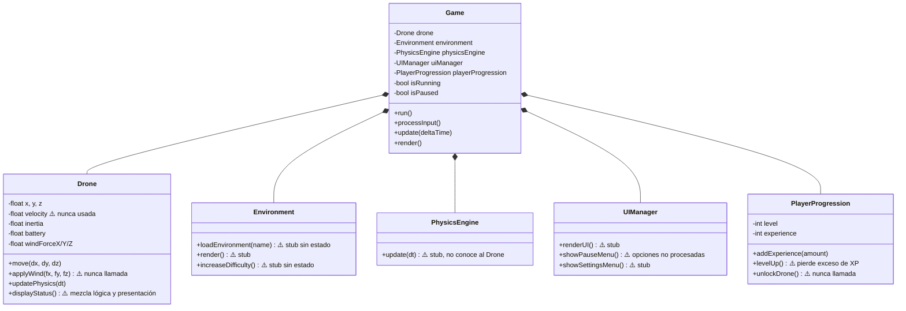
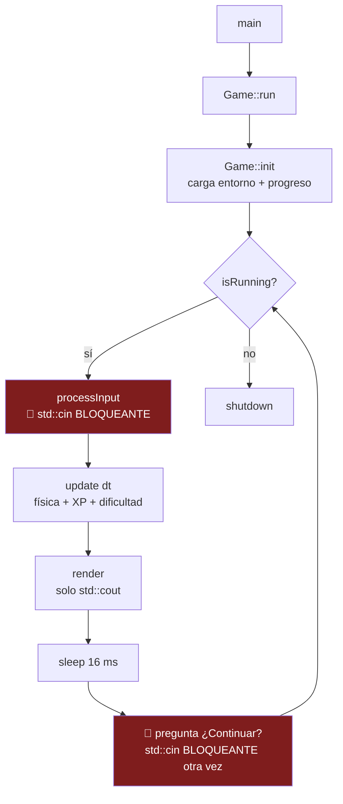
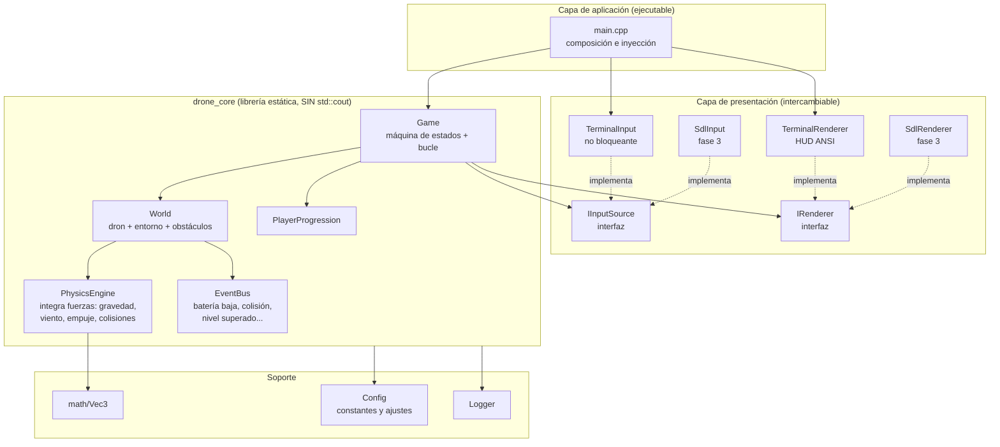
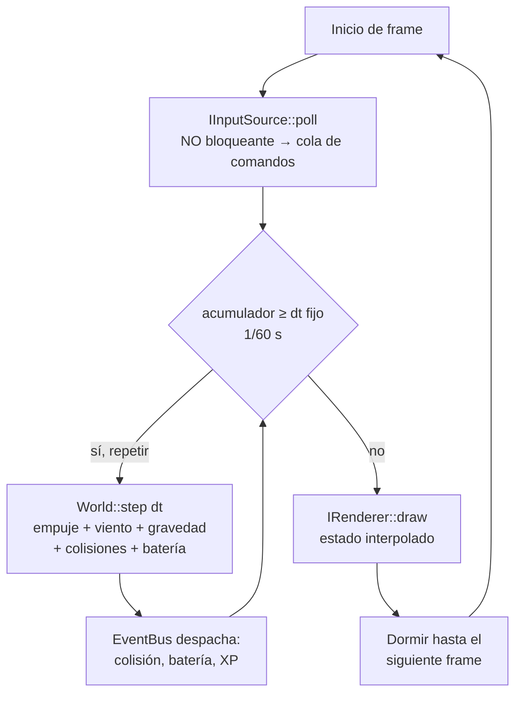
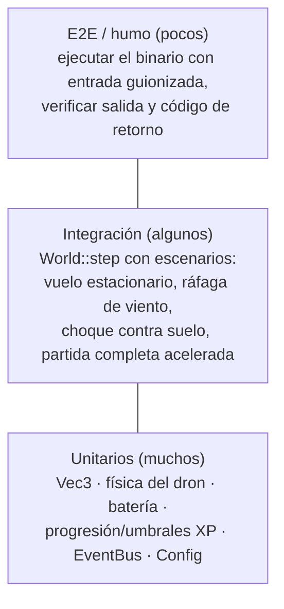
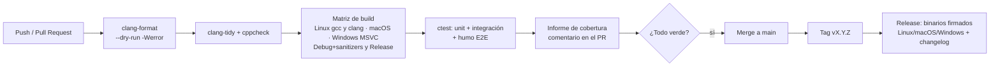
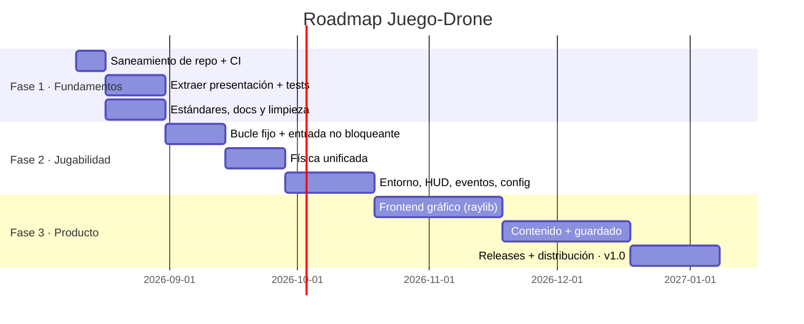

# PLAN.md — Hoja de ruta para profesionalizar Juego-Drone

> **Objetivo:** convertir el prototipo actual (simulador de dron en consola, C++11, ~250 LOC) en una aplicación mantenible, escalable, testeada y lista para distribución.
>
> **Fecha de análisis:** 2026-08-04 · **Commit base:** `1c3a019`
>
> **⚠️ Documento evolucionado:** la versión vigente del plan es **[PLAN2.md](PLAN2.md)**, que conserva íntegro este análisis (mismos identificadores B1–B9, D1–D10, R1–R9 y mismas fases) y añade estimaciones, decisiones cerradas, riesgos y trazabilidad (PLAN2.md §20). Este documento se mantiene como análisis de referencia; ante divergencias, manda PLAN2.md.

---

## Índice

1. [Resumen ejecutivo](#1-resumen-ejecutivo)
2. [Análisis de la estructura del proyecto](#2-análisis-de-la-estructura-del-proyecto)
3. [Arquitectura actual](#3-arquitectura-actual)
4. [Fortalezas](#4-fortalezas)
5. [Debilidades, bugs y deuda técnica](#5-debilidades-bugs-y-deuda-técnica)
6. [Arquitectura propuesta](#6-arquitectura-propuesta)
7. [Refactorizaciones recomendadas](#7-refactorizaciones-recomendadas)
8. [Estándares de código y buenas prácticas](#8-estándares-de-código-y-buenas-prácticas)
9. [Optimización del rendimiento](#9-optimización-del-rendimiento)
10. [Mejoras de seguridad y robustez](#10-mejoras-de-seguridad-y-robustez)
11. [Estrategia de testing](#11-estrategia-de-testing)
12. [Documentación técnica](#12-documentación-técnica)
13. [Gestión de dependencias y limpieza](#13-gestión-de-dependencias-y-limpieza)
14. [UX/UI y accesibilidad](#14-uxui-y-accesibilidad)
15. [CI/CD y automatización](#15-cicd-y-automatización)
16. [Despliegue y monitoreo](#16-despliegue-y-monitoreo)
17. [Roadmap priorizado](#17-roadmap-priorizado)

---

## 1. Resumen ejecutivo

Juego-Drone es hoy un **esqueleto funcional**: compila, arranca y ejecuta un bucle de juego, pero la mayoría de sus clases (`Environment`, `PhysicsEngine`, `UIManager`) son *stubs* que solo imprimen por consola. La física real está incompleta (inercia y velocidad no se usan, el viento nunca se aplica), la entrada es bloqueante y el bucle pide confirmación en cada frame, lo que impide cualquier experiencia en tiempo real.

La buena noticia: la **separación en clases por responsabilidad ya existe** y es la correcta para un juego (dron, entorno, física, UI, progresión, orquestador). El trabajo no es rediseñar desde cero, sino:

1. **Corto plazo (semanas 1–4):** sanear el repositorio, corregir bugs, desacoplar lógica de presentación e instaurar tests y CI.
2. **Medio plazo (meses 2–3):** bucle de juego real con entrada no bloqueante, motor de física funcional, entorno con estado, y primera capa gráfica (terminal enriquecida o SDL2/raylib).
3. **Largo plazo (meses 4–6+):** contenido jugable (niveles, obstáculos, misiones), persistencia, empaquetado multiplataforma y telemetría opcional.

---

## 2. Análisis de la estructura del proyecto

### 2.1 Estado actual

```
Juego-Drone/
├── CMakeLists.txt          # Build con CMake ≥3.10, C++11
├── main.cpp                # Punto de entrada (7 líneas)
├── Game.{h,cpp}            # Orquestador: bucle, entrada, pausa
├── Drone.{h,cpp}           # Posición, batería, viento, "inercia"
├── Environment.{h,cpp}     # Stub: carga/render/dificultad (sin estado)
├── PhysicsEngine.{h,cpp}   # Stub: solo imprime deltaTime
├── UIManager.{h,cpp}       # Stub: menús por consola
├── PlayerProgression.{h,cpp} # Nivel y experiencia
├── README.md               # 2 líneas
└── build/                  # ⚠️ COMITEADO: binario, caché CMake, ar.txt, archivo.txt
```

### 2.2 Problemas de organización

| Problema | Evidencia | Impacto |
|---|---|---|
| Artefactos de build versionados | `build/DroneFlightSim` (binario), `CMakeCache.txt`, logs | Repo pesado, ruido en diffs, caché de CMake con rutas absolutas de otra máquina rompe builds ajenos |
| Sin `.gitignore` | No existe | Cualquier build vuelve a ensuciar el repo |
| Ficheros basura | `build/archivo.txt`, `build/CMakeFiles/ar.txt` | Restos de pruebas de subida por la web de GitHub |
| Todo en la raíz | 15 ficheros fuente + build en el mismo nivel | No escala; imposible separar librería/app/tests |
| Sin LICENSE ni CONTRIBUTING | — | Bloquea colaboración externa |
| Historia git de baja calidad | Commits "Add files via upload", borrados manuales | Sin trazabilidad de cambios; trabajar por ramas + PR |

---

## 3. Arquitectura actual

### 3.1 Diagrama de clases (estado real del código)



### 3.2 Flujo del bucle de juego actual



**Consecuencia clave:** el `deltaTime` se mide con `high_resolution_clock` pero incluye todo el tiempo que el usuario tarda en teclear (segundos), así que la "física por tiempo real" produce saltos arbitrarios: la gravedad y el viento se multiplican por segundos de espera humana, no por el frame de 16 ms.

---

## 4. Fortalezas

- **Separación por responsabilidades correcta desde el inicio.** Las seis clases mapean bien a los subsistemas de un juego real; es la descomposición que un motor serio también usaría.
- **Bucle de juego con deltaTime ya planteado** (`Game::run`, [Game.cpp:92-119](Game.cpp#L92-L119)): la estructura *input → update → render* es la canónica.
- **Build portable con CMake**, sin dependencias externas: compila con un compilador C++11 en cualquier plataforma.
- **Intención documentada en comentarios**: el propio código señala los siguientes pasos (SDL2/SFML para entrada, Bullet para física), lo que facilita alinear este plan con la visión original.
- **Alcance contenido (~250 LOC):** el coste de refactorizar ahora es mínimo; ninguna decisión es aún cara de revertir.

---

## 5. Debilidades, bugs y deuda técnica

### 5.1 Bugs funcionales confirmados

| # | Severidad | Bug | Ubicación |
|---|---|---|---|
| B1 | 🔴 Alta | El bucle pregunta "¿Continuar? (s/n)" **en cada frame**: el juego no puede fluir en tiempo real | [Game.cpp:111-116](Game.cpp#L111-L116) |
| B2 | 🔴 Alta | `deltaTime` incluye el tiempo bloqueado esperando al teclado → física dependiente de la velocidad de tecleo del usuario | [Game.cpp:97-103](Game.cpp#L97-L103) |
| B3 | 🔴 Alta | Si `std::cin` entra en estado de fallo (EOF, entrada no válida), el bucle gira infinitamente consumiendo CPU sin validación alguna | [Game.cpp:21](Game.cpp#L21), [Game.cpp:113](Game.cpp#L113) |
| B4 | 🟠 Media | La gravedad solo actúa si `y > 0` y nada impide `y < 0` vía viento: el dron puede atravesar el suelo; no hay colisiones ni límites del mundo | [Drone.cpp:31-34](Drone.cpp#L31-L34) |
| B5 | 🟠 Media | `Drone::move` no usa `deltaTime` ni `velocity`: el desplazamiento es por pulsación, la "inercia" es un multiplicador estático 0.9, no una simulación | [Drone.cpp:7-17](Drone.cpp#L7-L17) |
| B6 | 🟠 Media | `applyWind` no se llama nunca: el viento anunciado en el README no existe en la práctica | [Drone.cpp:19-24](Drone.cpp#L19-L24) |
| B7 | 🟡 Baja | `levelUp` hace `experience = 0`, descartando el excedente (llegar con 105 XP al umbral 100 pierde 5 XP); además solo puede subirse un nivel por llamada | [PlayerProgression.cpp:14-18](PlayerProgression.cpp#L14-L18) |
| B8 | 🟡 Baja | El menú de pausa muestra opciones 1-3 pero ninguna se procesa; "3. Salir" no sale | [UIManager.cpp:14-19](UIManager.cpp#L14-L19), [Game.cpp:75-90](Game.cpp#L75-L90) |
| B9 | 🟡 Baja | La batería se agota (0.1 %/movimiento) sin recarga posible; al llegar a 0 solo imprime un aviso y el juego continúa igual | [Drone.cpp:8-16](Drone.cpp#L8-L16) |

### 5.2 Deuda técnica estructural

| # | Deuda | Detalle |
|---|---|---|
| D1 | **Lógica acoplada a presentación** | Todas las clases hacen `std::cout` directamente. Imposible testear unitariamente, imposible cambiar de consola a gráficos sin tocar todo. Es la deuda raíz del proyecto. |
| D2 | **`PhysicsEngine` vacío y desconectado** | No recibe referencias al dron ni al entorno; la física real vive duplicada en `Drone::updatePhysics`. Dos dueños para la misma responsabilidad. |
| D3 | **`Environment` sin estado** | `increaseDifficulty()` no incrementa nada; no hay obstáculos, ni dimensiones del mundo, ni generación de viento. |
| D4 | **Sin abstracción de vectores** | Tríos `x, y, z` y `windForceX/Y/Z` sueltos; cada operación 3D se escribe a mano tres veces. Falta un `Vec3`. |
| D5 | **Números mágicos** | `9.81f`, `0.9f`, `0.1f`, `16 ms`, `level * 100` dispersos sin constantes nombradas ni configuración. |
| D6 | **Headers con includes innecesarios** | [Drone.h:4-5](Drone.h#L4-L5) incluye `<iostream>` y `<cmath>` que el header no necesita. |
| D7 | **Sin namespace** | Todo en el espacio global; colisiones garantizadas al añadir dependencias. |
| D8 | **C++11 y CMake 3.10** | Estándares de 2011/2018. C++17 (mínimo razonable hoy) da `std::optional`, structured bindings, `string_view`, etc. |
| D9 | **`build/` comiteado** | Binario + caché con rutas absolutas de otra máquina en el repo. |
| D10 | **Cero tests, cero CI** | Ninguna red de seguridad para refactorizar. |

---

## 6. Arquitectura propuesta

### 6.1 Principio rector

**Separar el *core* de simulación (librería pura, sin I/O) de la capa de presentación (frontend intercambiable).** Esto resuelve D1 de raíz, habilita el testing (el core se testea sin consola ni gráficos) y permite evolucionar de terminal → SDL2/raylib sin reescribir la lógica.



### 6.2 Flujo de datos propuesto (bucle de tiempo fijo)



Puntos clave frente al bucle actual:

- **Timestep fijo con acumulador** (patrón estándar de *Fix Your Timestep*): la física es determinista y testeable; el render va a la velocidad que pueda.
- **Entrada no bloqueante** (terminal en modo raw con `termios`/`poll` en macOS/Linux; `_kbhit` en Windows; o directamente los eventos de SDL2 en fase 3).
- **Eventos en lugar de `cout`:** el core emite `BatteryLow`, `Collision`, `LevelUp`; el frontend decide cómo mostrarlos.

### 6.3 Estructura de directorios propuesta

```
Juego-Drone/
├── CMakeLists.txt              # raíz: opciones, subdirectorios
├── .gitignore  .clang-format  .clang-tidy  LICENSE
├── README.md   PLAN.md  docs/
├── src/
│   ├── core/                   # librería drone_core (sin I/O)
│   │   ├── Game.{h,cpp}
│   │   ├── World.{h,cpp}
│   │   ├── Drone.{h,cpp}
│   │   ├── Environment.{h,cpp}
│   │   ├── PhysicsEngine.{h,cpp}
│   │   ├── PlayerProgression.{h,cpp}
│   │   ├── EventBus.{h,cpp}
│   │   └── math/Vec3.h
│   ├── frontend/
│   │   ├── IRenderer.h  IInputSource.h
│   │   └── terminal/   TerminalRenderer, TerminalInput
│   └── app/main.cpp
├── tests/                      # GoogleTest / Catch2
│   ├── unit/                   # Vec3, Drone, Physics, Progression
│   └── integration/            # World::step, escenarios completos
├── assets/                     # niveles, configuración (fase 2+)
└── .github/workflows/ci.yml
```

---

## 7. Refactorizaciones recomendadas

Ordenadas para que cada paso deje el proyecto compilando y jugable:

1. **R1 — Sanear el repo** *(sin tocar código)*: borrar `build/` del índice (`git rm -r --cached build`), añadir `.gitignore` (build/, binarios, `.DS_Store`, ficheros de IDE), añadir LICENSE y limpiar `archivo.txt`/`ar.txt`.
2. **R2 — Introducir `Vec3`** y sustituir los tríos `x,y,z` y `windForceX/Y/Z` en `Drone`. Elimina D4 y prepara la física real.
3. **R3 — Extraer la presentación**: crear `IRenderer`/`IInputSource`; mover todos los `std::cout` de `Drone`, `Environment`, `PlayerProgression` y `Game` a `TerminalRenderer`. Las clases del core pasan a exponer *getters* de estado (`getPosition()`, `getBattery()`, `getLevel()`…). **Es el refactor que desbloquea el testing.**
4. **R4 — Unificar la física en `PhysicsEngine`**: recibe `World&` y `dt`; integra empuje, viento, gravedad y fricción con velocidad real (`v += a·dt; p += v·dt`). `Drone::move` pasa a ser `Drone::setThrust(Vec3)`. Elimina B4, B5, B6 y D2 de una vez.
5. **R5 — Bucle de tiempo fijo + entrada no bloqueante**: eliminar la pregunta "¿Continuar?" (B1) y el `cin` del frame (B2, B3); `Q` o `Esc` para salir, `P` para pausa como estado de la máquina de estados de `Game`.
6. **R6 — Dar estado a `Environment`**: dificultad numérica real, generador de viento (p. ej. ruido suavizado + rachas), límites del mundo y lista de obstáculos AABB.
7. **R7 — Corregir progresión**: `experience -= threshold` en vez de `= 0`, bucle `while` para multiniveles, y emitir evento `DroneUnlocked` (conecta `unlockDrone`, hoy código muerto).
8. **R8 — Configuración centralizada**: constantes físicas y de juego en `Config` (posteriormente cargable de fichero), eliminando los números mágicos (D5).
9. **R9 — Modernizar toolchain**: C++17, CMake ≥3.21 con *targets* e instalación correcta, `namespace drone::`, includes mínimos en headers (D6, D7, D8).

---

## 8. Estándares de código y buenas prácticas

- **Estándar de lenguaje:** C++17 como mínimo (`CMAKE_CXX_STANDARD 17`, `CMAKE_CXX_EXTENSIONS OFF`).
- **Formato automático:** `.clang-format` versionado (base LLVM o Google, 4 espacios, 100 columnas) + verificación en CI. Se acaba el debate de estilo.
- **Análisis estático:** `.clang-tidy` con `bugprone-*`, `modernize-*`, `performance-*`, `readability-*`; `cppcheck` como segunda opinión en CI.
- **Convenciones:**
  - Clases `PascalCase`, métodos y variables `camelCase`, constantes `kConstantName`, miembros `m_` o sufijo `_` (elegir uno y fijarlo en `docs/style.md`).
  - `const` correctness estricta; `[[nodiscard]]` en getters; `explicit` en constructores de un argumento.
  - Prohibido `using namespace std;` en headers; includes ordenados (propio → proyecto → estándar).
- **Gestión de errores:** el core no imprime ni termina el proceso; devuelve `std::optional`/códigos de estado o emite eventos. Excepciones solo para errores irrecuperables de inicialización.
- **Git:** ramas por feature + PR, mensajes convencionales (`feat:`, `fix:`, `refactor:`), prohibido subir binarios. Considerar *Conventional Commits* para changelog automático.

## 9. Optimización del rendimiento

El rendimiento **no es el problema hoy** (el cuello de botella es la entrada bloqueante); estas pautas son para que no se convierta en problema:

- **Timestep fijo** (sección 6.2): coste de simulación constante y predecible; presupuesto de frame de 16,6 ms.
- **Evitar trabajo por frame innecesario:** hoy `render()` imprime ~8 líneas por frame; con render diferencial ANSI (solo repintar lo que cambia) la terminal aguanta 60 FPS sin parpadeo.
- **Paso por referencia/`string_view`** para strings y agregados; `Vec3` por valor (es trivial, 12 bytes).
- **Reservas de memoria previsibles:** `std::vector::reserve` para obstáculos/partículas; sin asignaciones dentro del bucle caliente.
- **Medir antes de optimizar:** contador de FPS y tiempo de frame en el HUD de debug; perfilado con Instruments (macOS) / `perf` cuando haya contenido real.
- **Compilación:** builds `Release` con `-O2` en CI; `Debug` con sanitizers para desarrollo.

## 10. Mejoras de seguridad y robustez

Superficie de ataque pequeña (app local sin red), pero hay robustez básica pendiente:

- **Validación de entrada:** tratar `std::cin` en estado de fallo/EOF (hoy provoca bucle infinito, B3). Con entrada no bloqueante el problema desaparece, pero cualquier lectura restante debe validar y limpiar el stream.
- **Sanitizers en CI:** compilar y ejecutar los tests con `-fsanitize=address,undefined` (ASan/UBSan). Es la medida de seguridad de mayor retorno en C++.
- **Warnings como errores:** `-Wall -Wextra -Wpedantic -Werror` en CI (localmente sin `-Werror` para no frenar el desarrollo).
- **Ficheros de guardado (fase 2+):** validar y versionar el formato al cargar (tamaños, rangos); nunca deserializar con `memcpy` ciego. Preferir un formato de texto (JSON/TOML) con parser mantenido.
- **Dependencias fijadas:** versiones exactas vía FetchContent/vcpkg con lockfile; activar Dependabot/Renovate para avisos de CVE.
- **Sin secretos en el repo** y permisos mínimos en los workflows de GitHub Actions (`permissions: contents: read`).

## 11. Estrategia de testing

**Prerequisito:** R3 (extraer presentación). Con `std::cout` incrustado no hay nada testeable; tras R3, todo el core lo es.



- **Framework:** Catch2 v3 (header-friendly, expresivo) o GoogleTest; integrado con CTest (`ctest --output-on-failure` en CI).
- **Unitarios (objetivo: cada regla de juego con test):**
  - `Vec3`: operaciones, normalización, casos límite.
  - Física: con empuje 0 y sin viento, el dron cae; con empuje = gravedad, se sostiene; la batería a 0 anula el empuje; el suelo detiene la caída (test de regresión de B4).
  - Progresión: 100 XP sube a nivel 2; 250 XP de golpe sube dos niveles y conserva 50 (test de regresión de B7); desbloqueo a nivel 3.
- **Integración:** `World` completo avanzado N pasos con secuencias de comandos, comprobando trayectorias e invariantes (nunca `y < 0`, batería en [0, 100]).
- **E2E/humo:** el binario terminal ejecutado con un guion (`expect` o pipe) — arranca, procesa comandos, sale limpio. Uno por plataforma en CI.
- **Cobertura:** gcov/llvm-cov con informe en CI; objetivo inicial 70 % del core, sin obsesionarse con el frontend.
- **Determinismo:** semilla del generador de viento inyectable para que todos los tests sean reproducibles.

## 12. Documentación técnica

| Documento | Contenido | Cuándo |
|---|---|---|
| `README.md` ampliado | Qué es, captura/gif, requisitos, build (`cmake -B build && cmake --build build`), controles, cómo testear | Fase 1 |
| `PLAN.md` (este) | Hoja de ruta viva; actualizar al cerrar cada fase | Continuo |
| `docs/architecture.md` | Diagramas de las secciones 3 y 6, decisiones y límites entre capas | Fase 1–2 |
| `docs/adr/` | Architecture Decision Records: una página por decisión (¿SDL2 o raylib? ¿Catch2 o GTest? ¿timestep fijo?) | Desde la primera decisión |
| `docs/style.md` | Convenciones de la sección 8 | Fase 1 |
| `CONTRIBUTING.md` | Flujo de ramas/PR, cómo correr tests y linters | Fase 1 |
| Comentarios Doxygen | Solo en la API pública del core; generación opcional en CI a GitHub Pages | Fase 2 |
| `CHANGELOG.md` | Generado desde Conventional Commits al taggear releases | Fase 3 |

## 13. Gestión de dependencias y limpieza

**Código a eliminar o conectar (hoy muerto):**

- `Drone::velocity` — nunca leída/escrita → se usará de verdad en R4.
- `Drone::applyWind` — nunca llamada → la llamará `Environment` en R6.
- `PlayerProgression::unlockDrone` — nunca llamada → evento en R7.
- `build/` completo, `archivo.txt`, `ar.txt` — eliminar (R1).
- Includes `<iostream>`/`<cmath>` de `Drone.h` — eliminar (D6).

**Política de dependencias (hoy: cero — mantener el mínimo):**

| Dependencia | Para qué | Fase | Mecanismo |
|---|---|---|---|
| Catch2 o GoogleTest | Tests | 1 | CMake `FetchContent` (versión fijada) |
| raylib **o** SDL2 | Gráficos/entrada/audio | 3 | FetchContent o vcpkg; decidir vía ADR (raylib recomendado: API mínima, ideal para este alcance) |
| nlohmann/json o toml++ | Config y guardado | 2–3 | FetchContent |
| spdlog (opcional) | Logging | 2 | FetchContent |

Bullet Physics (mencionado en los comentarios del código) **se desaconseja por ahora**: la física de un dron en un mundo con AABBs se resuelve con ~200 líneas propias y testeables; un motor de cuerpos rígidos completo es peso muerto a este alcance.

## 14. UX/UI y accesibilidad

**Corto plazo (terminal):**

- Controles en tiempo real sin Enter (entrada raw), sin la pregunta por frame.
- HUD estable con códigos ANSI: posición, altitud, barra de batería, viento (dirección/fuerza), nivel/XP, FPS — repintado en sitio, sin *scroll* infinito de texto.
- Mensajes de evento con vida útil ("¡Nivel 2!", "Batería baja") en una línea de avisos, no intercalados con el HUD.
- Pausa funcional con menú navegable (las opciones 1-3 hoy no hacen nada — B8).

**Medio/largo plazo (gráfico):** vista 2.5D/3D simple con raylib, minimapa, indicadores analógicos de altitud/batería.

**Accesibilidad:**

- Controles remapeables desde configuración (base ya prevista en `showSettingsMenu`).
- No depender solo del color: batería con porcentaje + barra, no solo verde/rojo; paleta segura para daltonismo.
- Escala de texto/HUD configurable; los mensajes de evento permanecen en pantalla un tiempo mínimo legible.
- Modo "asistencia": estabilización automática del dron (reduce carga cognitiva y sirve de tutorial).

## 15. CI/CD y automatización



- **GitHub Actions** (`.github/workflows/ci.yml`): la matriz de arriba en cada PR; caché de CMake/deps para builds < 5 min.
- **Reglas de rama:** `main` protegida; merge solo con CI verde y una revisión.
- **Automatización adicional:** Dependabot (actions + deps), plantillas de issue/PR, `pre-commit` local opcional con clang-format.
- **Releases:** workflow disparado por tag que compila Release en las tres plataformas, empaqueta (tar.gz/zip, más adelante .dmg/instalador) y publica en GitHub Releases con changelog generado.

## 16. Despliegue y monitoreo

Para un juego de escritorio, "despliegue" = **distribución de binarios** y "monitoreo" = **diagnóstico local + telemetría opcional**:

- **Distribución:** GitHub Releases como canal principal (automatizado, sección 15). Más adelante: Homebrew tap (macOS), itch.io para alcance de jugadores; empaquetado con CPack.
- **Versionado:** SemVer (`v0.x` durante las fases 1–2; `v1.0` al cierre de la fase 3) con el número inyectado en el binario en build (`--version`).
- **Diagnóstico local:** logging estructurado a fichero (`spdlog`, rotación, nivel configurable); volcado de estado del mundo al detectar un invariante roto en debug.
- **Crash reporting:** en `v1.0`, captura de crashes local con consentimiento explícito y opción de adjuntar el informe a un issue de GitHub. Nada de telemetría silenciosa.
- **Métricas de calidad continuas:** tiempo de frame p95 y fallos de tests por plataforma visibles en CI; issues etiquetados por severidad como tablero de salud del proyecto.

---

## 17. Roadmap priorizado

### Fase 1 — Fundamentos (semanas 1–4) · *el proyecto se vuelve profesional*

| Prioridad | Tarea | Refs | Impacto | Esfuerzo |
|---|---|---|---|---|
| P0 | Sanear repo: quitar `build/` y basura, `.gitignore`, LICENSE | R1, D9 | 🔥 Alto | XS |
| P0 | CI mínima: build + warnings en Linux/macOS/Windows | §15 | 🔥 Alto | S |
| P0 | Extraer presentación del core (`IRenderer`, getters) | R3, D1 | 🔥 Muy alto | M |
| P0 | Tests unitarios base (Drone, Progression) + CTest en CI | §11 | 🔥 Muy alto | M |
| P1 | Corregir B3 (cin en fallo), B7 (XP perdida), B9 (batería) | §5.1 | Alto | S |
| P1 | `Vec3` + limpieza de código muerto e includes | R2, §13 | Medio | S |
| P1 | clang-format + clang-tidy + docs/style.md | §8 | Medio | S |
| P2 | README completo + CONTRIBUTING + architecture.md | §12 | Medio | S |

### Fase 2 — Jugabilidad real (meses 2–3) · *el juego se vuelve juego*

| Prioridad | Tarea | Refs | Impacto | Esfuerzo |
|---|---|---|---|---|
| P0 | Bucle de tiempo fijo + entrada no bloqueante (elimina B1, B2) | R5 | 🔥 Muy alto | M |
| P0 | Física unificada: velocidad, empuje, gravedad, suelo (B4, B5) | R4, D2 | 🔥 Muy alto | M |
| P1 | `Environment` con estado: viento real (B6), dificultad, obstáculos AABB | R6, D3 | Alto | M |
| P1 | HUD ANSI en tiempo real + pausa funcional (B8) | §14 | Alto | M |
| P1 | EventBus + progresión conectada (`unlockDrone`) | R7 | Medio | S |
| P2 | Config en fichero (constantes físicas, controles) | R8 | Medio | S |
| P2 | Tests de integración de `World` + sanitizers en CI | §11 | Alto | M |
| P2 | C++17 + CMake moderno + namespace | R9 | Medio | S |

### Fase 3 — Producto (meses 4–6+) · *el juego se puede publicar*

| Prioridad | Tarea | Refs | Impacto | Esfuerzo |
|---|---|---|---|---|
| P0 | Frontend gráfico (raylib): render 2.5D, entrada, audio básico | §6, §14 | 🔥 Muy alto | L |
| P1 | Contenido: 3+ entornos, misiones, obstáculos, modelos de dron | — | Alto | L |
| P1 | Guardado/carga de progresión validado | §10 | Alto | M |
| P1 | Releases automatizadas multiplataforma + CPack | §15 | Alto | M |
| P2 | Accesibilidad: remapeo, daltonismo, modo asistencia | §14 | Medio | M |
| P2 | Crash reporting opt-in + logging estructurado | §16 | Medio | S |
| P3 | Distribución: Homebrew / itch.io · v1.0 | §16 | Medio | S |



### Criterios de éxito por fase

- **Fase 1:** CI verde en 3 plataformas; cobertura ≥ 60 % del core; cero `std::cout` fuera del frontend; repo sin binarios.
- **Fase 2:** jugable en tiempo real a 60 FPS en terminal; física determinista bajo tests; todos los bugs B1–B9 cerrados.
- **Fase 3:** binarios descargables para las 3 plataformas; primera partida completa sin leer el código; `v1.0` publicada.

---

*Documento generado a partir del análisis del commit `1c3a019`. Actualizar al cierre de cada fase.*
