# PLAN2.md — Hoja de Ruta de Profesionalización de Juego-Drone

> **Propósito:** Convertir el prototipo actual (simulador de dron de consola, C++11, ~250 LOC) en una aplicación mantenible, escalable, testeada, segura y lista para distribución multiplataforma.
>
> **Fecha de análisis:** 2026-08-04 · **Commit base:** `1c3a019` · **Versión del plan:** 2.1
>
> **Estado de ejecución (2026-08-04, v0.5.0):** Fase 1 completa (tareas 1.1–1.8) y Fase 2 completa salvo la tarea 2.6 (externalizar config a TOML + spdlog). Los 9 bugs B1–B9 están cerrados con tests de regresión; 48 tests verdes con ASan/UBSan. Fase 3 pendiente según calendario.
>
> **Relación con [PLAN.md](PLAN.md):** este documento es la evolución directa del plan v1. Conserva íntegros sus catálogos (bugs **B1–B9**, deudas **D1–D10**, refactorizaciones **R1–R9**, con los mismos identificadores) y sus tres fases, y añade: estimaciones por tarea, decisiones técnicas cerradas, workflows listos para usar, máquina de estados del juego, gestión de riesgos (§19) y trazabilidad completa (§20). PLAN.md queda como análisis de referencia; ante cualquier divergencia, manda PLAN2.md.

---

## Índice

1. [Resumen Ejecutivo](#1-resumen-ejecutivo)
2. [Análisis de la Estructura del Proyecto](#2-análisis-de-la-estructura-del-proyecto)
3. [Arquitectura Actual](#3-arquitectura-actual)
4. [Fortalezas Identificadas](#4-fortalezas-identificadas)
5. [Debilidades, Bugs y Deuda Técnica](#5-debilidades-bugs-y-deuda-técnica)
6. [Arquitectura Propuesta](#6-arquitectura-propuesta)
7. [Refactorizaciones Recomendadas](#7-refactorizaciones-recomendadas)
8. [Estándares de Código y Buenas Prácticas](#8-estándares-de-código-y-buenas-prácticas)
9. [Optimización del Rendimiento](#9-optimización-del-rendimiento)
10. [Mejoras de Seguridad y Robustez](#10-mejoras-de-seguridad-y-robustez)
11. [Estrategia de Testing](#11-estrategia-de-testing)
12. [Documentación Técnica](#12-documentación-técnica)
13. [Gestión de Dependencias y Limpieza](#13-gestión-de-dependencias-y-limpieza)
14. [Mejoras de UX/UI y Accesibilidad](#14-mejoras-de-uxui-y-accesibilidad)
15. [Estrategia de CI/CD y Automatización](#15-estrategia-de-cicd-y-automatización)
16. [Estrategia de Despliegue y Monitoreo](#16-estrategia-de-despliegue-y-monitoreo)
17. [Roadmap Priorizado con Estimaciones](#17-roadmap-priorizado-con-estimaciones)
18. [Métricas de Éxito y KPIs](#18-métricas-de-éxito-y-kpis)
19. [Gestión de Riesgos](#19-gestión-de-riesgos)
20. [Trazabilidad con PLAN.md](#20-trazabilidad-con-planmd)

---

## 1. Resumen Ejecutivo

### 1.1 Situación Actual

**Juego-Drone** es un prototipo funcional de simulador de vuelo de dron en consola. Compila, arranca y ejecuta un bucle de juego, pero opera como un esqueleto: el 60% de las clases son *stubs* que solo imprimen texto por `std::cout`. La física está incompleta, la entrada es bloqueante, el bucle principal es interactivo (turn-based) en lugar de tiempo real, y el repositorio carece de infraestructura de calidad.

### 1.2 Diagnóstico Clave

| Dimensión | Estado | Riesgo |
|-----------|--------|--------|
| **Funcionalidad** | ~40% implementada | No es jugable como juego real |
| **Arquitectura** | Correcta en intención, rota en ejecución | Refactorizable sin reescribir |
| **Calidad de código** | Sin estándares, sin tests, sin CI | Frágil ante cualquier cambio |
| **Repositorio** | Binarios comiteados, sin `.gitignore`, sin LICENSE | Bloquea colaboración externa |
| **Deuda técnica** | 9 bugs + 10 deudas estructurales | Acumulativa si no se actúa ya |

### 1.3 Estrategia de Profesionalización en Tres Fases

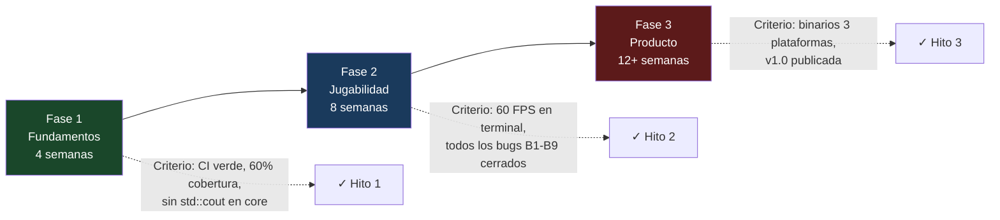

- **Fase 1 — Fundamentos (semanas 1–4):** Saneamiento del repositorio, desacoplamiento de presentación del core, tests unitarios mínimos, CI/CD. *El proyecto se vuelve profesional.*
- **Fase 2 — Jugabilidad real (semanas 5–12):** Bucle de tiempo fijo, física unificada, entrada no bloqueante, entorno con estado, HUD en terminal. *El proyecto se vuelve un juego.*
- **Fase 3 — Producto (semanas 13–24+):** Render gráfico (raylib), contenido jugable, guardado/carga, distribución multiplataforma, v1.0. *El proyecto se puede publicar.*

---

## 2. Análisis de la Estructura del Proyecto

### 2.1 Árbol de Ficheros Actual

```
Juego-Drone/                          (15 archivos fuente + build)
├── .git/                             (Historial con artefactos binarios)
├── CMakeLists.txt                    (CMake ≥3.10, C++11, sin dependencias)
├── main.cpp                          (7 líneas — instancia Game y llama run())
├── Game.{h,cpp}                      (125 líneas — orquestador y bucle principal)
├── Drone.{h,cpp}                     (41 líneas — entidad: posición, batería, gravedad)
├── Environment.{h,cpp}               (22 líneas — stub sin estado)
├── PhysicsEngine.{h,cpp}             (13 líneas — stub desconectado del Drone)
├── UIManager.{h,cpp}                 (30 líneas — stub con menús no funcionales)
├── PlayerProgression.{h,cpp}         (31 líneas — XP, nivel, desbloqueo)
├── README.md                         (2 líneas)
├── PLAN.md                           (30 KB — análisis previo)
└── build/
    └── DroneFlightSim                (⚠️ Binario arm64 comiteado)
```

### 2.2 Organización del Código — Diagnóstico

| Aspecto | Observación | Gravedad |
|---------|-------------|----------|
| **Estructura plana** | Los 15 archivos fuente coexisten en la raíz sin separación `src/`/`include/`/`tests/` | Alta |
| **build/ versionado** | El directorio `build/` con el binario compilado está en git | Alta |
| **Sin `.gitignore`** | Cada build local vuelve a ensuciar el repositorio | Alta |
| **Sin `src/`** | No hay separación entre código de librería y aplicación | Media |
| **Sin `tests/`** | No existe infraestructura de testing | Alta |
| **Ficheros basura** | `archivo.txt`, `ar.txt` en el historial | Baja |
| **Sin LICENSE** | Bloquea cualquier uso o colaboración externa | Alta |
| **Historial git caótico** | Ciclos commit/delete de build, mensajes no descriptivos | Media |

### 2.3 Mapa de Dependencias entre Módulos

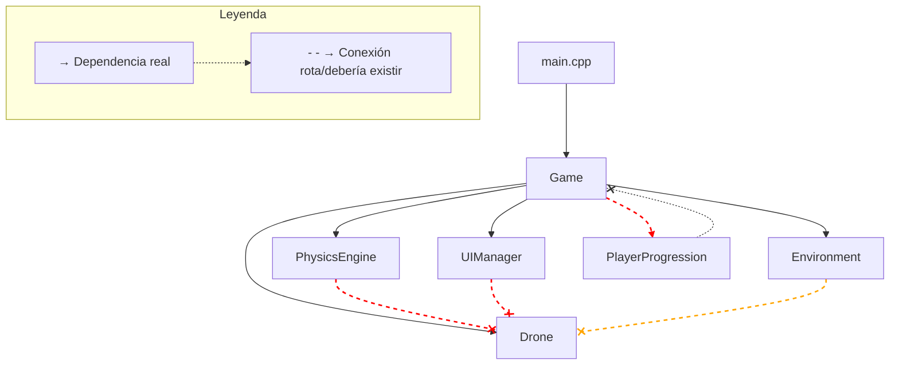

**Hallazgo crítico:** `PhysicsEngine` no conoce al `Drone`. `UIManager` no lee el estado del `Drone`. `Environment` no afecta al `Drone`. El grafo de dependencias *declarado* (Game compone todas las clases) no se corresponde con el grafo de dependencias *efectivo* (las clases son islas inconexas).

---

## 3. Arquitectura Actual

### 3.1 Diagrama de Clases

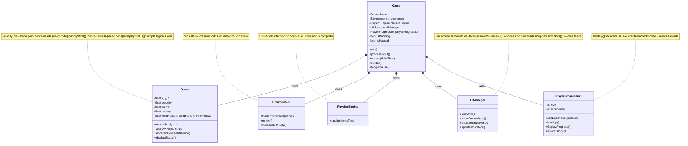

### 3.2 Flujo del Bucle de Juego Actual

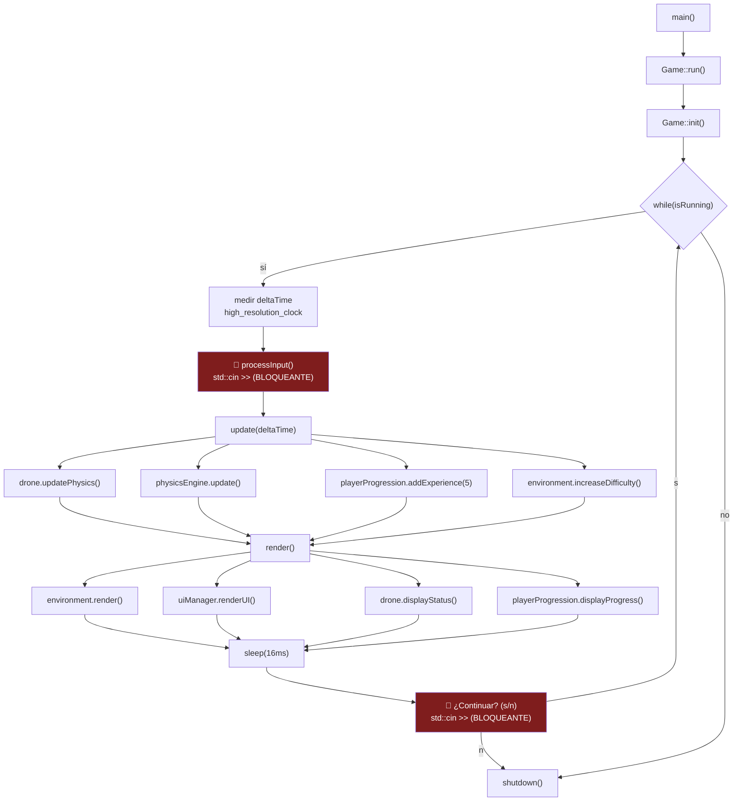

**Problemas estructurales del bucle:**

1. **Entrada bloqueante:** `std::cin >>` detiene el bucle hasta que el usuario pulsa Enter. No es un juego en tiempo real.
2. **Dos prompts por frame:** `processInput()` + `¿Continuar?` = 2 bloqueos por iteración.
3. **deltaTime contaminado:** Incluye el tiempo que el usuario tarda en escribir. La física (gravedad, viento) usa este deltaTime hinchado, produciendo saltos impredecibles.
4. **Sin validación de stream:** Si `std::cin` entra en estado de error (EOF, Ctrl+D), el bucle gira infinitamente.
5. **Física duplicada:** `Drone` tiene su propia física; `PhysicsEngine` es un stub que imprime deltaTime. Dos dueños para una misma responsabilidad.

### 3.3 Flujo de Datos Actual

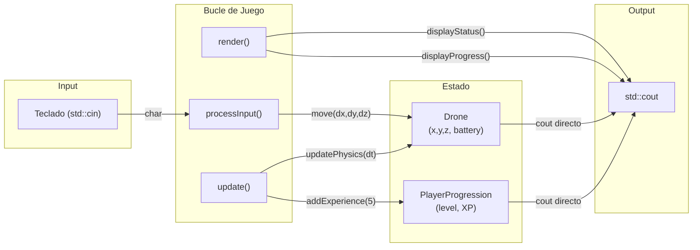

Todas las clases escriben directamente a `std::cout`. Esto impide testear cualquier clase de forma aislada y hace imposible cambiar la capa de presentación sin modificar el core.

---

## 4. Fortalezas Identificadas

### 4.1 Fortalezas Arquitectónicas

| Fortaleza | Evidencia | Valor |
|-----------|-----------|-------|
| **Separación por responsabilidades correcta** | 6 clases que mapean a subsistemas canónicos de un juego (entidad, mundo, física, UI, progresión, orquestador) | Refactorizar es reorganizar, no rediseñar |
| **Bucle de juego canónico** | `input → update → render` ya implementado en `Game::run()` | La estructura base es la correcta |
| **Uso de deltaTime** | `std::chrono::high_resolution_clock` para medir tiempo entre frames | Preparado para física basada en tiempo |
| **CMake multiplataforma** | Build portable sin dependencias externas | Compila en Linux, macOS, Windows sin cambios |

### 4.2 Fortalezas de Proyecto

| Fortaleza | Evidencia | Valor |
|-----------|-----------|-------|
| **Código mínimo (~250 LOC)** | 8 archivos .cpp con una media de 30 líneas cada uno | Coste de refactorización cercano a cero |
| **Intención documentada en comentarios** | `// Futuro: integrar librería Bullet Physics`, `// Para un juego real se recomienda SDL2` | Visión alineada con este plan |
| **Sin dependencias externas** | Solo STL (iostream, chrono, thread, string, cmath) | Sin riesgo de supply chain, builds instantáneos |
| **Binario compilado funcional** | `build/DroneFlightSim` (50 KB, Mach-O arm64) ejecutable | Demo funcional disponible |

---

## 5. Debilidades, Bugs y Deuda Técnica

### 5.1 Bugs Funcionales — Catálogo Completo

| ID | Severidad | Descripción | Ubicación | Estado |
|----|-----------|-------------|-----------|--------|
| **B1** | 🔴 Crítica | El bucle pregunta "¿Continuar? (s/n)" en cada frame, impidiendo juego en tiempo real | `Game.cpp:111-116` | ✅ Cerrado (v0.5.0) |
| **B2** | 🔴 Crítica | `deltaTime` incluye el tiempo de espera del teclado del usuario → física no determinista | `Game.cpp:97-103` | ✅ Cerrado (v0.5.0) |
| **B3** | 🔴 Crítica | `std::cin` sin validación de stream: EOF o entrada inválida causa bucle infinito con 100% CPU | `Game.cpp:21`, `:113` | ✅ Cerrado (v0.5.0) |
| **B4** | 🟠 Alta | Gravedad solo actúa si `y > 0`; el dron puede caer bajo el suelo si es empujado por viento | `Drone.cpp:32-34` | ✅ Cerrado (v0.5.0) |
| **B5** | 🟠 Alta | `move()` no usa `deltaTime` ni `velocity`: desplazamiento por pulsación, física ficticia | `Drone.cpp:7-17` | ✅ Cerrado (v0.5.0) |
| **B6** | 🟠 Alta | `applyWind()` declarada pero nunca invocada: el viento del README no existe | `Drone.cpp:19-24` | ✅ Cerrado (v0.5.0) |
| **B7** | 🟡 Media | `levelUp()` hace `experience = 0` descartando el excedente (ej: 120 XP pierde 20) | `PlayerProgression.cpp:14-18` | ✅ Cerrado (v0.5.0) |
| **B8** | 🟡 Media | Menú de pausa muestra 3 opciones pero ninguna se procesa; "3. Salir" no sale | `UIManager.cpp:14-18` | ✅ Cerrado (v0.5.0) |
| **B9** | 🟡 Media | Batería se agota irreversiblemente; al llegar a 0% solo imprime un aviso sin consecuencias | `Drone.cpp:8-16` | ✅ Cerrado (v0.5.0) |

### 5.2 Deuda Técnica Estructural — Catálogo Completo

| ID | Deuda | Detalle | Impacto |
|----|-------|---------|---------|
| **D1** | Lógica acoplada a presentación | Todas las clases hacen `std::cout`. Imposible testear. | 🔥 Bloquea todo testing |
| **D2** | `PhysicsEngine` vacío y desconectado | No recibe referencia al `Drone` ni al `World`; física duplicada en `Drone` | 🔥 Dos dueños para una responsabilidad |
| **D3** | `Environment` sin estado | `increaseDifficulty()` no incrementa nada; sin obstáculos ni dimensiones | 🔥 No es un entorno real |
| **D4** | Sin abstracción de vectores | Tríos `x,y,z` y `windForceX/Y/Z` repetidos sin tipo `Vec3` | Medio |
| **D5** | Números mágicos | `9.81f`, `0.9f`, `0.1f`, `16`, `level * 100` sin constantes nombradas | Medio |
| **D6** | Headers con includes innecesarios | `Drone.h` incluye `<iostream>` y `<cmath>` sin usarlos en el header | Bajo |
| **D7** | Sin namespace | Todas las clases en el espacio global → colisiones al añadir dependencias | Medio |
| **D8** | C++11 y CMake 3.10 obsoletos | C++17 da `std::optional`, `string_view`, structured bindings, `if constexpr` | Medio |
| **D9** | `build/` comiteado | Binario + caché CMake con rutas absolutas en el repositorio | Alto |
| **D10** | Cero tests, cero CI | Sin red de seguridad para refactorizar ni verificar regresiones | 🔥 Crítico |

### 5.3 Matriz de Riesgo

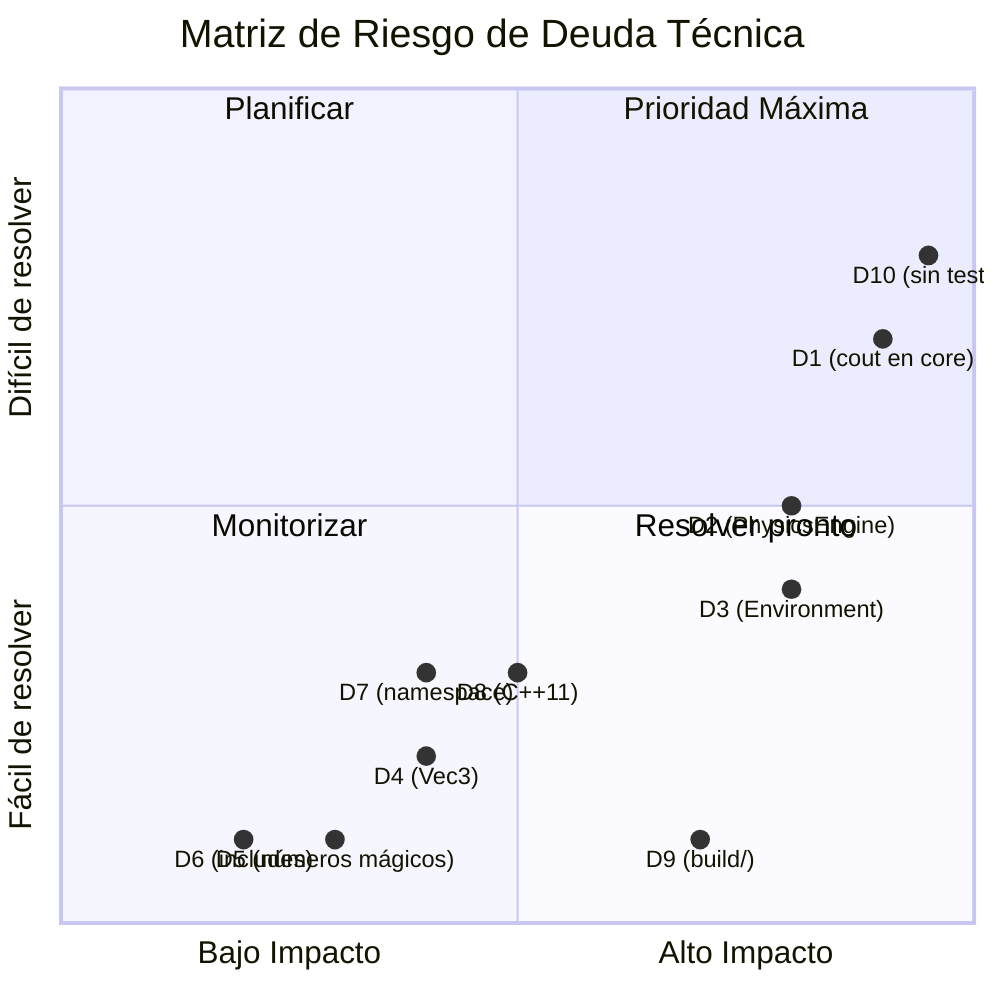

---

## 6. Arquitectura Propuesta

### 6.1 Principio Rector: Separación Core/Frontend

El cambio fundamental es dividir el proyecto en dos capas con una interfaz bien definida:

- **`drone_core`** (librería estática): Toda la lógica de simulación. **Cero I/O.** Solo recibe comandos y expone estado.
- **Frontend** (intercambiable): Lee entrada y renderiza salida. Puede ser terminal, raylib, o cualquier otra tecnología.

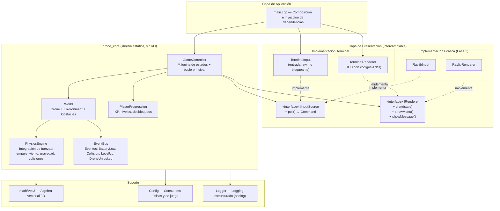

### 6.2 Bucle de Juego Propuesto: Timestep Fijo

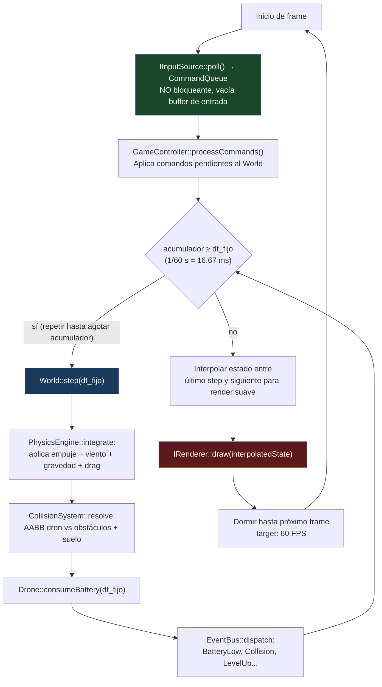

**Ventajas del timestep fijo frente al bucle actual:**

| Aspecto | Bucle actual | Bucle propuesto |
|---------|-------------|-----------------|
| Entrada | Bloqueante (`std::cin >>`) | No bloqueante (buffer de comandos) |
| Física | Dependiente de velocidad de tecleo | Determinista, 60 pasos/segundo |
| Render | Sincrónico con física | Independiente, interpolado |
| Testabilidad | Ninguna (depende de entrada humana) | Total (comandos inyectables) |
| Frame rate | Variable, bloqueado por I/O | Estable, 60 FPS garantizados en simulación |

### 6.3 Estructura de Directorios Propuesta

```
Juego-Drone/
├── .git/
├── .github/
│   └── workflows/
│       ├── ci.yml                  # Build + test + lint (Linux, macOS, Windows)
│       └── release.yml             # Build + package + publish
├── .clang-format                    # Estilo de código automático
├── .clang-tidy                      # Análisis estático
├── .gitignore                       # Excluir build/, binarios, IDE files
├── CMakeLists.txt                   # Raíz: proyecto, opciones, subdirectorios
├── LICENSE                          # MIT
├── README.md                        # Ampliado: build, controles, contribución
├── CHANGELOG.md                     # Generado desde Conventional Commits
├── PLAN2.md                         # Este documento
│
├── src/
│   ├── core/                        # Librería drone_core (C++17, sin I/O)
│   │   ├── CMakeLists.txt           # add_library(drone_core STATIC ...)
│   │   ├── GameController.{h,cpp}   # Máquina de estados + bucle principal
│   │   ├── World.{h,cpp}            # Agrega Drone + Environment + obstáculos
│   │   ├── Drone.{h,cpp}            # Estado del dron (posición, velocidad, batería)
│   │   ├── Environment.{h,cpp}      # Estado del mundo (viento, dificultad, límites)
│   │   ├── PhysicsEngine.{h,cpp}    # Integración de fuerzas + colisiones AABB
│   │   ├── PlayerProgression.{h,cpp}# XP, niveles, desbloqueos
│   │   ├── EventBus.{h,cpp}         # Sistema de eventos (Observer pattern)
│   │   ├── Config.h                 # Constantes de juego centralizadas
│   │   └── math/
│   │       └── Vec3.h               # Vector 3D con operadores
│   │
│   ├── frontend/                    # Capa de presentación (interfaces + implementaciones)
│   │   ├── IRenderer.h              # Interfaz de renderizado
│   │   ├── IInputSource.h           # Interfaz de entrada
│   │   └── terminal/
│   │       ├── TerminalRenderer.{h,cpp}  # HUD con códigos ANSI
│   │       └── TerminalInput.{h,cpp}     # Entrada raw no bloqueante (termios/poll)
│   │
│   └── app/
│       ├── CMakeLists.txt           # add_executable(DroneFlightSim ...)
│       └── main.cpp                 # Composición + inyección + arranque
│
├── tests/
│   ├── CMakeLists.txt               # CTest + Catch2
│   ├── unit/
│   │   ├── TestVec3.cpp
│   │   ├── TestDrone.cpp
│   │   ├── TestPhysics.cpp
│   │   ├── TestProgression.cpp
│   │   └── TestEventBus.cpp
│   └── integration/
│       ├── TestWorldStep.cpp
│       └── TestScenarios.cpp
│
├── docs/
│   ├── architecture.md              # Decisiones de arquitectura + diagramas
│   ├── adr/                         # Architecture Decision Records
│   │   ├── 001-timestep-fijo.md
│   │   ├── 002-raylib-vs-sdl2.md
│   │   └── 003-catch2-vs-gtest.md
│   ├── style.md                     # Guía de estilo C++
│   └── CONTRIBUTING.md              # Guía de contribución
│
└── assets/                          # (Fase 2+)
    ├── config/
    │   └── game.toml                # Constantes de juego externalizadas
    └── levels/
        └── city.json                # Definición de entorno: obstáculos, viento
```

### 6.4 Diagrama de Módulos y Dependencias (Arquitectura Propuesta)

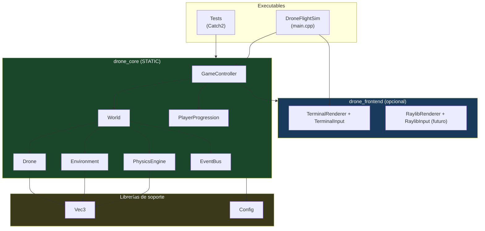

### 6.5 Máquina de Estados del Juego

Los booleanos `isRunning`/`isPaused` actuales no pueden expresar estados como *game over* o *menú de configuración* — por eso B8 (menú decorativo) y B9 (batería agotada sin consecuencia) existen. `GameController` pasa a gestionar una máquina de estados explícita:

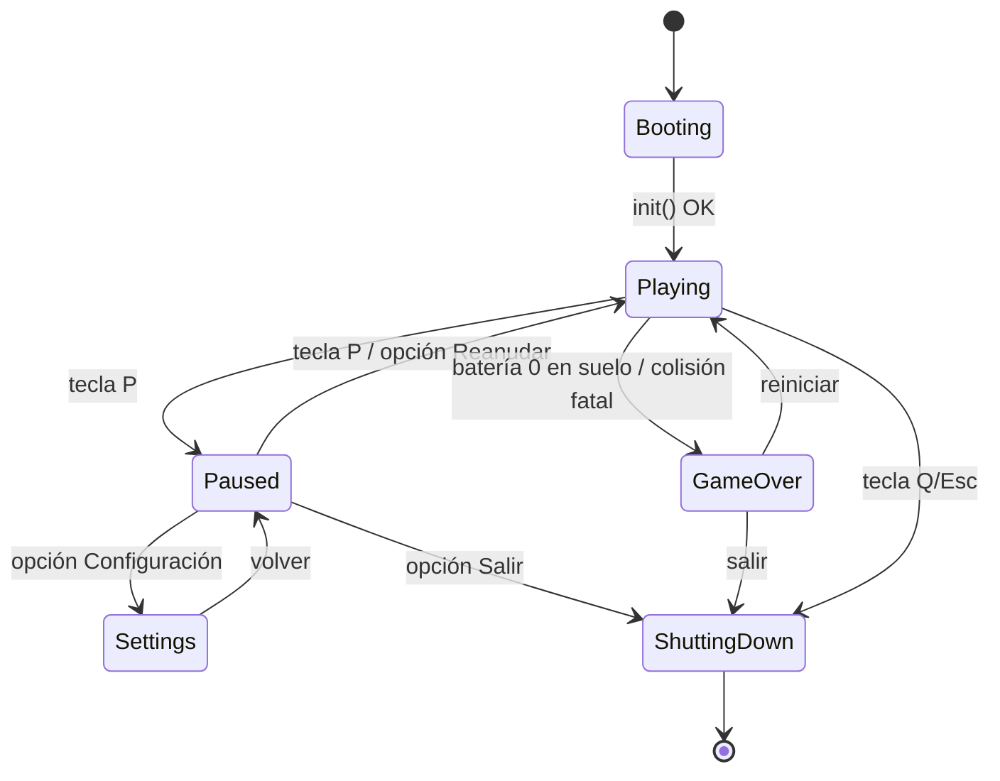

```cpp
// src/core/GameController.h
enum class GameState { Booting, Playing, Paused, Settings, GameOver, ShuttingDown };
```

Cada estado define qué comandos acepta y qué se simula/renderiza: en `Paused` no avanza la física; en `GameOver` solo se aceptan `Confirm`/`Quit`. Esto cierra B8 (las opciones del menú transicionan estados reales) y B9 (batería 0 + suelo ⇒ `GameOver` con opción de reinicio).

---

## 7. Refactorizaciones Recomendadas

Las refactorizaciones están ordenadas por precedencia: cada una desbloquea las siguientes.

### Resumen de Refactorizaciones

| ID | Refactorización | Desbloquea | Esfuerzo | Impacto |
|----|----------------|------------|----------|---------|
| R1 | Saneamiento del repositorio | R2–R9 | XS | 🔥 Alto |
| R2 | Introducir `Vec3` | R4, R6 | S | Medio |
| R3 | Extraer presentación del core | Tests, R4, R5 | M | 🔥 Muy alto |
| R4 | Unificar física en `PhysicsEngine` | R5, R6 | M | 🔥 Muy alto |
| R5 | Bucle de tiempo fijo + entrada no bloqueante | — | M | 🔥 Muy alto |
| R6 | Dar estado real a `Environment` | — | M | Alto |
| R7 | Corregir progresión + conectar desbloqueos | — | S | Medio |
| R8 | Configuración centralizada + externalizada | R9 | S | Medio |
| R9 | Modernizar toolchain (C++17, CMake 3.21, namespace) | Fase 3 | S | Medio |

### R1 — Saneamiento del Repositorio

**Archivos afectados:** `.gitignore` (nuevo), `LICENSE` (nuevo), `build/` (eliminar del índice)

```
git rm -r --cached build/
# Crear .gitignore con: build/ .DS_Store *.o *.out CMakeCache.txt CMakeFiles/ Makefile cmake_install.cmake
# Añadir LICENSE (MIT recomendado)
```

**Criterio de aceptación:** `git status` limpio tras build; `build/` no aparece en `git ls-files`.

### R2 — Introducir `Vec3`

**Objetivo:** Reemplazar los tríos `(x,y,z)` y `(windForceX, windForceY, windForceZ)` por un tipo `Vec3` con operadores (`+`, `-`, `*`, `+=`, `length()`, `normalized()`).

```cpp
// src/core/math/Vec3.h (ejemplo)
struct Vec3 {
    float x = 0, y = 0, z = 0;
    Vec3& operator+=(const Vec3& o) { x += o.x; y += o.y; z += o.z; return *this; }
    Vec3 operator+(const Vec3& o) const { return {x + o.x, y + o.y, z + o.z}; }
    Vec3 operator*(float s) const { return {x * s, y * s, z * s}; }
    float length() const;
    Vec3 normalized() const;
};
```

**Beneficio:** Elimina D4. Cada operación vectorial pasa de 3 líneas a 1. Legibilidad y mantenibilidad.

### R3 — Extraer Presentación del Core

**Objetivo:** Eliminar todos los `std::cout` de las clases del core. Cada clase expone su estado mediante getters `const`. Las interfaces `IRenderer` e `IInputSource` definen el contrato.

```cpp
// src/frontend/IRenderer.h
class IRenderer {
public:
    virtual ~IRenderer() = default;
    virtual void drawWorld(const WorldState& state) = 0;
    virtual void drawHUD(const PlayerStats& stats) = 0;
    virtual void showMessage(const std::string& text, float duration) = 0;
};

// src/frontend/IInputSource.h
enum class Command { ThrustUp, ThrustDown, StrafeLeft, StrafeRight,
                     Ascend, Descend, Pause, Quit, None };

class IInputSource {
public:
    virtual ~IInputSource() = default;
    virtual Command poll() = 0;  // No bloqueante
};
```

**Es la refactorización más importante.** Desbloquea el testing unitario (D1 resuelto) y permite cambiar de terminal a gráficos sin tocar el core.

### R4 — Unificar Física en `PhysicsEngine`

**Objetivo:** `PhysicsEngine` recibe `World&` y `dt`, y centraliza TODA la física:

```cpp
void PhysicsEngine::step(World& world, float dt) {
    auto& drone = world.getDrone();
    const auto& env = world.getEnvironment();

    // 1. Empuje del jugador
    Vec3 thrust = drone.getThrust();
    // 2. Viento del entorno
    Vec3 wind = env.getWindForce();
    // 3. Gravedad
    Vec3 gravity(0, -9.81f, 0);
    // 4. Drag (resistencia del aire)
    Vec3 drag = -drone.getVelocity() * 0.1f;

    Vec3 acceleration = (thrust + wind + gravity + drag);
    drone.setVelocity(drone.getVelocity() + acceleration * dt);
    drone.setPosition(drone.getPosition() + drone.getVelocity() * dt);

    // 5. Colisiones
    resolveCollisions(drone, world.getObstacles(), world.getBounds());
}
```

`Drone::move()` desaparece como método de desplazamiento y se convierte en `Drone::setThrust(Vec3)`.

**Resuelve:** B4 (colisión con suelo), B5 (física real), B6 (viento funcional), D2 (física unificada).

### R5 — Bucle de Tiempo Fijo + Entrada No Bloqueante

**Objetivo:** Implementar el patrón "Fix Your Timestep" con entrada asíncrona (terminal raw mode con `termios`/`poll`).

```cpp
// src/core/GameController.cpp — esqueleto del bucle definitivo
void GameController::run() {
    constexpr float kFixedDt = 1.0f / 60.0f;
    float accumulator = 0.0f;
    auto last = std::chrono::steady_clock::now();

    while (m_state != GameState::ShuttingDown) {
        const auto now = std::chrono::steady_clock::now();
        // Clamp a 0.25 s: evita la "espiral de la muerte" si un frame se atasca (§10.3)
        accumulator += std::min(std::chrono::duration<float>(now - last).count(), 0.25f);
        last = now;

        for (Command c = m_input.poll(); c != Command::None; c = m_input.poll())
            handleCommand(c);                       // nunca bloquea

        while (accumulator >= kFixedDt) {
            if (m_state == GameState::Playing) m_world.step(kFixedDt);
            accumulator -= kFixedDt;
        }
        m_renderer.draw(m_world.state(), accumulator / kFixedDt);  // alpha de interpolación
        std::this_thread::sleep_for(std::chrono::milliseconds(1));
    }
}
```

**Decisión sobre Windows (cierra el riesgo "termios es POSIX-only"):** la entrada raw interactiva de terminal se implementa solo para macOS/Linux (`termios` + `poll()`, ~40 líneas aisladas dentro de `TerminalInput`). El soporte interactivo en Windows se pospone a la Fase 3, donde raylib lo resuelve de serie. Mientras tanto, la CI **sí** compila y ejecuta los tests en Windows (el core es 100 % portable); solo el frontend terminal interactivo queda fuera. No se adopta ncurses/PDCurses: sería una dependencia pesada para leer teclas.

**Resuelve:** B1 (sin prompt por frame), B2 (deltaTime correcto), B3 (sin bloqueo de cin).

### R6 — Dar Estado Real a `Environment`

**Objetivo:** `Environment` mantiene estado interno real:
- Dificultad numérica (1.0 → 10.0)
- Vector de viento con ruido suavizado (Perlin simplificado o sinusoide con rachas)
- Límites del mundo (AABB)
- Lista de obstáculos (posición + AABB)
- `increaseDifficulty()` realmente incrementa el multiplicador y añade obstáculos

**Resuelve:** D3.

### R7 — Corregir Progresión + Conectar Desbloqueos

- `levelUp()` usa `experience -= threshold` en lugar de `= 0`, en bucle `while` para multiniveles.
- `unlockDrone()` se conecta vía `EventBus::emit(DroneUnlocked{model})`.
- `GameController` o `IRenderer` escuchan el evento y muestran notificación.

**Resuelve:** B7, conecta código muerto.

### R8 — Configuración Centralizada

```cpp
// src/core/Config.h
namespace drone::config {
    constexpr float kGravity          = 9.81f;
    constexpr float kDragCoefficient  = 0.1f;
    constexpr float kDroneInertia     = 0.9f;
    constexpr float kBatteryDrainRate = 0.1f;
    constexpr float kFixedTimestep    = 1.0f / 60.0f;
    constexpr int   kXPPerLevelBase   = 100;
    constexpr int   kUnlockLevel      = 3;
}
```

Fase 2: externalizar a `assets/config/game.toml` con carga en tiempo de inicialización.

**Resuelve:** D5.

### R9 — Modernizar Toolchain

- **C++17:** `CMAKE_CXX_STANDARD 17`, `CMAKE_CXX_EXTENSIONS OFF`
- **CMake ≥3.21:** targets modernos, `target_compile_features`, `FetchContent`
- **Namespace:** `namespace drone { }` para todo el core
- **Headers mínimos:** eliminar `<iostream>` y `<cmath>` de `Drone.h`
- **`#pragma once`** o include guards consistentes

**Resuelve:** D6, D7, D8.

---

## 8. Estándares de Código y Buenas Prácticas

### 8.1 Herramientas

| Herramienta | Propósito | Configuración |
|-------------|-----------|---------------|
| **clang-format** | Formato automático de código | `.clang-format` en raíz (base Google, 100 columnas, 4 espacios) |
| **clang-tidy** | Análisis estático | `.clang-tidy` con checks: `bugprone-*`, `modernize-*`, `performance-*`, `readability-*` |
| **cppcheck** | Segunda opinión de análisis estático | Integrado en CI |
| **CMake** | Sistema de build | ≥3.21, targets con `PUBLIC`/`PRIVATE` correcto |

### 8.2 Convenciones de Nomenclatura

| Elemento | Convención | Ejemplo |
|----------|------------|---------|
| Clases / Structs | `PascalCase` | `PhysicsEngine`, `GameController` |
| Métodos / Funciones | `camelCase` | `updatePhysics()`, `getPosition()` |
| Variables miembro | `m_` prefijo | `m_position`, `m_isRunning` |
| Constantes | `kPascalCase` | `kGravity`, `kMaxBattery` |
| Namespaces | `snake_case` | `drone::core`, `drone::math` |
| Archivos | `PascalCase.{h,cpp}` | `Drone.cpp`, `GameController.h` |

### 8.3 Reglas de Código

- **`const` correctness estricta:** todo getter es `const`; parámetros de solo lectura son `const&`.
- **`[[nodiscard]]`** en todo getter y función cuyo retorno no deba ignorarse.
- **`explicit`** en constructores de un parámetro.
- **`noexcept`** en destructores, getters triviales y movimientos.
- **Prohibido `using namespace std;`** en headers (`.h`).
- **Orden de includes:** propio → proyecto → bibliotecas → estándar (separados por línea en blanco).
- **`#pragma once`** como alternativa a include guards (soportado por todos los compiladores modernos).

### 8.4 Gestión de Errores

- **El core nunca imprime ni termina el proceso.** Devuelve `std::optional<T>`, códigos de error o emite eventos por `EventBus`.
- **Excepciones solo para errores irrecuperables** de inicialización (ej: no se puede cargar configuración).
- **Validación de entrada:** `IInputSource::poll()` devuelve `Command::None` si no hay entrada; nunca lanza.
- **Aserciones de invariantes:** `assert()` en debug para condiciones que nunca deberían fallar (ej: batería en rango [0, 100]).

### 8.5 Estrategia de Git

- **Ramas:** `main` (protegida) + `feature/<desc>` + `fix/<desc>`.
- **Commits convencionales:** `feat:`, `fix:`, `refactor:`, `docs:`, `test:`, `ci:`, `chore:`.
- **Pull Requests:** obligatorios para merge a `main`; requieren CI verde + 1 revisión.
- **Prohibido:** commits de binarios, ficheros de build, `merge` sin rebase lineal.

---

## 9. Optimización del Rendimiento

### 9.1 Principio General

El rendimiento hoy no es problema (el cuello de botella es la entrada bloqueante). Las siguientes pautas son preventivas para cuando el juego tenga contenido real.

### 9.2 Estrategia de Optimización

| Área | Estrategia | Detalle |
|------|-----------|---------|
| **Bucle de juego** | Timestep fijo con acumulador | Coste de simulación constante (60 Hz), render a la velocidad del monitor |
| **Render en terminal** | Repintado diferencial ANSI | Solo redibujar caracteres que cambiaron; sin scroll infinito |
| **Física** | AABB simple sin motor externo | Para < 100 obstáculos, AABB es más que suficiente; Bullet Physics es sobreingeniería |
| **Memoria** | Reservas predecibles | `std::vector::reserve()` para obstáculos y partículas; cero `new`/`delete` en el bucle caliente |
| **Paso de parámetros** | `Vec3` por valor (12 bytes, trivial) | Strings por `const&` o `string_view` |
| **Compilación** | `-O2` en Release, `-O0 -g` en Debug | Sanitizers (ASan, UBSan) solo en Debug |

### 9.3 Métricas de Rendimiento

| Métrica | Objetivo | Medición |
|---------|----------|----------|
| Frame time medio | ≤ 16.6 ms (60 FPS) | Contador en HUD de debug |
| Frame time p99 | ≤ 20 ms | Registro en log |
| Uso de memoria | ≤ 50 MB | OS profiler |
| Tiempo de arranque | ≤ 1 s | Medir en `main()` |
| Tamaño del binario | ≤ 5 MB (Release) | `ls -lh` |

### 9.4 Perfilado

- **macOS:** Instruments (Time Profiler, Allocations)
- **Linux:** `perf record` + FlameGraph
- **Windows:** Visual Studio Profiler
- **Regla:** Medir antes de optimizar. No optimizar sin datos.

---

## 10. Mejoras de Seguridad y Robustez

### 10.1 Superficie de Ataque

Al ser una aplicación local de escritorio sin red, la superficie de ataque es mínima. Las prioridades de seguridad son robustez y prevención de comportamientos indefinidos (UB).

### 10.2 Medidas de Seguridad

| Medida | Herramienta | Fase |
|--------|-------------|------|
| **Sanitizers en tests** | `-fsanitize=address,undefined` (clang/gcc) | Fase 1 |
| **Warnings como errores en CI** | `-Wall -Wextra -Wpedantic -Werror` | Fase 1 |
| **Análisis estático** | clang-tidy + cppcheck | Fase 1 |
| **Fuzzing de carga de archivos** | libFuzzer para parsers de JSON/TOML | Fase 2 |
| **Validación de datos deserializados** | Tamaños, rangos, integridad estructural | Fase 2 |
| **Sin dependencias con CVEs** | Dependabot/Renovate + lockfile | Fase 2 |
| **Permisos mínimos en CI** | `permissions: contents: read` | Fase 1 |

### 10.3 Robustez del Bucle Principal

- **Validación de invariantes:** `assert(drone.getBattery() >= 0 && drone.getBattery() <= 100)` tras cada step.
- **Recuperación de errores:** si una colisión produce `NaN`, resetear el dron a posición segura y loguear el error.
- **Timeouts:** si un step de física tarda > 50 ms, loguear advertencia y saltar frames para no acumular espiral de la muerte.

---

## 11. Estrategia de Testing

### 11.1 Pirámide de Testing

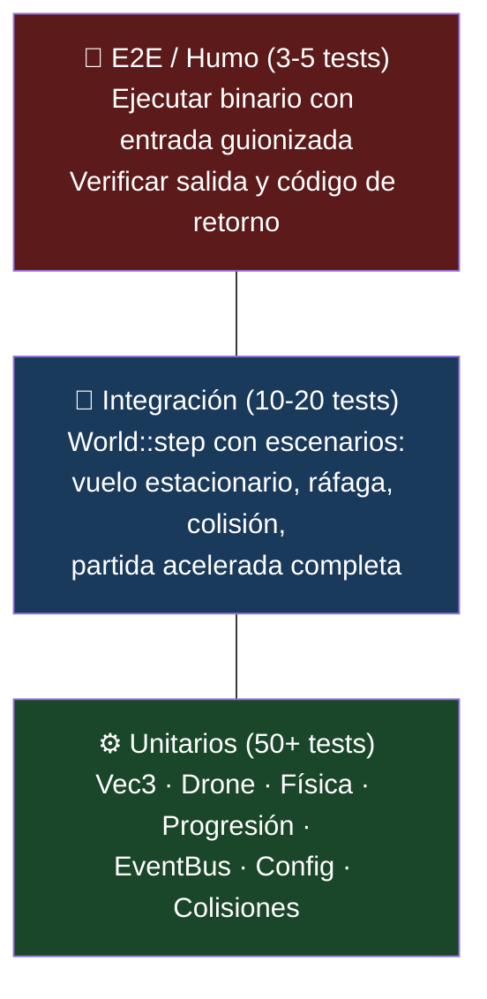

### 11.2 Framework y Configuración

- **Framework:** Catch2 v3 (header-only, sintaxis BDD, integración nativa con CTest).
- **Integración CMake:**
  ```cmake
  include(FetchContent)
  FetchContent_Declare(Catch2 GIT_REPOSITORY https://github.com/catchorg/Catch2.git
                       GIT_TAG v3.5.0)
  FetchContent_MakeAvailable(Catch2)
  add_executable(test_drone_core ${TEST_SOURCES})
  target_link_libraries(test_drone_core PRIVATE drone_core Catch2::Catch2WithMain)
  ```
- **Ejecución:** `ctest --output-on-failure` en CI; `cmake --build build && ctest --test-dir build` en local.

### 11.3 Catálogo de Tests Unitarios

| Módulo | Tests | Verifica |
|--------|-------|----------|
| **Vec3** | `+`, `-`, `*`, `+=`, `length()`, `normalized()`, borde: vector cero, magnitud negativa | Operaciones correctas |
| **Drone** | Batería inicial = 100%, mover con batería > 0 cambia posición, mover con batería = 0 no cambia posición, batería nunca < 0 ni > 100, setThrust/getThrust | Estado y consumo |
| **Physics** | Con empuje 0 y sin viento el dron cae, con empuje = gravedad se mantiene en hover, el suelo detiene la caída (y >= 0), viento desplaza horizontalmente, drag reduce velocidad | Física correcta |
| **Progression** | 100 XP → nivel 2, 250 XP → nivel 3 + 50 XP residual, XP negativa no permitida, unlockDrone() a nivel 3 devuelve string de desbloqueo | Progresión correcta (regresión B7) |
| **EventBus** | Suscribir/emitir, múltiples suscriptores, desuscribir, eventos sin suscriptores no explotan | Pub/sub correcto |
| **Config** | Constantes accesibles, rangos válidos | Configuración cargada |

### 11.4 Catálogo de Tests de Integración

| Escenario | Entrada | Verifica |
|-----------|---------|----------|
| Vuelo estacionario | Empuje = gravedad, sin viento | Altura constante (± ε) |
| Ráfaga de viento | Viento lateral 5 m/s durante 2s | Desplazamiento horizontal proporcional a `viento * dt^2` |
| Choque contra suelo | Empuje 0 desde altura 10m | Dron se detiene en y=0, no atraviesa |
| Batería agotada | Empuje constante hasta batería = 0 | Dron deja de ascender, empuje ignorado |
| Partida acelerada | Secuencia de comandos pregrabados | Trayectoria determinista; invariantes: y≥0, 0≤battery≤100 |
| Nivel 3 + desbloqueo | 300 XP acumulados | Evento `DroneUnlocked` emitido |

### 11.5 Tests E2E (Humo)

- El binario arranca, responde a `--version` y `--help`.
- Con entrada guionizada (`echo "w w w n" | ./DroneFlightSim`), el programa ejecuta, procesa comandos y termina con código 0.
- Uno por plataforma en CI (Linux, macOS, Windows).

### 11.6 Cobertura

- **Objetivo inicial:** 70% del core (`drone_core`).
- **Herramientas:** `gcov` (GCC) / `llvm-cov` (Clang) + `gcovr` o `lcov` para informes.
- **Informe en CI:** falla el build si la cobertura baja respecto al baseline.
- **No obsesionarse con el frontend:** la cobertura del renderizador es irrelevante; lo importante es la lógica.

### 11.7 Determinismo en Tests

- Semilla del generador de viento inyectable (`Environment::setWindSeed(uint64_t)`).
- Timestep fijo hace la física determinista por construcción.

---

## 12. Documentación Técnica

### 12.1 Plan de Documentación

| Documento | Contenido | Fase | Prioridad |
|-----------|-----------|------|-----------|
| `README.md` | Qué es, captura/gif, requisitos, build rápido, controles, cómo contribuir | Fase 1 | P0 |
| `PLAN2.md` | Este documento — hoja de ruta viva | Continuo | — |
| `docs/architecture.md` | Diagramas (clases, flujo, módulos), decisiones arquitectónicas, límites entre capas | Fase 1 | P0 |
| `docs/adr/` | Architecture Decision Records: una página por decisión técnica importante | Fase 1+ | P1 |
| `docs/style.md` | Convenciones de código C++, herramientas, ejemplos | Fase 1 | P1 |
| `CONTRIBUTING.md` | Flujo de ramas/PR, cómo ejecutar tests y linters, guía para primeras contribuciones | Fase 1 | P1 |
| `CHANGELOG.md` | Generado automáticamente desde Conventional Commits al taggear releases | Fase 3 | P2 |
| Comentarios Doxygen | Documentación de API pública del core (`@brief`, `@param`, `@return`) | Fase 2 | P2 |
| Página de documentación | GitHub Pages con Doxygen generado en CI | Fase 3 | P3 |

### 12.2 Template de ADR

```markdown
# ADR-00X: Título de la decisión

**Estado:** Propuesto | Aceptado | Reemplazado
**Fecha:** YYYY-MM-DD
**Contexto:** ...
**Decisión:** ...
**Alternativas consideradas:** ...
**Consecuencias:** ...
```

---

## 13. Gestión de Dependencias y Limpieza

### 13.1 Código a Eliminar o Reconectar

| Elemento | Estado actual | Acción | Fase |
|----------|--------------|--------|------|
| `Drone::velocity` | Declarada, nunca usada | Se usará de verdad en R4 | Fase 2 |
| `Drone::applyWind()` | Nunca llamada | La llamará `Environment` vía `PhysicsEngine` (R4, R6) | Fase 2 |
| `PlayerProgression::unlockDrone()` | Nunca llamada | Conectar vía `EventBus` (R7) | Fase 2 |
| `Drone::displayStatus()` | `std::cout` directo | Eliminar; reemplazar por getters (R3) | Fase 1 |
| `build/` entero | Comiteado en git | `git rm -r --cached` (R1) | Fase 1 |
| `archivo.txt`, `ar.txt` | Basura en historial | Eliminar del historial o ignorar | Fase 1 |
| `<iostream>` en `Drone.h` | Include innecesario | Eliminar (R9) | Fase 1 |
| `<cmath>` en `Drone.h` | Include no usado | Eliminar (R9) | Fase 1 |

### 13.2 Política de Dependencias

**Principio:** Dependencias mínimas, versiones fijadas, integración vía CMake `FetchContent`.

| Dependencia | Propósito | Fase | Mecanismo | Peso estimado |
|-------------|-----------|------|-----------|---------------|
| **Catch2 v3** | Testing unitario + integración | 1 | `FetchContent` | ~1 MB (header) |
| **spdlog** | Logging estructurado | 2 | `FetchContent` | ~500 KB (header) |
| **toml++** | Carga de configuración | 2 | `FetchContent` | ~300 KB (header) |
| **raylib** | Gráficos 2D/3D + entrada + audio | 3 | `FetchContent` o vcpkg | ~2 MB |
| **Dependencias NO recomendadas** | | | | |
| ~~Bullet Physics~~ | Motor de física 3D | — | — | Sobredimensionado para este alcance |
| ~~SDL2~~ | Ventana + entrada + audio | — | — | raylib proporciona lo mismo con API más simple |
| ~~OpenGL~~ | Gráficos 3D | — | — | raylib abstrae OpenGL |

### 13.3 Estrategia de Actualización

- **Lockfile:** `FetchContent` con `GIT_TAG` fijo (hash o tag inmutable).
- **Dependabot:** Activar para avisos de nuevas versiones de Catch2, spdlog, raylib.
- **Actualización manual:** Solo en ventana de mantenimiento; requiere CI verde + tests.

---

## 14. Mejoras de UX/UI y Accesibilidad

### 14.1 Fase 1 — Terminal Enriquecida

```
┌─────────────────────────────────────────────────┐
│  DRONE FLIGHT SIMULATOR          FPS: 60  ⏸    │
├─────────────────────────────────────────────────┤
│                                                 │
│              Altitud: 45.2 m                    │
│              Batería: [████████░░] 78%          │
│              Viento:  → 3.2 m/s                 │
│                                                 │
│         [ Vista 2.5D ASCII del dron ]           │
│                                                 │
├─────────────────────────────────────────────────┤
│  ⚡ Nivel 4  |  XP: 45/400  |  🚁 Modelo X     │
│  ℹ Batería baja — busca zona de aterrizaje     │
└─────────────────────────────────────────────────┘
```

- **HUD fijo con códigos ANSI:** sin scroll, repintado en el mismo lugar.
- **Barra de batería ASCII:** proporcional y numérica.
- **Indicador de viento:** dirección (flecha) + velocidad.
- **Línea de eventos:** mensajes con tiempo de vida ("¡Nivel 2!", "Batería baja", "Dron desbloqueado").
- **Pausa funcional:** menú navegable con teclas (no solo display, B8 resuelto).
- **Entrada en tiempo real:** sin necesidad de pulsar Enter (raw mode).

### 14.2 Fase 3 — Gráfico con raylib

- Vista 2.5D/3D con cámara siguiendo al dron.
- Minimapa en esquina.
- Indicadores analógicos de altitud y batería (barras + números).
- Efectos de partículas para viento y estela.
- Entornos con texturas diferenciadas.

### 14.3 Accesibilidad

| Requisito | Implementación | Fase |
|-----------|---------------|------|
| **Controles remapeables** | Fichero de configuración `controls.toml` | Fase 2 |
| **No depender solo del color** | Batería con porcentaje + barra; paleta segura para daltonismo (viridis) | Fase 2 |
| **Escala de HUD configurable** | Tamaño de fuente/texto ajustable | Fase 3 |
| **Subtítulos de eventos** | Eventos del juego con texto descriptivo en pantalla | Fase 3 |
| **Modo asistencia** | Estabilización automática del dron (reduce carga cognitiva, sirve de tutorial) | Fase 3 |
| **Alto contraste** | Modo visual simplificado con colores de alto contraste | Fase 3 |

---

## 15. Estrategia de CI/CD y Automatización

### 15.1 Pipeline de CI

```mermaid
flowchart LR
    PR["Push / Pull Request"] --> FMT["🎨 clang-format<br/>--dry-run -Werror"]
    FMT --> LINT["🔍 clang-tidy<br/>+ cppcheck"]
    LINT --> BUILD["🔨 Build Matrix<br/>Ubuntu gcc+clang<br/>macOS clang<br/>Windows MSVC<br/>Debug + Release"]
    BUILD --> TEST["✅ ctest<br/>unit + integración<br/>+ humo E2E"]
    TEST --> COV["📊 Cobertura<br/>llvm-cov/gcov<br/>comentario en PR"]
    COV --> MERGE{"Todo ✓?"}

    MERGE -->|sí| MAIN["Merge a main"]
    MAIN --> TAG["Tag semver"]
    TAG --> REL["📦 Release<br/>Binarios 3 plataformas<br/>+ changelog automático"]

    style FMT fill:#3a3a1a,color:#fff
    style LINT fill:#1a3a5c,color:#fff
    style BUILD fill:#1a472a,color:#fff
    style TEST fill:#5c1a1a,color:#fff
    style REL fill:#3a1a5c,color:#fff
```

### 15.2 Workflows de GitHub Actions

**`.github/workflows/ci.yml`** — Disparado en cada push y PR:

```yaml
name: CI
on: [push, pull_request]
permissions:
  contents: read
jobs:
  lint:
    runs-on: ubuntu-latest
    steps:
      - uses: actions/checkout@v4
      # git ls-files en lugar de globs: los ** no expanden en el shell del runner
      - run: clang-format --dry-run -Werror $(git ls-files '*.h' '*.cpp')
      # clang-tidy necesita el compile_commands.json que genera CMake
      - run: cmake -B build -DCMAKE_EXPORT_COMPILE_COMMANDS=ON
      - run: run-clang-tidy -p build $(git ls-files 'src/*.cpp')
      # Guardia de arquitectura: el core no puede tocar iostream (falla si D1 reaparece)
      - run: "! grep -rn 'cout\\|cin\\|printf' src/core/"
  build-and-test:
    needs: lint
    strategy:
      matrix:
        os: [ubuntu-latest, macos-latest, windows-latest]
        build-type: [Debug, Release]
    runs-on: ${{ matrix.os }}
    steps:
      - uses: actions/checkout@v4
      - run: cmake -B build -DCMAKE_BUILD_TYPE=${{ matrix.build-type }} -DDRONE_WERROR=ON
      - run: cmake --build build --config ${{ matrix.build-type }} --parallel
      - run: ctest --test-dir build -C ${{ matrix.build-type }} --output-on-failure
  sanitizers:
    needs: lint
    runs-on: ubuntu-latest
    steps:
      - uses: actions/checkout@v4
      - run: cmake -B build -DCMAKE_BUILD_TYPE=Debug
             -DCMAKE_CXX_FLAGS="-fsanitize=address,undefined -fno-omit-frame-pointer"
      - run: cmake --build build --parallel
      - run: ctest --test-dir build --output-on-failure
```

> El job `sanitizers` materializa la medida de §10.2 desde el primer día; el paso `grep` convierte la regla "cero `std::cout` en el core" (§18.1) en un check automático en vez de una intención.

**`.github/workflows/release.yml`** — Disparado por tag `v*`:

```yaml
name: Release
on:
  push:
    tags: ['v*']
jobs:
  release:
    strategy:
      matrix:
        os: [ubuntu-latest, macos-latest, windows-latest]
    runs-on: ${{ matrix.os }}
    steps:
      - uses: actions/checkout@v4
      - run: cmake -B build -DCMAKE_BUILD_TYPE=Release
      - run: cmake --build build
      - run: cmake --install build --prefix dist
      - uses: actions/upload-artifact@v4
        with:
          name: DroneFlightSim-${{ runner.os }}
          path: dist/
  publish:
    needs: release
    runs-on: ubuntu-latest
    steps:
      - uses: actions/download-artifact@v4
      - uses: softprops/action-gh-release@v1
        with:
          files: DroneFlightSim-*
          generate_release_notes: true
```

### 15.3 Automatización Adicional

| Herramienta | Propósito |
|-------------|-----------|
| **Dependabot** | Actualización de acciones de GitHub + dependencias FetchContent |
| **pre-commit** | Hook local opcional: clang-format al commitear |
| **Plantillas de Issue/PR** | `.github/ISSUE_TEMPLATE/bug_report.md`, `feature_request.md` |
| **Generación de changelog** | `softprops/action-gh-release` con `generate_release_notes: true` |

### 15.4 Reglas de Protección de Rama

- `main` protegida: no se puede pushear directamente.
- Merge solo con: CI verde, 1 revisión aprobatoria, sin conflictos.
- Linear history: squash merge o rebase merge.

---

## 16. Estrategia de Despliegue y Monitoreo

### 16.1 Distribución de Binarios

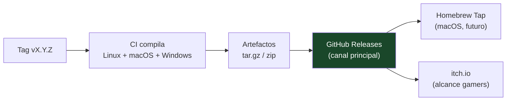

**Estrategia de canales:**

| Canal | Plataforma | Audiencia | Fase |
|-------|-----------|-----------|------|
| GitHub Releases | Linux, macOS, Windows | Desarrolladores, early adopters | Fase 2+ |
| Homebrew Tap | macOS | Usuarios de terminal | Fase 3 |
| itch.io | Windows, Linux | Jugadores | Fase 3 |

### 16.2 Versionado Semántico (SemVer)

```
v<MAJOR>.<MINOR>.<PATCH>

MAJOR: Cambios incompatibles en API/savefiles
MINOR: Nuevas funcionalidades compatibles
PATCH: Correcciones de bugs

Ejemplos:
  v0.1.0 — Primer binario jugable (Fase 1)
  v0.2.0 — Física real + HUD (Fase 2)
  v0.9.0 — Beta con gráficos (Fase 3 temprana)
  v1.0.0 — Lanzamiento oficial
```

### 16.3 Empaquetado con CPack

```cmake
# CMakeLists.txt (raíz)
include(CPack)
set(CPACK_PACKAGE_NAME "DroneFlightSim")
set(CPACK_PACKAGE_VERSION "1.0.0")
set(CPACK_GENERATOR "TGZ;ZIP")
```

### 16.4 Monitoreo y Diagnóstico

| Componente | Herramienta | Fase |
|-----------|-------------|------|
| **Logging** | spdlog con rotación de archivos y niveles (trace/debug/info/warn/error) | Fase 2 |
| **FPS counter** | Contador en HUD de debug (toggle con F3) | Fase 2 |
| **Frame time** | Registro en log del p95 cada 1000 frames | Fase 3 |
| **Crash dump** | Captura local con stack trace en debug builds | Fase 3 |
| **Telemetría** | ❌ No implementar. Juego offline. | — |
| **Feedback opcional** | Botón "Reportar bug" que abre issue de GitHub con log adjunto | Fase 3 |

### 16.5 Métricas de Calidad Continuas

| Métrica | Fuente | Visualización |
|---------|--------|---------------|
| Cobertura de tests | llvm-cov/gcov en CI | Badge en README + comentario en PR |
| Estado de build | GitHub Actions | Badge en README |
| Bugs abiertos | GitHub Issues | Tablero de proyecto |
| Versión actual | Git tags | Badge en README |
| Licencia | LICENSE | Badge en README |

---

## 17. Roadmap Priorizado con Estimaciones

### 17.1 Diagrama de Gantt

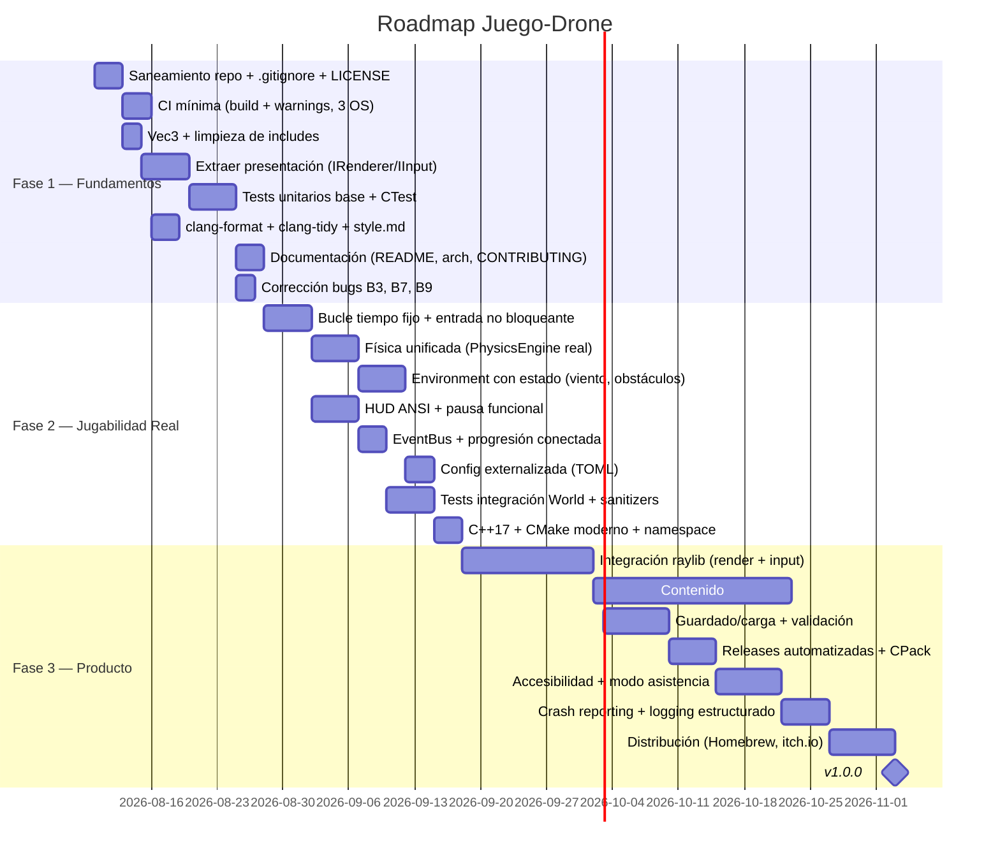

### 17.2 Tabla de Tareas Priorizadas

#### Fase 1 — Fundamentos (Semanas 1–4)

| ID | Tarea | Ref. | Prioridad | Esfuerzo | Impacto | Riesgo |
|----|-------|------|-----------|----------|---------|--------|
| 1.1 | Crear `.gitignore`, eliminar `build/` de git, añadir LICENSE (MIT) | R1, D9 | P0 🔴 | XS (2h) | Alto | Ninguno |
| 1.2 | Configurar CI mínima: build + warnings en Linux/macOS/Windows | §15 | P0 🔴 | S (4h) | Alto | Configuración de runners |
| 1.3 | Implementar `Vec3` + tests + sustituir tríos x,y,z | R2, D4 | P1 🟠 | S (3h) | Medio | Ninguno |
| 1.4 | Crear `IRenderer`/`IInputSource`, extraer todos los `std::cout` | R3, D1 | P0 🔴 | M (8h) | Muy alto | Ninguno |
| 1.5 | Tests unitarios: Vec3, Drone, Progression + CTest en CI | §11 | P0 🔴 | M (6h) | Muy alto | Elegir framework |
| 1.6 | Configurar clang-format + clang-tidy + docs/style.md | §8 | P1 🟠 | S (3h) | Medio | Falsa alarma de tidy |
| 1.7 | README ampliado + CONTRIBUTING.md + docs/architecture.md | §12 | P1 🟠 | S (3h) | Medio | Ninguno |
| 1.8 | Corregir B3 (validación `std::cin`), B7 (XP), B9 (batería) | §5.1 | P1 🟠 | S (2h) | Alto | B3 se resuelve con R5 |

#### Fase 2 — Jugabilidad Real (Semanas 5–12)

| ID | Tarea | Ref. | Prioridad | Esfuerzo | Impacto | Riesgo |
|----|-------|------|-----------|----------|---------|--------|
| 2.1 | Implementar bucle de tiempo fijo + entrada no bloqueante | R5 | P0 🔴 | M (8h) | Muy alto | termios es POSIX-only |
| 2.2 | Reescribir `PhysicsEngine`: empuje, gravedad, drag, colisiones AABB | R4 | P0 🔴 | M (8h) | Muy alto | Complejidad de colisiones |
| 2.3 | `Environment` con estado: viento suavizado, dificultad, obstáculos | R6, D3 | P1 🟠 | M (6h) | Alto | Generación de viento |
| 2.4 | HUD ANSI: posición, batería, viento, FPS, eventos | §14 | P1 🟠 | M (6h) | Alto | Códigos ANSI cross-platform |
| 2.5 | `EventBus` + conectar `unlockDrone()` + corregir progresión | R7 | P1 🟠 | S (4h) | Medio | Ninguno |
| 2.6 | Configuración externalizada en `game.toml` + spdlog | R8 | P2 🟢 | S (4h) | Medio | Parseo de TOML |
| 2.7 | Tests de integración de `World` + sanitizers en CI | §11 | P1 🟠 | M (6h) | Alto | Sanitizers en CI |
| 2.8 | Migrar a C++17 + namespace `drone` + CMake moderno | R9 | P2 🟢 | S (3h) | Medio | Compatibilidad de compiladores |

#### Fase 3 — Producto (Semanas 13–24+)

| ID | Tarea | Ref. | Prioridad | Esfuerzo | Impacto | Riesgo |
|----|-------|------|-----------|----------|---------|--------|
| 3.1 | Integrar raylib: render 2.5D/3D, cámara, entrada, audio básico | §6, §14 | P0 🔴 | L (24h) | Muy alto | Curva de aprendizaje raylib |
| 3.2 | Crear 3+ entornos jugables con obstáculos y condiciones de viento | — | P1 🟠 | L (20h) | Alto | Diseño de niveles |
| 3.3 | Sistema de guardado/carga con validación (JSON/TOML) | §10 | P1 🟠 | M (8h) | Alto | Migración de formato |
| 3.4 | Workflow de release: build multiplataforma + CPack + GitHub Releases | §15 | P1 🟠 | M (6h) | Alto | Firma de binarios |
| 3.5 | Accesibilidad: remapeo de controles, daltonismo, modo asistencia | §14 | P2 🟢 | M (8h) | Medio | Testing de accesibilidad |
| 3.6 | Crash reporting local + volcado de estado | §16 | P2 🟢 | S (4h) | Medio | Stack trace cross-platform |
| 3.7 | Distribución: Homebrew Tap, itch.io, página web | §16 | P3 🔵 | M (8h) | Medio | Requisitos de cada plataforma |

---

## 18. Métricas de Éxito y KPIs

### 18.1 Criterios de Aceptación por Fase

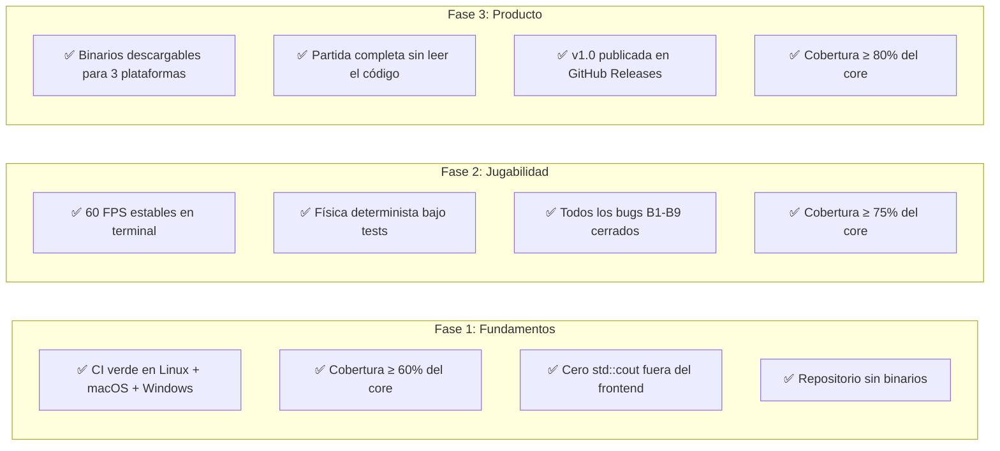

### 18.2 KPIs Técnicos

| KPI | Objetivo | Medición |
|-----|----------|----------|
| Cobertura de tests | ≥ 80% del core | llvm-cov en CI |
| Tiempo de CI | < 5 minutos | GitHub Actions |
| Bugs abiertos | 0 críticos, < 5 totales | GitHub Issues |
| Frame time p99 | < 20 ms | Logging |
| Binario Release | < 5 MB | `ls -lh` en CI |
| Dependencias directas | ≤ 4 | CMakeLists.txt |
| Tiempo de build limpio | < 30 segundos | Medir en CI |

### 18.3 KPIs de Proyecto

| KPI | Objetivo | Medición |
|-----|----------|----------|
| Commits convencionales | 100% | CI lint |
| Tiempo hasta PR merge | < 48h | GitHub Insights |
| Releases | 1 por fase | GitHub Releases |
| Documentación actualizada | ≤ 1 semana de desfase | Revisión manual |

---

## 19. Gestión de Riesgos

Las tablas del roadmap (§17.2) señalan riesgos por tarea; aquí se consolidan los transversales, con disparador de alarma y mitigación decidida de antemano:

| ID | Riesgo | Prob. | Impacto | Disparador de alarma | Mitigación |
|----|--------|-------|---------|----------------------|------------|
| RG-1 | La entrada raw de terminal se complica entre emuladores/SO | Media | Alto (bloquea la Fase 2) | La tarea 2.1 no cierra en 1 semana | Está aislada tras `IInputSource`: *timebox* de 3 días; si falla, fallback temporal a entrada por línea sin tocar nada más; raylib la reemplaza en Fase 3. Windows ya pospuesto por decisión (R5) |
| RG-2 | *Scope creep*: añadir features antes de cerrar fundamentos | Alta | Alto | PRs de features con tareas P0 de la fase abiertas | Regla dura: ninguna feature nueva mientras queden P0 de la fase en curso; PLAN2.md es el backlog único |
| RG-3 | Ajuste de física frustrante (dron incontrolable o soso) | Media | Medio | Feedback de la primera build jugable (fin de 2.2) | Parámetros externalizados en `game.toml` (R8) ⇒ iterar sin recompilar; modo asistencia (§14.3) como red de seguridad |
| RG-4 | Factor bus = 1 (un solo desarrollador) | Alta | Medio | — (estructural) | Este documento + ADRs + CI hacen el proyecto retomable por cualquiera; PRs pequeños y descriptivos como bitácora |
| RG-5 | Dependencias (Catch2/raylib/toml++) rompen el build | Baja | Medio | CI rojo tras un bump de Dependabot | `GIT_TAG` fijo e inmutable en FetchContent (§13.3); Dependabot propone, un humano dispone |
| RG-6 | El HUD ANSI a 60 FPS parpadea en terminales lentas | Media | Bajo | Prueba en Terminal.app/iTerm2 durante la tarea 2.4 | Repintado diferencial (solo celdas cambiadas) y cap del refresco del HUD a 30 Hz independiente de la simulación a 60 Hz |
| RG-7 | El plan y la realidad divergen silenciosamente | Media | Medio | PLAN2.md sin actualizar durante > 1 fase | Revisión obligatoria del documento como última tarea de cada fase (ya prevista en §12.1) |

---

## 20. Trazabilidad con PLAN.md

Garantía de que nada del plan v1 se pierde: cada elemento de [PLAN.md](PLAN.md) tiene dueño en este documento.

| Elemento de PLAN.md | Dónde vive en PLAN2.md |
|---------------------|------------------------|
| §2 Estructura y organización | §2 (ampliado con mapa de dependencias efectivas §2.3) |
| §3 Arquitectura actual + diagramas | §3 (ampliado con flujo de datos §3.3) |
| §4 Fortalezas | §4 |
| §5 Bugs B1–B9 y deudas D1–D10 | §5, mismos identificadores (más matriz de riesgo §5.3) |
| §6 Arquitectura propuesta core/frontend | §6 (ampliado con máquina de estados §6.5) |
| §7 Refactorizaciones R1–R9 | §7, mismos identificadores, con código de referencia |
| §8–§16 (estándares, rendimiento, seguridad, testing, docs, dependencias, UX, CI/CD, despliegue) | §8–§16, sección a sección, con el mismo alcance ampliado |
| §17 Roadmap en 3 fases y criterios de éxito | §17 (con estimaciones en horas) y §18.1 |

**Divergencias deliberadas respecto a PLAN.md** (mejoras, no pérdidas):

1. **`Game` → `GameController`** en el core propuesto: nombre más preciso; el bucle y la máquina de estados son control, no "el juego" entero.
2. **Fase 2 pasa de ~8 a 8 semanas explícitas (semanas 5–12)** con estimaciones por tarea: más realista que "meses 2–3".
3. **Decisiones cerradas** donde PLAN.md dejaba alternativas: Catch2 (no GoogleTest), raylib (no SDL2), física propia (no Bullet), `m_` como prefijo de miembros (PLAN.md pedía "elegir uno").
4. **Telemetría descartada explícitamente** (§16.4): PLAN.md contemplaba crash reporting opt-in; se mantiene el reporte manual de bugs con log adjunto, sin envío automático de datos.
5. **Windows terminal interactivo pospuesto a Fase 3** por decisión (R5); PLAN.md no lo resolvía.

---

## Apéndice A: Glosario

| Término | Definición |
|---------|-----------|
| **AABB** | Axis-Aligned Bounding Box — caja de colisión alineada a los ejes |
| **ADR** | Architecture Decision Record — documento que registra una decisión arquitectónica |
| **ANSI** | Códigos de escape para control de terminal (colores, movimiento de cursor) |
| **ASan** | AddressSanitizer — detector de errores de memoria en tiempo de ejecución |
| **CI/CD** | Integración Continua / Despliegue Continuo |
| **CPack** | Herramienta de empaquetado de CMake |
| **CTest** | Herramienta de testing de CMake |
| **FetchContent** | Módulo de CMake para descargar dependencias en tiempo de configuración |
| **HUD** | Heads-Up Display — interfaz superpuesta en pantalla |
| **SemVer** | Versionado Semántico (MAJOR.MINOR.PATCH) |
| **Timestep fijo** | Técnica donde la física avanza en pasos de tiempo constantes |
| **UBSan** | UndefinedBehaviorSanitizer — detector de comportamiento indefinido |

---

## Apéndice B: Referencias

| Recurso | Enlace |
|---------|--------|
| Fix Your Timestep (Gaffer on Games) | `https://gafferongames.com/post/fix_your_timestep/` |
| Game Programming Patterns (Robert Nystrom) | `https://gameprogrammingpatterns.com/` |
| Catch2 Documentation | `https://github.com/catchorg/Catch2` |
| raylib Documentation | `https://www.raylib.com/` |
| CMake FetchContent | `https://cmake.org/cmake/help/latest/module/FetchContent.html` |
| Conventional Commits | `https://www.conventionalcommits.org/` |
| clang-tidy Checks | `https://clang.llvm.org/extra/clang-tidy/checks/list.html` |

---

*Documento generado a partir del análisis exhaustivo del commit `1c3a019`. Actualizar al cierre de cada fase como registro vivo de la evolución del proyecto.*

**Próxima revisión:** Al finalizar la Fase 1 (≈ 4 semanas).
