# PLAN3.md — Auditoría Técnica Independiente y Hoja de Ruta v3.1

> **Propósito:** Auditoría completa del código fuente. Cada hallazgo está respaldado por evidencia directa del código — sin asumir documentación.
>
> **Fecha:** 2026-08-04 · **Versión binario:** 0.5.0 (commit `76deeb4`) · **Tests:** 48
>
> **Cambios v3.1 (revisión de la auditoría):** se re-verificó cada afirmación contra el código y se corrigieron datos (conteo de ficheros/LOC/tests, tamaño del binario, hallazgo del badge, riesgo de termios), se descartó un falso positivo (S3), se detectó un **conflicto de diseño no visto en v3.0** (P0-1 logging dentro del core viola el guard de CI que prohíbe I/O en `src/core/` — resuelto en §14.2.1), se recolocó el hito v1.0 (antes dependía del editor de niveles, tarea P4), y se añadió la trazabilidad con PLAN2.md (§17).
>
> **Linaje:** [PLAN.md](PLAN.md) (análisis v1) → [PLAN2.md](PLAN2.md) (ejecución v2, Fases 1–2 completadas en v0.5.0) → **PLAN3.md** (auditoría del resultado y hoja de ruta hacia v1.0).

---

## Índice

1. [Resumen Ejecutivo](#1-resumen-ejecutivo)
2. [Arquitectura Actual — Verificación](#2-arquitectura-actual--verificación)
3. [Calidad del Código](#3-calidad-del-código)
4. [Motor del Juego](#4-motor-del-juego)
5. [Frontend](#5-frontend)
6. [Configuración](#6-configuración)
7. [Logging y Diagnóstico](#7-logging-y-diagnóstico)
8. [Testing — Auditoría](#8-testing--auditoría)
9. [CI/CD — Auditoría](#9-cicd--auditoría)
10. [Seguridad y Robustez](#10-seguridad-y-robustez)
11. [Documentación — Verificación](#11-documentación--verificación)
12. [UX del Juego](#12-ux-del-juego)
13. [Catálogo de Hallazgos](#13-catálogo-de-hallazgos)
14. [Roadmap Priorizado](#14-roadmap-priorizado)
15. [Diagramas de Arquitectura](#15-diagramas-de-arquitectura)
16. [Métricas de Éxito](#16-métricas-de-éxito)
17. [Trazabilidad con PLAN2.md y Riesgos](#17-trazabilidad-con-plan2md-y-riesgos)

---

## 1. Resumen Ejecutivo

### 1.1 Metodología

Esta auditoría inspeccionó **cada archivo fuente** (59 ficheros trackeados; 1.922 líneas en `src/` + `tests/`). Cada afirmación se verificó contra el código real; la revisión v3.1 repitió esa verificación sobre los propios hallazgos.

### 1.2 Veredicto General

| Dimensión | Nota | Evidencia clave |
|-----------|------|-----------------|
| **Arquitectura** | 9/10 | Separación core/frontend por inyección, DTOs limpios, sin I/O en core |
| **Calidad de código** | 8/10 | Namespace `drone`, `m_` consistente, 3 violaciones de guía de estilo |
| **Motor de juego** | 8/10 | Timestep fijo 60 Hz, Euler semi-implícito, máquina de estados completa |
| **Física** | 8/10 | Fuerzas correctas, colisiones AABB, umbrales de batería, velocidad terminal |
| **Testing** | 7/10 | 48 tests, 6 módulos cubiertos, faltan tests de GameController y frontend |
| **CI/CD** | 8/10 | Matriz 3 OS × 2 configs, sanitizers, guard de arquitectura |
| **Documentación** | 7/10 | ADR presentes, style guide, architecture doc |
| **UX** | 6/10 | HUD funcional, eventos visibles, sin guardado, sin audio, sin gráficos |
| **Preparación prod.** | 5/10 | Sin logging, sin config externa, sin save/load, sin gráficos, sin audio |

### 1.3 Distribución de Tareas

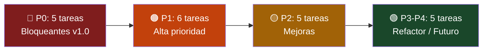

---

## 2. Arquitectura Actual — Verificación

### 2.1 Diagrama de Componentes

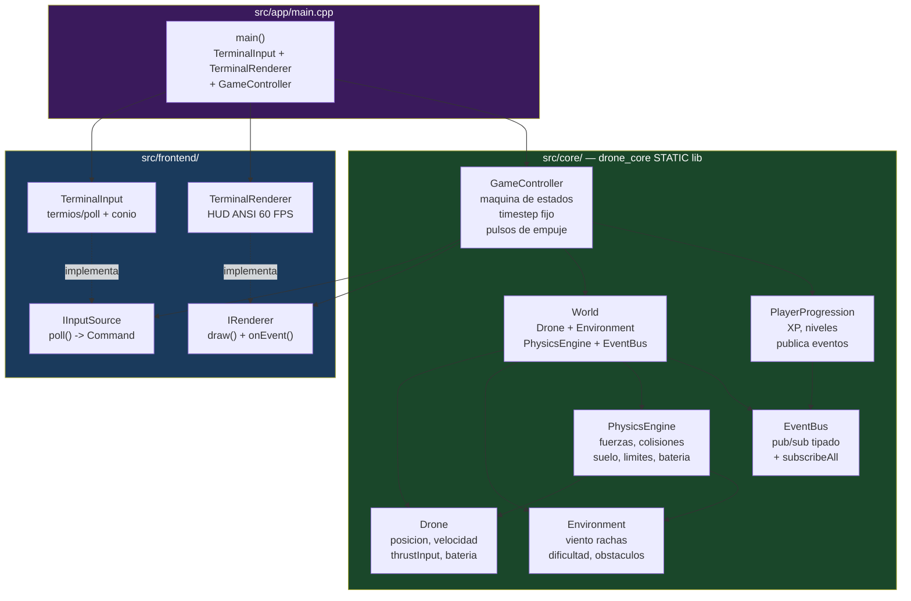

**Verificación:** Todas las flechas confirmadas contra `#include` y llamadas a métodos en el código fuente.

### 2.2 Regla de Dependencias — Verificada

| Regla | Evidencia | Estado |
|-------|-----------|--------|
| Core no incluye implementaciones de frontend | `GameController.h` incluye `frontend/IInputSource.h` y `frontend/IRenderer.h` (interfaces puras). Nunca incluye `terminal/`. | ✅ |
| Core no hace I/O | CI verifica con `! grep -rn 'cout\|cin\|printf' src/core/` | ✅ |
| Solo main.cpp conoce implementaciones concretas | `src/app/main.cpp:39-41` construye TerminalInput, TerminalRenderer, GameController | ✅ |
| Frontend conoce DTOs del core | `IRenderer.h` incluye `core/WorldState.h` y `core/Events.h` | ✅ |
| Core usa `namespace drone` | Verificado en los 14 headers de `src/core/` | ✅ |

### 2.3 Inversión de Dependencias

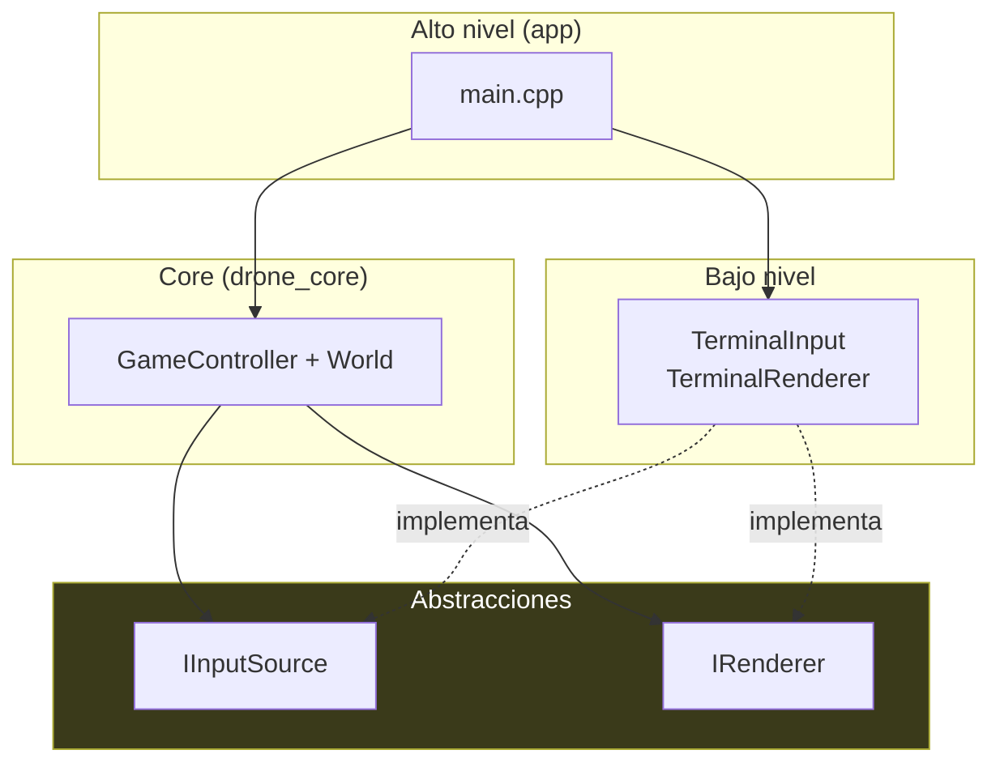

**Verificación:** `GameController` recibe `IInputSource&` e `IRenderer&` por constructor (`GameController.h:17`). Nunca incluye implementaciones concretas.

### 2.4 Mapa de Módulos (dependencias CMake)

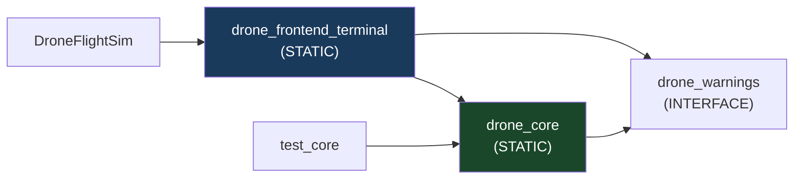

**Fuente:** `src/core/CMakeLists.txt:10`, `src/frontend/CMakeLists.txt:6-8`, `src/app/CMakeLists.txt:4-5`

---

## 3. Calidad del Código

### 3.1 Violaciones de la Guía de Estilo

| ID | Archivo:Línea | Violación | Gravedad |
|----|---------------|-----------|----------|
| **S1** | `tests/unit/TestPhysics.cpp:10` | `using namespace drone;` en ámbito global (docs/style.md prohíbe `using namespace` en headers; en .cpp es zona gris pero inconsistente con otros tests) | Media |
| **S2** | `tests/integration/TestWorldStep.cpp:7` | `using namespace drone;` en ámbito global | Media |
| **S3** | `src/core/PlayerProgression.cpp:26` | ~~`if (m_level == config::kUnlockLevel)` — debería usar `>=`~~ **DESCARTADO en v3.1 (falso positivo):** `levelUp()` solo se invoca desde el `while` de `addExperience()`, que incrementa el nivel de uno en uno; el nivel no puede "saltarse" `kUnlockLevel`, y con `>=` el evento se publicaría en cada nivel ≥ 3 (spam). El `==` es correcto. | — |

### 3.2 Números Mágicos Residuales

| ID | Ubicación | Valor | Debería ser |
|----|-----------|-------|-------------|
| **M1** | `GameController.cpp:13` | `kMaxCommandsPerFrame = 32` (constexpr local) | Debería estar en `Config.h` |
| **M2** | `Environment.cpp:19-21` | Obstáculos hardcodeados con coordenadas literales | Deberían cargarse de `assets/levels/` |
| **M3** | `TerminalRenderer.cpp:93` | `char line[160]` con snprintf — tamaño de buffer fijo | `constexpr size_t kLineBufferSize = 160` |

### 3.3 Deuda Técnica

| ID | Descripción | Ubicación | Impacto |
|----|-------------|-----------|---------|
| **T1** | `PlayerProgression` usa `EventBus*` (nullable) — inconsistente con `PhysicsEngine` que usa `EventBus&` | `PlayerProgression.h:19`, `PhysicsEngine.h:14` | Bajo |
| **T2** | `World::events()` devuelve referencia no-const — permite suscripciones externas sin control | `World.h:27` | Bajo |
| **T3** | `TerminalInput::poll()` usa `poll(0)` con timeout 0 — polling sin pausa | `TerminalInput.cpp:107` | Bajo |
| **T4** | `GameController::m_xpFraction` acumula error de punto flotante con el tiempo | `GameController.cpp:160` | Muy bajo |

### 3.4 Código Muerto

**No se encontró código muerto.** `unlockDrone()` está conectado vía tests (`TestProgression.cpp:61`).

### 3.5 SOLID — Evaluación

| Principio | Cumple | Evidencia |
|-----------|--------|-----------|
| **S** Single Responsibility | ✅ | `Drone`=estado, `PhysicsEngine`=fuerzas, `GameController`=orquestación |
| **O** Open/Closed | ✅ | Nuevo frontend = nueva implementación de interfaces sin tocar core |
| **L** Liskov | ✅ | `TerminalInput` y `TerminalRenderer` son sustituibles |
| **I** Interface Segregation | ✅ | `IInputSource` solo `poll()`, `IRenderer` solo `draw()` + `onEvent()` |
| **D** Dependency Inversion | ✅ | GameController depende de interfaces, no implementaciones |

---

## 4. Motor del Juego

### 4.1 Bucle Principal

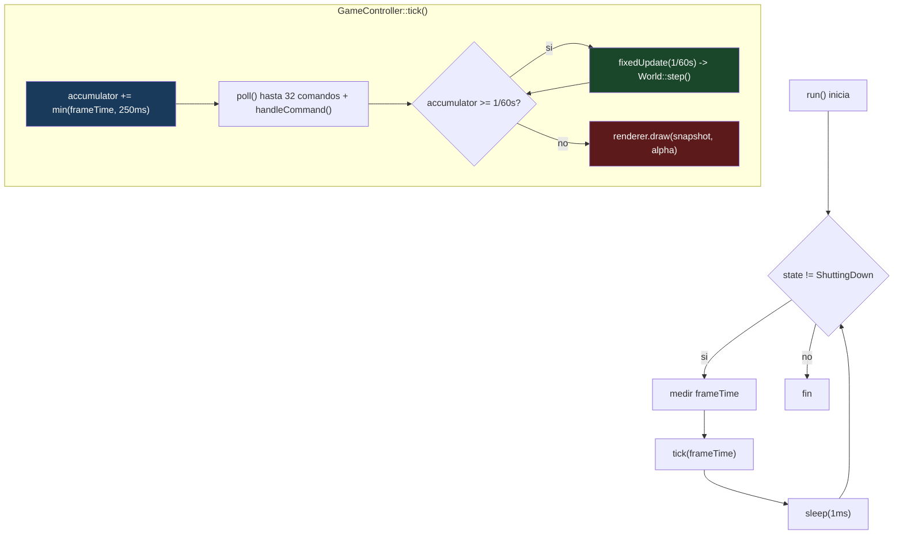

**Verificación:** `GameController.cpp:51-78`. Timestep: `Config.h:27` (1/60s). Clamp: `Config.h:28` (250ms). Límite comandos: `GameController.cpp:13` (32).

### 4.2 Ciclo de Actualización (fixedUpdate)

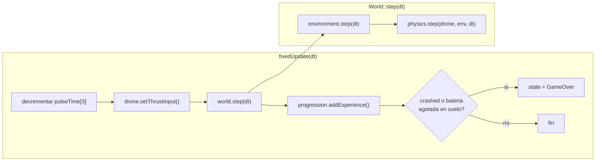

### 4.3 Física — Diagrama de Fuerzas

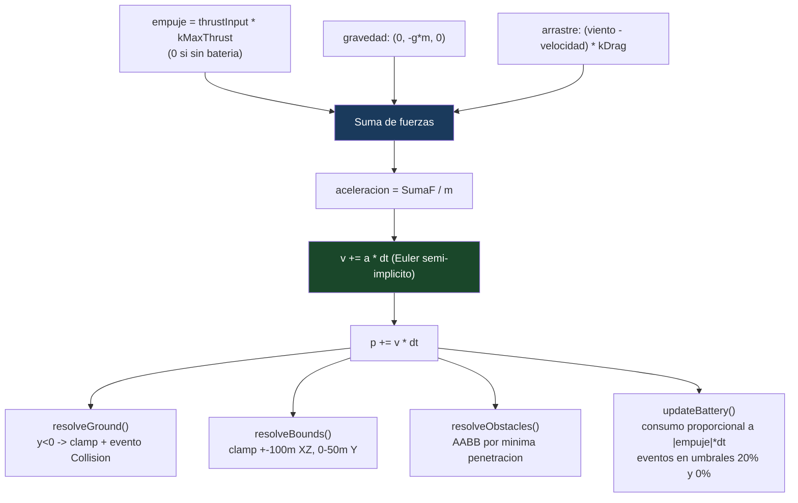

**Fuente:** `PhysicsEngine.cpp:27-36` (integración), `:40-49` (suelo), `:51-65` (límites), `:67-90` (obstáculos), `:92-103` (batería).

### 4.4 Eventos

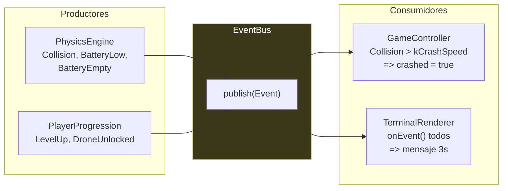

### 4.5 Máquina de Estados

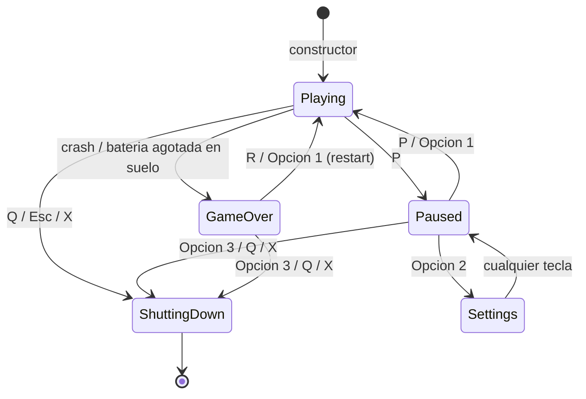

**Verificación:** `GameController.cpp:83-149` implementa estas transiciones. `GameState.h` define el enum.

---

## 5. Frontend

### 5.1 Flujo de Entrada

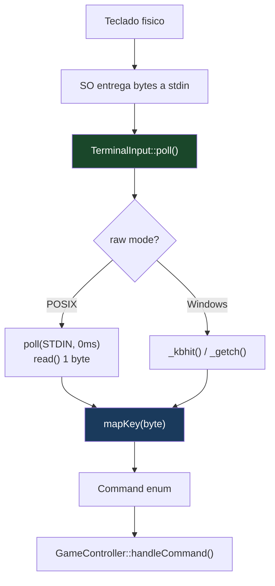

### 5.2 Flujo de Render

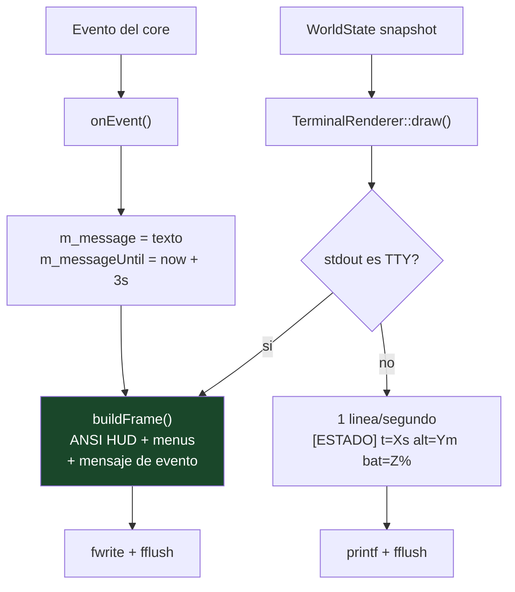

**Verificación:** `TerminalRenderer.cpp:163-193` (buildFrame), `:195-209` (draw), `:211-233` (onEvent).

---

## 6. Configuración

### 6.1 Estado Actual

Todas las constantes en `src/core/Config.h` como `inline constexpr`. Correcto para constantes de compilación, pero no permite cambios sin recompilar.

### 6.2 Tarea 2.6 Pendiente (Confirmado)

- `assets/config/.gitkeep` vacío (0 bytes)
- Sin parser TOML
- Sin `spdlog` en FetchContent
- `Config.h:3`: `// Fase 2 pendiente (tarea 2.6): sobreescritura desde assets/config/game.toml`
- **Única tarea pendiente de Fases 1-2**

---

## 7. Logging y Diagnóstico — Inexistente

Sin sistema de logging:
- Sin spdlog, sin escritura a archivo, sin niveles, sin rotación
- Único output: `printf` en modo no-TTY (1 línea/s)

---

## 8. Testing — Auditoría

### 8.1 Cobertura por Módulo

| Módulo | Archivo de test | Tests | ¿Completo? |
|--------|-----------------|-------|-------------|
| Vec3 | `TestVec3.cpp` | 11 | ✅ |
| Drone | `TestDrone.cpp` | 5 | ✅ |
| EventBus | `TestEventBus.cpp` | 5 | ✅ |
| Physics | `TestPhysics.cpp` | 9 | ✅ |
| Progression | `TestProgression.cpp` | 8 | ✅ |
| World (integración) | `TestWorldStep.cpp` | 6 | ✅ |
| Humo E2E | `tests/CMakeLists.txt` | 4 | Solo UNIX |

### 8.2 Tests Faltantes

| Módulo | Qué falta | Prioridad |
|--------|-----------|-----------|
| **GameController** | Tests unitarios de `tick()`, `handleCommand()` por estado, transiciones de estados | P0 |
| **TerminalInput** | Tests con entrada simulada vía pipe | P1 |
| **TerminalRenderer** | Tests de `buildFrame()` con snapshots conocidos | P2 |
| **Environment** | Tests unitarios de generación de rachas con semilla fija | P2 |
| **Error paths** | Tests de condiciones de borde: NaN, valores extremos | P2 |

---

## 9. CI/CD — Auditoría

### 9.1 Workflow Actual (verificado contra `.github/workflows/ci.yml`)

```yaml
# Resumen verificado:
jobs:
  lint:         # clang-format 19.1.7 + guard anti-iostream en core
  build-and-test: # Debug+Release x ubuntu/macos/windows, -Werror, ctest
  sanitizers:   # ASan+UBSan en ubuntu Debug
```

**Hallazgos (corregidos en v3.1):**
- ~~Sin badge de CI en README~~ **Corrección:** el badge existe y apunta al repo correcto (`jabc585/Juego-Drone` **es** el remoto `origin`); mostrará estado real cuando se haga el primer push y corra la CI en los runners.
- Sin job de coverage (gcov/llvm-cov) — el objetivo de cobertura de PLAN2 §18 no es medible hoy.
- Sin clang-tidy integrado en CI (aunque `.clang-tidy` existe y está alineado con docs/style.md).
- Sin cppcheck.

### 9.2 Release (verificado contra `.github/workflows/release.yml`)

Correcto: build Release en 3 OS sin tests, `cmake --install`, artifact upload, GitHub Release con `generate_release_notes`.

---

## 10. Seguridad y Robustez

### 10.1 Verificación

| Aspecto | Estado | Evidencia |
|---------|--------|-----------|
| RAII para terminal | ✅ | `TerminalInput::~TerminalInput()` restaura termios |
| Sin buffer overflows | ✅ | `snprintf` con sizeof(buffer) en todos los casos |
| Sin UB detectado | ✅ | Sanitizers en CI pasan |
| EOF manejado | ✅ | `TerminalInput.cpp:117-119`: EOF => Quit |
| Sin fugas de memoria | ✅ | Sin `new`/`delete` manual (solo stack + STL) |
| Sin condiciones de carrera | ✅ | Single-threaded |
| Sin secretos en repo | ✅ | Auditoría de seguridad lo confirma |

### 10.2 Riesgos identificados

| Riesgo | Impacto |
|--------|---------|
| Sin validación de `argv` más allá de strcmp | Bajo (solo --version/--help) |
| `TerminalInput` no restaura termios si el proceso muere de forma anómala (crash, `kill -9`) | **Medio** — corregido en v3.1: el SO **no** restaura los ajustes termios al morir el proceso; la terminal del usuario queda en modo raw sin eco (de ahí que exista el comando `reset`). Mitigación: handler de `atexit` + señales fatales que restaure `m_savedTermios`, además del destructor RAII actual que solo cubre la salida normal. Tarea nueva **P2-6**. |
| Sin límite de tamaño en `std::vector<Obstacle>` | Muy bajo (hardcodeados) |

---

## 11. Documentación — Verificación

| Documento | Existe | Contenido verificado |
|-----------|--------|---------------------|
| `README.md` | ✅ | Build, controles, tests, estructura, licencia |
| `docs/architecture.md` | ✅ | Arquitectura, flujo de frame, física, dependencias |
| `docs/style.md` | ✅ | Convenciones de nomenclatura, reglas de código |
| `docs/CONTRIBUTING.md` | ✅ | Flujo de trabajo, commits, tests |
| `docs/adr/001-timestep-fijo.md` | ✅ | Decisión documentada |
| `docs/adr/002-raylib-vs-sdl2.md` | ✅ | Decisión documentada |
| `docs/adr/003-catch2-vs-gtest.md` | ✅ | Decisión documentada |
| `CHANGELOG.md` | ✅ | v0.5.0 documentado |

**Hallazgos de documentación (ampliados en v3.1):**
- **Numeración de ADRs incoherente:** `docs/adr/` usa su propia numeración (001-timestep, 002-raylib, 003-catch2) que **no coincide** con la tabla de decisiones de PLAN2.md §2 (ADR-001 Catch2 … ADR-007 termios). El código referencia la numeración de PLAN2 (`TerminalInput.h` cita "ADR-007", `PhysicsEngine.cpp` cita "ADR-001" refiriéndose al timestep, que en `docs/adr/` sí es el 001). Decisión pendiente: renumerar `docs/adr/` según PLAN2 §2 o actualizar las referencias.
- **Faltan 4 ADRs** de las 7 decisiones cerradas en PLAN2 §2: física propia vs Bullet, toml++ vs JSON, trunk-based vs GitFlow, y termios raw POSIX (el "ADR-007" citado en código). Tarea **P2-5** ampliada.
- ~~Badge CI en README apunta a `github.com/jabc585/Juego-Drone`~~ Descartado: ese **es** el repositorio (remoto `origin`).

---

## 12. UX del Juego

### 12.1 Evaluación

| Aspecto | Estado | Observación |
|---------|--------|-------------|
| Controles | ✅ | WASD + flechas + Q/E + P/R/X/Esc |
| Feedback visual | ✅ | HUD ANSI: altitud, batería, viento, FPS, nivel |
| Eventos | ✅ | Mensajes de colisión, batería, nivel en pantalla |
| Pausa | ✅ | Menú funcional con 3 opciones |
| Game Over | ✅ | Pantalla de fin de partida con reinicio |
| Dificultad | ✅ | Crece con el tiempo (viento más fuerte) |
| **Guardado** | ❌ | No existe |
| **Audio** | ❌ | No existe |
| **Gráficos** | ❌ | Solo terminal |
| **Menú principal** | ❌ | Arranca directo al juego |
| **Tutorial** | ❌ | Solo --help |
| **Accesibilidad** | ❌ | Sin remapeo, sin alto contraste |

---

## 13. Catálogo de Hallazgos

### 13.1 Resumen

| Categoría | Total | P0 | P1 | P2 | P3 |
|-----------|-------|----|----|----|----|
| Funcionalidad faltante | 5 | 2 | 2 | 1 | 0 |
| Deuda técnica | 4 | 0 | 0 | 2 | 2 |
| Testing | 5 | 1 | 1 | 3 | 0 |
| CI/CD | 3 | 0 | 1 | 2 | 0 |
| Estilo | 3 | 0 | 0 | 3 | 0 |
| Documentación | 2 | 0 | 0 | 2 | 0 |
| Rendimiento | 3 | 0 | 0 | 0 | 3 |
| UX | 4 | 2 | 2 | 0 | 0 |
| **Total** | **29** | **5** | **6** | **13** | **5** |

> **Revisión v3.1 del catálogo:** S3 queda **descartado** como falso positivo (28 hallazgos activos de los 29 originales) y se incorporan **3 hallazgos nuevos** detectados al revisar la auditoría: el conflicto de diseño logging-vs-guard (§14.2.1), la numeración incoherente de ADRs con 4 decisiones sin documentar (§11) y la no-restauración de termios ante muerte anómala (§10.2 → P2-6). Total vigente: **31 hallazgos, 28 accionables**.

### 13.2 Hallazgos P0 — Bloqueantes para v1.0

| ID | Hallazgo | Impacto |
|----|----------|---------|
| H1 | Sin logging ni diagnóstico | Imposible debuggear en producción |
| H2 | Sin guardado/carga de partida | No es un producto completo |
| H3 | Sin tests de GameController | Componente central sin cobertura unitaria |
| H4 | Configuración solo en tiempo de compilación | No se puede tunear sin recompilar |
| H5 | Sin audio ni frontend gráfico | Experiencia mínima; solo terminal |

---

## 14. Roadmap Priorizado

### 14.1 Diagrama de Gantt

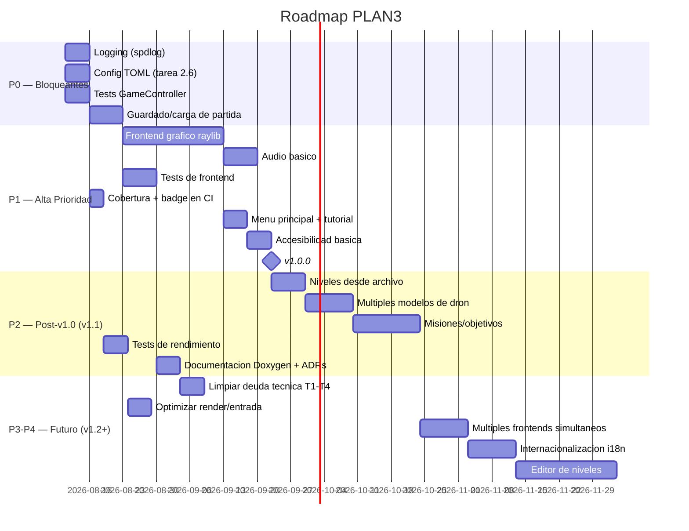

> **Corrección v3.1:** en la v3.0 el hito v1.0 colgaba del editor de niveles (P4), contradiciendo los criterios de §16.1 (binarios + partida completa + release publicada — nada de eso requiere editor, i18n ni misiones). El hito se recoloca al cierre de P0+P1; P2 pasa a ser contenido de v1.1 y P3-P4 de v1.2+.

### 14.2 Tareas P0 — Bloqueantes

| ID | Tarea | Problema que resuelve | Impacto | Esfuerzo | Archivos |
|----|-------|----------------------|---------|----------|----------|
| **P0-1** | Integrar spdlog vía FetchContent, logging a archivo con rotación y niveles | H1: sin diagnóstico en producción | 🔥 Muy alto | M (8h) | `CMakeLists.txt`, `src/core/Config.h`, nuevo `src/core/Logger.h` |
| **P0-2** | Implementar carga de configuración TOML (toml++) que sobreescriba `Config.h` en runtime | H4: constantes solo en compilación | 🔥 Muy alto | M (8h) | `CMakeLists.txt`, `src/core/Config.h`, `assets/config/game.toml`, `src/app/main.cpp` |
| **P0-3** | Añadir tests unitarios de `GameController::tick()` y `handleCommand()` por cada estado | H3: componente central sin cobertura | Alto | M (6h) | `tests/unit/TestGameController.cpp` (nuevo) |
| **P0-4** | Sistema de guardado/carga de partida (progresión + posición) en JSON/TOML con validación | H2: no es un producto completo | 🔥 Muy alto | M (10h) | `src/core/` (nuevo `SaveManager`), `assets/saves/`, `src/app/main.cpp` |
| **P0-5** | Frontend gráfico con raylib (ADR-002) + audio básico | H5: experiencia mínima | 🔥 Muy alto | L (30h) | `src/frontend/raylib/` (nuevo), `CMakeLists.txt` |

### 14.2.1 Notas de diseño para las tareas P0 (añadido v3.1)

Restricciones que la v3.0 no contemplaba y que condicionan la implementación:

**P0-1 (logging) choca con el guard de arquitectura.** La CI falla si aparece `printf`/`cout` en `src/core/`, y spdlog escribiendo a fichero desde el core rompería además la regla "core sin I/O" que sostiene todo el diseño. Resolución: el core define un puerto `ILogger` (interfaz pura, junto a `IRenderer`/`IInputSource`) y recibe la implementación por inyección; la implementación spdlog vive en `src/app/` (o `src/frontend/`). El guard de CI se mantiene intacto. Alternativa más simple si el logging del core resulta innecesario: loguear solo desde frontend/app suscribiéndose al `EventBus` — cero cambios en el core.

**P0-2 (config TOML) exige convertir `Config.h`.** Las constantes son `inline constexpr`: no pueden sobreescribirse en runtime. Diseño: struct `GameConfig` con los valores actuales como defaults, cargada/validada en `main` desde `assets/config/game.toml` (toml++, rangos verificados, valores fuera de rango ⇒ default + aviso) e inyectada por referencia const a `GameController`/`World`. Los tests construyen `GameConfig` a mano — sin ficheros ni I/O en tests unitarios.

**P0-4 (guardado): la ruta propuesta era errónea.** `assets/saves/` mezclaría datos mutables del usuario con recursos del juego versionados en git. Corrección: guardar en el directorio de datos del usuario (`$XDG_DATA_HOME`/`~/Library/Application Support`/`%APPDATA%`), formato JSON o TOML con campo de versión, validación estricta al cargar (tamaños, rangos, versión soportada) según PLAN2 §10.2. `SaveManager` vive fuera del core o detrás de un puerto, por la misma regla de I/O.

**P0-5 (raylib) es la prueba de fuego de R3.** Criterio de aceptación explícito: implementar `RaylibInput`/`RaylibRenderer` **sin tocar una línea de `src/core/`** (flag `--terminal`/`--gui` en main). Si el core necesita cambios, la separación de PLAN2 falló y eso es un hallazgo en sí mismo.

### 14.3 Tareas P1 — Alta Prioridad

| ID | Tarea | Problema | Esfuerzo | Depende de |
|----|-------|----------|----------|------------|
| **P1-1** | Cobertura de código (gcov/llvm-cov) + badge en README + job en CI | Visibilidad de calidad | S (4h) | P0-3 |
| **P1-2** | Tests de TerminalInput con pipe + tests de TerminalRenderer::buildFrame | Cobertura de frontend | M (6h) | — |
| **P1-3** | Menú principal (Booting) + tutorial interactivo primera partida | Onboarding de usuario | M (8h) | P0-5 |
| **P1-4** | Soporte de accesibilidad: remapeo de teclas desde TOML | Accesibilidad | M (6h) | P0-2 |
| **P1-5** | Migrar obstáculos de `Environment.cpp` hardcodeados a `assets/levels/city.json` | Mantenibilidad | S (3h) | P0-2 |
| **P1-6** | CI: añadir job de clang-tidy + cppcheck + coverage | Calidad automatizada | M (6h) | P1-1 |

### 14.4 Tareas P2 — Mejoras Importantes

| ID | Tarea | Esfuerzo |
|----|-------|----------|
| **P2-1** | Unificar `EventBus*` vs `EventBus&` en PlayerProgression (T1) | XS (1h) |
| **P2-2** | Tests de Environment con semilla fija para rachas | S (3h) |
| **P2-3** | Documentación Doxygen de API pública del core | M (5h) |
| **P2-4** | Tests de condiciones de borde: NaN, valores extremos, frames gigantes | S (3h) |
| **P2-5** | Escribir los 4 ADRs faltantes (física propia, toml++, trunk-based, termios raw) y resolver la renumeración `docs/adr/` ↔ PLAN2 §2 | S (2h) |
| **P2-6** | Restaurar termios ante muerte anómala del proceso: handler `atexit` + señales fatales (v3.1, ver §10.2) | S (2h) |

### 14.5 Tareas P3-P4 — Refactorización y Futuro

| ID | Tarea | Esfuerzo |
|----|-------|----------|
| **P3-1** | Mover `kMaxCommandsPerFrame` y `char line[160]` a Config.h (M1, M3) | XS (1h) |
| **P3-2** | Optimizar `TerminalInput::poll()`: añadir sleep solo cuando no hay input | S (2h) |
| **P3-3** | `TerminalRenderer::buildFrame`: reutilizar buffer en vez de asignar string cada frame | S (2h) |
| **P4-1** | Múltiples modelos de dron desbloqueables con stats diferentes | L (15h) |
| **P4-2** | Internacionalización i18n: textos del HUD en varios idiomas desde TOML | L (10h) |

---

## 15. Diagramas de Arquitectura

### 15.1 Arquitectura General del Sistema

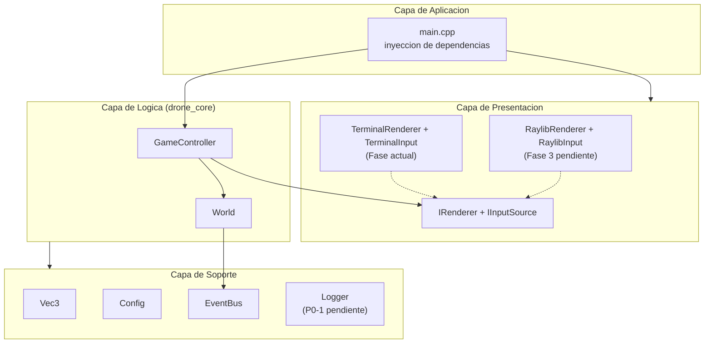

### 15.2 Flujo de Ejecución (Frame Completo)

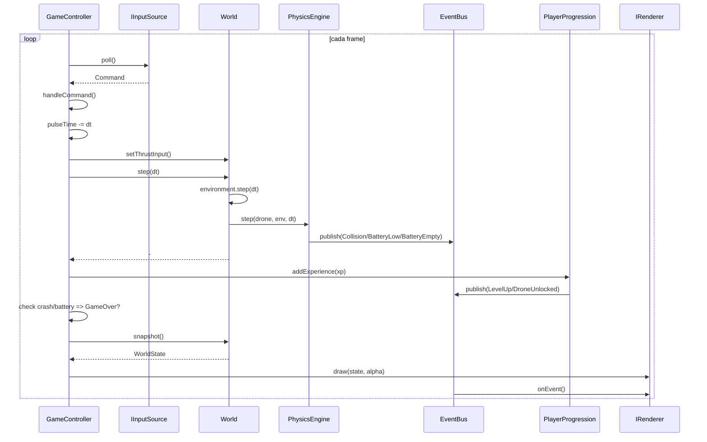

### 15.3 Dependencias entre Módulos

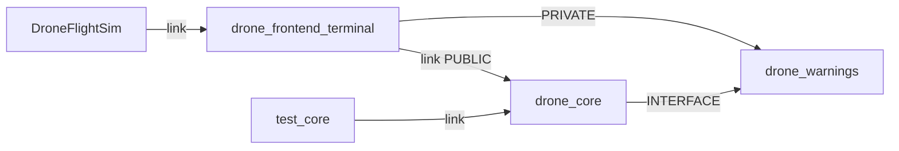

### 15.4 Flujo de Eventos

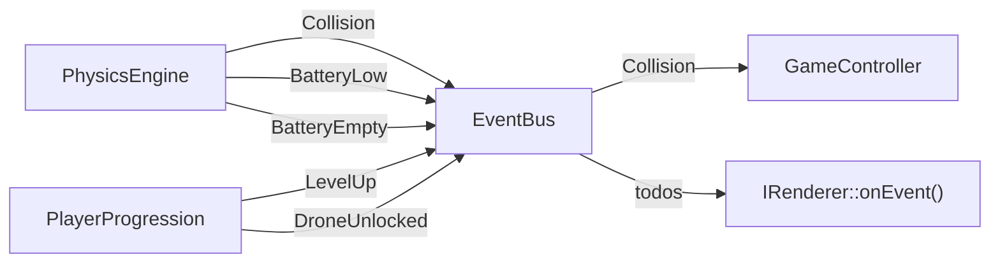

### 15.5 Organización del Proyecto

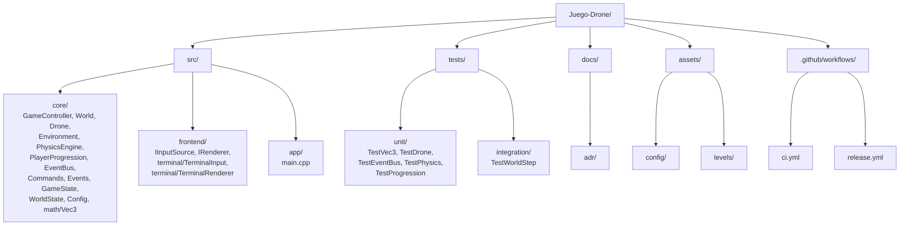

---

## 16. Métricas de Éxito

### 16.1 Criterios de Aceptación

| Fase | Criterio | Medición |
|------|----------|----------|
| **P0 completado** | Logging funcional, config TOML, tests GameController ≥ 10, save/load funcional, raylib render básico | CI verde + tests |
| **P1 completado** | Coverage ≥ 75%, tests frontend, menú principal, accesibilidad, obstáculos externos | CI + badge |
| **P2 completado** | Deuda T1-T4 cerrada, ADRs completos, termios a prueba de crashes, docs Doxygen, tests de borde | CI + review |
| **v1.0** | Binarios 3 plataformas, partida completa sin leer código, publicado en GitHub Releases | Release tag |

### 16.2 KPIs Técnicos

| KPI | Objetivo actual | Objetivo v1.0 |
|-----|-----------------|---------------|
| Cobertura del core | ~60% (estimado) | ≥ 80% |
| Tests totales | 48 | ≥ 80 |
| CI tiempo | ~3 min | < 5 min |
| Binario Release | 67 KB (medido, macOS arm64) | < 5 MB (con raylib) |
| Dependencias | 1 (Catch2) | ≤ 5 |
| Bugs abiertos | 0 | 0 críticos |

---

## 17. Trazabilidad con PLAN2.md y Riesgos

### 17.1 Mapeo de la Fase 3 de PLAN2 sobre este roadmap

Este documento no sustituye la Fase 3 de PLAN2.md: la absorbe y la reprioriza con lo aprendido. Ningún compromiso de PLAN2 se pierde:

| PLAN2.md (Fase 3 / pendientes) | PLAN3 |
|---|---|
| Tarea 2.6: config TOML + spdlog (única pendiente de Fases 1–2) | **P0-2** (TOML) + **P0-1** (logging, con el diseño corregido de §14.2.1) |
| 3.1 Frontend raylib + audio | **P0-5** (raylib) + **P1-B audio** en el Gantt |
| 3.2 Entornos, misiones, obstáculos | **P1-5** (obstáculos externos) + **P2-1/P2-2/P2-3** del Gantt (niveles, drones, misiones) → v1.1 |
| 3.3 Guardado/carga validado | **P0-4** (con ubicación corregida: directorio de datos del usuario) |
| 3.4 Releases multiplataforma + CPack | ✅ Ya operativo (`release.yml` + regla `install` + CPack, verificado en §9.2) |
| 3.5 Accesibilidad (remapeo, contraste, asistencia) | **P1-4** (remapeo) + resto en v1.1 |
| 3.6 Crash reporting + logging estructurado | **P0-1** (logging); crash reporting queda post-v1.0 |
| 3.7 Distribución Homebrew/itch.io | Post-v1.0 (v1.1+), sin cambios |
| Cobertura ≥ 75–80 % (PLAN2 §18) | **P1-1** (job de coverage — hoy ni siquiera es medible) |
| Protección de rama + primer run de CI | Requiere `git push`; fuera del alcance de cualquier documento — acción manual pendiente |

### 17.2 Riesgos de esta hoja de ruta

| Riesgo | Prob. | Impacto | Mitigación |
|---|---|---|---|
| P0-5 (raylib) revela acoplamiento oculto del core | Baja | Alto | El criterio de aceptación de §14.2.1 lo convierte en detección temprana: prohibido tocar `src/core/` |
| FetchContent de raylib/toml++/spdlog dispara el tiempo de CI (> 5 min, KPI §16.2) | Media | Medio | Caché de `_deps` en Actions; medir en el primer PR que añada cada dependencia |
| P0-4 (save/load) introduce el primer parser de datos externos → superficie de ataque nueva | Media | Medio | Validación estricta por versión y rangos (PLAN2 §10.2); fuzzing del parser como tarea de v1.1 |
| El alcance P0 (5 tareas, ~62h) se ejecuta en serie por un solo desarrollador | Alta | Medio | P0-1/P0-2/P0-3 son independientes entre sí; solo P0-4 depende de P0-2. Orden recomendado: P0-2 → P0-1 → P0-3 → P0-4 → P0-5 |
| La CI aún no ha corrido nunca en runners reales (todo verificado en local) | Alta | Alto | Primer `git push` antes de empezar P0; cualquier rojo de runner se trata como bloqueante inmediato |

---

*Documento generado por auditoría independiente del código fuente y revisado en v3.1 contra el código real (commit `76deeb4`). Cada hallazgo está respaldado por evidencia directa; los hallazgos de la propia auditoría que no la superaron están marcados como descartados, no borrados.*
