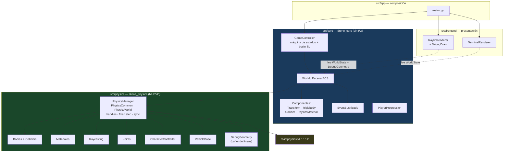
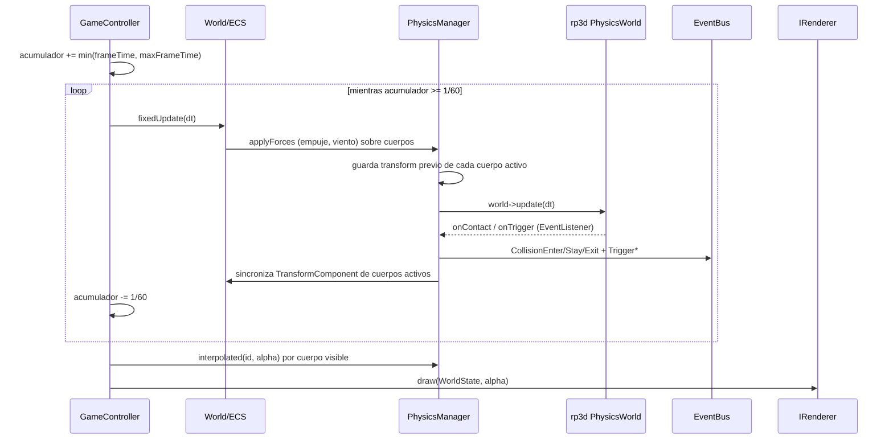
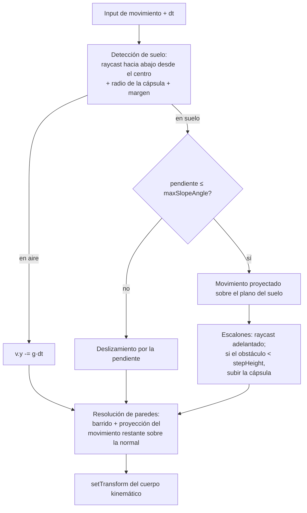
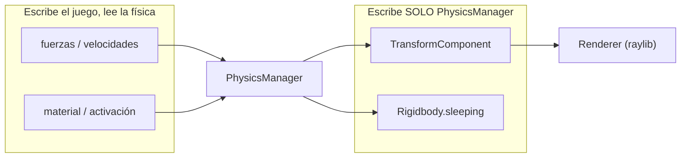
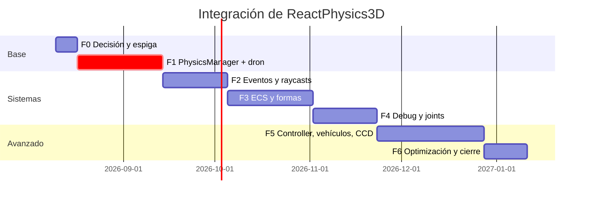

# grafico.md — Plan de integración de ReactPhysics3D como motor de físicas 3D

> **Encargo:** sustituir la física propia por **ReactPhysics3D** (exclusivamente: ni Box2D, ni Bullet, ni PhysX, ni Jolt), con un módulo `PhysicsManager` modular y desacoplado del renderizado, integrado de forma nativa con raylib.
>
> **Base:** commit `1da1216` · juego actual v0.5.0 · **rp3d v0.10.2 verificado contra su código fuente**, no contra documentación.
>
> **Linaje:** [PLAN3.md](PLAN3.md) (auditoría y hoja de ruta a v1.0) → **grafico.md** (motor de físicas 3D). Este documento sustituye la tarea P0-5/P1 de física de PLAN3 y **revierte la decisión ADR-004**.

---

## Índice

1. [Resumen ejecutivo](#1-resumen-ejecutivo)
2. [Punto de partida: qué es el juego hoy](#2-punto-de-partida-qué-es-el-juego-hoy)
3. [ReactPhysics3D 0.10.2: lo verificado y los 5 huecos](#3-reactphysics3d-0102-lo-verificado-y-los-5-huecos)
4. [ADR-008: decisiones de arquitectura](#4-adr-008-decisiones-de-arquitectura)
5. [Arquitectura propuesta](#5-arquitectura-propuesta)
6. [Diseño técnico por subsistema](#6-diseño-técnico-por-subsistema)
7. [Impacto sobre lo que ya funciona](#7-impacto-sobre-lo-que-ya-funciona)
8. [Plan por fases con criterios de aceptación](#8-plan-por-fases-con-criterios-de-aceptación)
9. [Riesgos](#9-riesgos)
10. [Trazabilidad con el encargo](#10-trazabilidad-con-el-encargo)

---

## 1. Resumen ejecutivo

### 1.1 Veredicto

El encargo es **viable e integrable con la arquitectura actual**, que ya separa núcleo de presentación y tiene el frontend raylib funcionando. Pero conviene decirlo sin rodeos: **no es "cambiar el motor de físicas", es construir la capa de físicas de un motor de juego 3D genérico**.

| | Hoy | Con este plan |
|---|---|---|
| Cuerpos simulados | 1 dron + 3 cajas estáticas | N cuerpos con ECS, joints, character controller, vehículos |
| Física | 99 líneas propias (Euler semi-implícito + AABB) | rp3d 0.10.2 (~13 MB de fuentes) |
| Formas de colisión | AABB únicamente | 6 tipos, múltiples colliders por cuerpo |
| Alcance del proyecto | Simulador de dron | Base para "mundo abierto, shooters, simuladores" |
| Esfuerzo estimado | — | **~22 semanas** de un desarrollador |

Esto es un **re-encuadre del proyecto**, no una mejora incremental. Es una decisión legítima —el encargo lo dice explícitamente— pero debe tomarse a sabiendas: buena parte del trabajo (vehículos, character controller, heightfields) no la necesita el juego del dron, sino el motor que se quiere construir con él. El plan está secuenciado para que **el dron siga jugable en todas las fases** y para que lo que sí usa el juego llegue primero.

### 1.2 Los 5 huecos entre el encargo y la librería

Verificados leyendo los headers de rp3d 0.10.2, no su web. Cada uno tiene solución propuesta en §6:

| # | El encargo pide | rp3d 0.10.2 | Solución |
|---|---|---|---|
| H1 | Continuous Collision Detection | **No existe.** Cero menciones en toda la API pública | Emular con subpasos + raycast de barrido (§6.14) |
| H2 | Evento con *fuerza del impacto* e *impulso aplicado* | El callback expone solo penetración, normal y puntos locales | Estimar el impulso con las velocidades pre-paso (§6.5) |
| H3 | Character Controller | **No existe.** Hay que escribirlo entero | Cápsula kinemática + raycasts (§6.9) |
| H4 | Vehículos | **No existe** (ni raycast vehicle) | Chasis + 4 raycasts como suspensión (§6.10) |
| H5 | 13 elementos de debug | El `DebugRenderer` cubre 6 | Los 4 restantes se dibujan con raylib (§6.13) |

Ninguno invalida la elección de rp3d, pero H1 y H2 son sorpresas caras si se descubren a mitad de la implementación.

---

## 2. Punto de partida: qué es el juego hoy

Leído entero: 81 ficheros versionados, 3.416 líneas entre `src/` y `tests/`, 72 tests en verde.

```
src/core/          drone_core — simulación pura, CERO I/O (la CI lo verifica con un guard)
  GameController   máquina de estados + bucle de timestep fijo a 60 Hz
  World            agrega Drone + Environment + PhysicsEngine + EventBus
  PhysicsEngine    99 líneas: empuje, gravedad, arrastre, suelo, límites, AABB, batería
  Drone            estado (posición, velocidad, empuje, batería) — sin lógica de integración
  Environment      viento por rachas con semilla, dificultad, obstáculos AABB
  EventBus         pub/sub tipado (BatteryLow, Collision, LevelUp, GameSaved…)
  WorldState       DTO inmutable que el core entrega al frontend cada frame
src/frontend/      IRenderer / IInputSource + terminal (HUD ANSI) + raylib (3D)
src/app/           main (composición), ConfigLoader (toml++), SaveManager, GameLogger (spdlog)
```

**Lo que condiciona este plan:**

1. **El core no hace I/O y la CI lo bloquea** (`! grep -rn 'cout\|cin\|printf' src/core/`). rp3d no hace I/O, así que el guard sobrevive — pero el core deja de tener cero dependencias.
2. **Todo el estado de simulación es autoritativo en el core y viaja al frontend por `WorldState`.** Con rp3d, el estado autoritativo pasa a vivir dentro del mundo físico; `WorldState` se convierte en una proyección.
3. **Hay un test de determinismo** (`misma semilla + mismos comandos ⇒ misma trayectoria, comparada con `==` de floats`). rp3d es determinista con el mismo binario, **no entre plataformas**: ese test debe reescribirse (§7).
4. **`GameConfig` inyecta todos los parámetros desde TOML.** La configuración de física de rp3d debe entrar por el mismo sitio, no por constantes nuevas.
5. **`assets/levels/city.json` existe pero no lo lee nadie**: los obstáculos están hardcodeados en `Environment::loadEnvironment`. La llegada de formas de colisión reales es el momento natural de conectarlo.
6. **No hay mallas 3D en el proyecto.** Convex mesh, concave mesh y heightfield no tienen datos que cargar: exigen antes un pipeline de assets (§8, Fase 4).

---

## 3. ReactPhysics3D 0.10.2: lo verificado y los 5 huecos

Todo lo de esta sección procede de leer `include/reactphysics3d/` del tag `v0.10.2`.

### 3.1 Lo que sí trae (todo lo que el encargo pide en estos apartados)

| Apartado | Estado | Evidencia |
|---|---|---|
| **6 formas de colisión** | ✅ Completo | `collision/shapes/`: `BoxShape.h`, `SphereShape.h`, `CapsuleShape.h`, `ConvexMeshShape.h`, `ConcaveMeshShape.h`, `HeightFieldShape.h` |
| **4 joints** | ✅ Completo | `constraint/`: `BallAndSocketJoint.h`, `HingeJoint.h`, `SliderJoint.h`, `FixedJoint.h` |
| **Eventos de colisión Enter/Stay/Exit** | ✅ | `CollisionCallback.h`: `ContactStart`, `ContactStay`, `ContactExit` |
| **Eventos de trigger Enter/Stay/Exit** | ✅ | `OverlapCallback.h`: `OverlapStart`, `OverlapStay`, `OverlapExit` |
| **Filtrado por categorías y máscaras** | ✅ | `Collider::setCollisionCategoryBits()` / `setCollideWithMaskBits()` |
| **Triggers sin respuesta física** | ✅ | `Collider::setIsTrigger(bool)` |
| **Sleeping automático** | ✅ | `WorldSettings::isSleepingEnabled` (por defecto `true`), `RigidBody::setIsAllowedToSleep()`, `PhysicsWorld::setSleepLinearVelocity()` |
| **Raycast con máscara** | ✅ | `PhysicsWorld::raycast(const Ray&, RaycastCallback*, unsigned short categoryMask = 0xFFFF)` |
| **Datos del impacto de raycast** | ✅ | `RaycastInfo`: `worldPoint`, `worldNormal`, `hitFraction`, `triangleIndex`, `body`, `collider` |
| **Interpolación para el render** | ✅ | `Transform::interpolateTransforms(old, new, factor)` — exactamente lo que necesita nuestro acumulador |
| **Gestión de memoria propia** | ✅ | `PhysicsCommon(MemoryAllocator* baseMemoryAllocator = nullptr)` |
| **Broad phase / narrow phase** | ✅ Interno | Dynamic AABB Tree + SAT/GJK, sin API que configurar: se obtiene "gratis" |

**Consecuencia práctica:** los apartados de *formas*, *joints*, *filtrado*, *triggers*, *sleeping*, *raycast* y *broad/narrow phase* del encargo son **trabajo de integración, no de implementación**. Ahí el coste es escribir nuestra fachada y sus tests, no algoritmos.

### 3.2 Los 5 huecos, con evidencia

**H1 — No hay Continuous Collision Detection.** Un `grep -rn "continuous"` sobre todos los headers devuelve una única coincidencia, y es un comentario sobre arrays de vértices. rp3d 0.10.2 no implementa CCD. Con timestep de 1/60 s, un cuerpo a 30 m/s avanza 0,5 m por paso: atraviesa cualquier pared más fina que eso.

**H2 — El callback de contacto no expone impulso ni fuerza.** `CollisionCallback::ContactPoint` ofrece exactamente cuatro cosas:

```cpp
decimal        getPenetrationDepth() const;
const Vector3& getWorldNormal() const;
const Vector3& getLocalPointOnCollider1() const;
const Vector3& getLocalPointOnCollider2() const;
```

El impulso que calcula el solver es interno y no está en la API pública. El encargo pide "fuerza del impacto" e "impulso aplicado" en **cada** evento: hay que estimarlo (§6.5) o bifurcar la librería (desaconsejado).

**H3 — No hay Character Controller.** No existe ninguna clase con ese nombre. Se construye entero sobre cuerpo kinemático + raycasts.

**H4 — No hay vehículos.** Tampoco `RaycastVehicle` (que sí tiene Bullet). Se construye entero.

**H5 — El DebugRenderer cubre 6 de los 13 elementos pedidos.** `DebugRenderer::DebugItem` es exactamente:

```cpp
COLLIDER_AABB, COLLIDER_BROADPHASE_AABB, COLLISION_SHAPE,
CONTACT_POINT, CONTACT_NORMAL, COLLISION_SHAPE_NORMAL
```

Cubre bounding boxes, colliders (con sus cápsulas, esferas y mallas), normales, contact points y AABB. **Faltan cuatro:** raycasts, centros de masa, joints y ejes locales — los dibujamos nosotros con raylib (§6.13).

---

## 4. ADR-008: decisiones de arquitectura

Tres decisiones a cerrar antes de escribir código. Se volcarán a `docs/adr/008-*.md`.

### 4.1 rp3d sustituye a la física propia (revierte ADR-004)

[ADR-004](docs/adr/004-fisica-propia-vs-bullet.md) decidió física propia porque "un motor de cuerpos rígidos completo es sobredimensionado para un dron con menos de 10 obstáculos". **Ese razonamiento sigue siendo correcto para el juego actual** y deja de serlo para el objetivo declarado en el encargo (mundo abierto, shooters, simuladores). ADR-008 lo sustituye y deja constancia de que el motivo del cambio es la ampliación de alcance, no un defecto de la física propia.

Nota de coherencia: ADR-004 ya preveía esta salida — *"si el proyecto escala a mundos complejos, migrar es posible: `PhysicsEngine` encapsula toda la física"*. Esa encapsulación es la que hace barata la Fase 1.

### 4.2 Dónde vive rp3d: módulo `drone_physics` propio

Tres opciones evaluadas:

| Opción | Pros | Contras | Veredicto |
|---|---|---|---|
| rp3d dentro de `drone_core` | Lo más simple | El core pierde su propiedad de "cero dependencias"; los tests de lógica pura arrastran 13 MB | ❌ |
| Puerto virtual `IPhysicsBackend` en el core + implementación rp3d aparte | Backend intercambiable, core testeable con un doble | Abstracción sobre una API ya abstracta, para un segundo backend que el encargo **prohíbe** ("exclusivamente ReactPhysics3D") | ❌ YAGNI |
| **Módulo `drone_physics` propio del que depende el core** | Modular como pide el encargo, límite claro, rp3d no se filtra al resto | Una biblioteca más en el grafo | ✅ **Elegida** |

`drone_physics` es una biblioteca estática con `PhysicsManager` y **ningún header de rp3d en su API pública**: quien la usa ve `BodyId`, `Vec3` y `Transform` propios. Así el core no incluye `reactphysics3d.h` ni una sola vez, y el frontend tampoco.

```
drone_frontend_raylib ─┐
drone_frontend_terminal┼→ drone_core → drone_physics → reactphysics3d
DroneFlightSim ────────┘
```

### 4.3 Identificadores opacos en vez de punteros de rp3d

`PhysicsManager` devuelve `BodyId`/`ColliderId` (índice + generación), nunca `rp3d::RigidBody*`. Es lo que hace posibles dos requisitos del encargo — *"creación y destrucción segura de cuerpos"* y *"object pooling"* — sin punteros colgantes: destruir un cuerpo invalida su generación y cualquier uso posterior del handle falla de forma detectable en vez de corromper memoria.

---

## 5. Arquitectura propuesta



**Regla que la CI debe vigilar (guard nuevo):** ningún fichero fuera de `src/physics/` puede incluir `reactphysics3d`. Un `grep` en el job de lint, igual que el guard de I/O que ya existe.

### 5.1 Flujo de un frame



El bucle de timestep fijo **ya existe y no cambia** (ADR-001): rp3d se acopla dentro del `while (acumulador >= dt)` que hoy llama a `World::step`.

---

## 6. Diseño técnico por subsistema

Código de referencia: firmas reales que se implementarán, no pseudocódigo.

### 6.1 PhysicsManager y handles

```cpp
// src/physics/PhysicsTypes.h — API pública SIN headers de rp3d
namespace drone::physics {

struct BodyId { uint32_t index = 0; uint32_t generation = 0;
                bool valid() const { return generation != 0; } };
struct ColliderId { uint32_t index = 0; uint32_t generation = 0; };

enum class BodyType { Static, Dynamic, Kinematic };
enum class ShapeType { Box, Sphere, Capsule, ConvexMesh, ConcaveMesh, HeightField };

struct MaterialDesc {           // §6.4
    float density   = 1.0f;
    float friction  = 0.3f;
    float bounciness = 0.1f;    // restitución
};

struct ShapeDesc {
    ShapeType type = ShapeType::Box;
    Vec3 halfExtents{0.5f, 0.5f, 0.5f};  // Box
    float radius = 0.5f;                  // Sphere / Capsule
    float height = 1.0f;                  // Capsule
    MeshId mesh;                          // Convex/Concave/HeightField
    Transform localOffset;                // múltiples colliders por cuerpo
    MaterialDesc material;
    uint16_t category = 0x0001;
    uint16_t mask     = 0xFFFF;
    bool isTrigger = false;
};

struct BodyDesc {
    BodyType type = BodyType::Dynamic;
    Transform transform;
    bool allowSleep = true;
    bool gravityEnabled = true;
    float linearDamping = 0.0f;
    float angularDamping = 0.0f;
};

}  // namespace drone::physics
```

```cpp
// src/physics/PhysicsManager.h
class PhysicsManager {
public:
    explicit PhysicsManager(const PhysicsSettings& settings);
    ~PhysicsManager();
    PhysicsManager(const PhysicsManager&) = delete;

    // --- ciclo de vida de cuerpos (seguro: handles con generación) ---
    BodyId createBody(const BodyDesc& desc);
    void destroyBody(BodyId id);                 // difiere al final del paso
    bool isValid(BodyId id) const;
    ColliderId addCollider(BodyId body, const ShapeDesc& shape);
    void removeCollider(ColliderId id);

    // --- simulación ---
    void fixedStep(float dt);                    // §6.2
    Transform interpolated(BodyId id, float alpha) const;
    Transform transform(BodyId id) const;

    // --- fuerzas y estado ---
    void applyForce(BodyId id, const Vec3& force);
    void applyTorque(BodyId id, const Vec3& torque);
    void setLinearVelocity(BodyId id, const Vec3& v);
    Vec3 linearVelocity(BodyId id) const;
    void setActive(BodyId id, bool active);      // activación dinámica

    // --- consultas y eventos ---
    RaycastHit raycastClosest(const Ray& ray, const RaycastFilter& f) const;   // §6.6
    bool raycast(const Ray& ray, const RaycastFilter& f) const;
    void raycastAll(const Ray& ray, const RaycastFilter& f,
                    std::vector<RaycastHit>& out) const;
    void setContactSink(ContactSink* sink);      // §6.5

    // --- depuración ---
    void setDebugEnabled(bool on);
    const DebugGeometry& debugGeometry() const;  // §6.13

private:
    struct Impl;                    // esconde rp3d por completo (pimpl)
    std::unique_ptr<Impl> m_impl;
};
```

El *pimpl* no es adorno: es lo que garantiza que `reactphysics3d.h` no aparezca en ningún header del proyecto y que el guard de CI de §5 pueda ser tajante.

### 6.2 Fixed step, sincronización e interpolación

rp3d ofrece `Transform::interpolateTransforms`, que encaja exactamente con el acumulador que ya tenemos:

```cpp
void PhysicsManager::Impl::fixedStep(float dt) {
    // 1. Guardar el transform previo SOLO de los cuerpos despiertos:
    //    el requisito de "actualizar únicamente cuerpos activos" empieza aquí.
    for (BodyRecord& b : activeBodies()) {
        b.previousTransform = b.body->getTransform();
    }

    // 2. Un único paso de tamaño fijo — determinismo (ADR-001).
    world->update(dt);

    // 3. Procesar destrucciones diferidas: destruir dentro del callback de
    //    contacto corrompería el estado interno del solver.
    flushPendingDestructions();
}

Transform PhysicsManager::Impl::interpolated(BodyId id, float alpha) const {
    const BodyRecord& b = get(id);
    if (b.isSleeping) return fromRp3d(b.body->getTransform());   // sin coste
    return fromRp3d(rp3d::Transform::interpolateTransforms(
        b.previousTransform, b.body->getTransform(), alpha));
}
```

**Determinismo:** con el mismo binario y el mismo orden de creación de cuerpos, rp3d es reproducible. **No lo es entre plataformas ni entre niveles de optimización** (reordenación de operaciones en coma flotante). Ver el impacto sobre los tests en §7.

### 6.3 Cuerpos y formas

```cpp
BodyId PhysicsManager::Impl::createBody(const BodyDesc& d) {
    rp3d::RigidBody* body = world->createRigidBody(toRp3d(d.transform));
    body->setType(toRp3dType(d.type));           // STATIC / KINEMATIC / DYNAMIC
    body->setIsAllowedToSleep(d.allowSleep);
    body->enableGravity(d.gravityEnabled);
    body->setLinearDamping(d.linearDamping);
    body->setAngularDamping(d.angularDamping);
    return registry.add(body);                   // asigna índice + generación
}

ColliderId PhysicsManager::Impl::addCollider(BodyId id, const ShapeDesc& s) {
    rp3d::CollisionShape* shape = createShape(s);   // las 6 formas, cacheadas
    rp3d::Collider* col = get(id).body->addCollider(shape, toRp3d(s.localOffset));

    rp3d::Material& m = col->getMaterial();
    m.setMassDensity(s.material.density);
    m.setFrictionCoefficient(s.material.friction);
    m.setBounciness(s.material.bounciness);

    col->setCollisionCategoryBits(s.category);
    col->setCollideWithMaskBits(s.mask);
    col->setIsTrigger(s.isTrigger);

    // Con múltiples colliders hay que recalcular masa/inercia tras cada alta.
    get(id).body->updateMassPropertiesFromColliders();
    return colliderRegistry.add(col);
}
```

**Reutilización de formas (requisito "reutilización de colliders"):** las formas de rp3d se crean desde `PhysicsCommon` y **pueden compartirse entre colliders**. `createShape` cachea por descriptor (`unordered_map<ShapeKey, CollisionShape*>`): 500 cajas idénticas comparten una `BoxShape`.

**Masa vs densidad:** rp3d deriva la masa de densidad × volumen al llamar a `updateMassPropertiesFromColliders()`. Si el juego quiere fijar masa directamente (el dron pesa 1,2 kg por configuración), se usa `body->setMass()` **después** de esa llamada, o el volumen del collider la sobrescribe. Es un orden que se olvida y produce drones de 40 kg.

### 6.4 Materiales físicos

El encargo pide 8 propiedades por collider. Reparto real:

| Propiedad | Dónde vive | API |
|---|---|---|
| Fricción | Collider | `Material::setFrictionCoefficient` |
| Restitución | Collider | `Material::setBounciness` |
| Densidad | Collider | `Material::setMassDensity` |
| Masa | **Cuerpo** | `RigidBody::setMass` (tras `updateMassPropertiesFromColliders`) |
| Centro de masa | **Cuerpo** | `RigidBody::setLocalCenterOfMass` |
| Inercia | **Cuerpo** | `RigidBody::setLocalInertiaTensor` |
| Sleeping | Cuerpo + mundo | `setIsAllowedToSleep` + `WorldSettings::isSleepingEnabled` |
| Activación dinámica | Cuerpo | `RigidBody::setIsActive` |

Es decir: **masa, centro de masa e inercia son propiedades del cuerpo, no del collider**. `PhysicsMaterialComponent` (§6.11) expone las tres primeras por collider y las otras por cuerpo, en vez de fingir que todas son lo mismo.

### 6.5 Sistema de eventos — y el hueco del impulso (H2)

```cpp
// src/physics/ContactBridge.h — traduce rp3d → eventos del juego
class ContactBridge final : public rp3d::EventListener {
public:
    void onContact(const rp3d::CollisionCallback::CallbackData& data) override;
    void onTrigger(const rp3d::OverlapCallback::CallbackData& data) override;
};
```

Mapeo directo, sin invención:

| Evento del encargo | Origen en rp3d |
|---|---|
| `OnCollisionEnter` | `ContactPair::EventType::ContactStart` |
| `OnCollisionStay` | `ContactStay` |
| `OnCollisionExit` | `ContactExit` |
| `OnTriggerEnter` | `OverlapPair::EventType::OverlapStart` |
| `OnTriggerStay` | `OverlapStay` |
| `OnTriggerExit` | `OverlapExit` |

Carga útil del evento:

```cpp
struct ContactEvent {
    EntityId a, b;
    Vec3 point;          // world = collider1->getLocalToWorldTransform() * localPoint1
    Vec3 normal;         // getWorldNormal()
    float penetration;   // getPenetrationDepth()
    float impulse;       // ESTIMADO — ver abajo
    float force;         // impulse / dt
};
```

**El hueco (H2) y cómo se cubre.** El impulso real lo calcula el solver y no está en la API pública. Se estima con la velocidad relativa **antes** del paso, que sí conocemos porque `fixedStep` ya guarda el estado previo:

```cpp
// Impulso normal de una colisión inelástica entre dos cuerpos:
//   j = (1 + e) · |v_rel · n| · m_efectiva,  con m_ef = (mA·mB)/(mA+mB)
// Para un cuerpo contra estático, m_ef = mA.
float estimateImpulse(const BodyRecord& a, const BodyRecord& b, const Vec3& n) {
    const float vRel = std::fabs(dot(a.previousVelocity - b.previousVelocity, n));
    const float mEff = (b.isStatic) ? a.mass
                                    : (a.mass * b.mass) / (a.mass + b.mass);
    return (1.0f + restitutionBetween(a, b)) * vRel * mEff;
}
```

Esto **no es el impulso del solver**: ignora la fricción, el reparto entre múltiples puntos de contacto y las iteraciones del solver. Para lo que el juego necesita —decidir si un impacto es fatal, escalar un sonido, disparar partículas— es suficiente y es exactamente lo que ya hace hoy `PhysicsEngine::resolveGround` con la velocidad de impacto. Se documentará como estimación en la API (`float impulse;  // estimado, ver grafico.md §6.5`) para que nadie lo use como si fuera exacto. La alternativa —bifurcar rp3d para exponer `mPenetrationImpulse`— nos ataría a un fork y se descarta.

**Regla dura:** los callbacks de rp3d se invocan **durante** `world->update()`. Está prohibido crear o destruir cuerpos dentro de ellos. `ContactBridge` solo encola eventos; el `EventBus` los despacha después del paso, y las destrucciones pasan por la cola diferida de §6.2.

### 6.6 Raycasting

Las tres variantes del encargo se apoyan en el valor de retorno de `notifyRaycastHit`, que controla cómo continúa el rayo:

```cpp
class ClosestHitCallback final : public rp3d::RaycastCallback {
public:
    rp3d::decimal notifyRaycastHit(const rp3d::RaycastInfo& info) override {
        if (m_filter.ignores(info.body)) return rp3d::decimal(1.0);  // seguir
        m_hit = toHit(info);
        return info.hitFraction;   // recorta el rayo: solo llegarán impactos más cercanos
    }
};

class AllHitsCallback final : public rp3d::RaycastCallback {
    rp3d::decimal notifyRaycastHit(const rp3d::RaycastInfo& info) override {
        if (!m_filter.ignores(info.body)) m_hits.push_back(toHit(info));
        return rp3d::decimal(1.0);  // seguir hasta el final
    }
};

class AnyHitCallback final : public rp3d::RaycastCallback {
    rp3d::decimal notifyRaycastHit(const rp3d::RaycastInfo& info) override {
        if (m_filter.ignores(info.body)) return rp3d::decimal(1.0);
        m_hit = true;
        return rp3d::decimal(0.0);  // 0 = parar de inmediato (el más barato)
    }
};
```

| Variante | Retorno | Coste |
|---|---|---|
| `raycastClosest` | `hitFraction` | Recorre el árbol recortando |
| `raycastAll` | `1.0` | Recorre todo |
| `raycast` (any) | `0.0` | Para en el primero — para tests de visibilidad |

El **filtrado por máscara** va en la llamada (`world->raycast(ray, &cb, categoryMask)`); **ignorar entidades concretas** no lo soporta rp3d y se resuelve en el callback (`m_filter.ignores`), que es donde ya tenemos el `Body*`.

### 6.7 Joints

Los cuatro existen. La fachada expone descriptores planos y permite modificar en caliente:

```cpp
struct HingeJointDesc {
    BodyId a, b;
    Vec3 anchorWorld, axisWorld;
    bool limitEnabled = false;  float minAngle = 0, maxAngle = 0;
    bool motorEnabled = false;  float motorSpeed = 0, maxMotorTorque = 0;
};
JointId createHinge(const HingeJointDesc&);
void setHingeMotor(JointId, bool enabled, float speed, float maxTorque);  // en runtime
```

Todos los parámetros que el encargo exige ajustables en tiempo real tienen *setter* en rp3d (`HingeJoint::enableMotor`, `setMotorSpeed`, `setMaxMotorTorque`, `enableLimit`…), así que es traducción directa.

### 6.8 Character Controller (H3 — se implementa entero)

No existe en rp3d. Diseño propuesto: **cápsula kinemática movida a mano**, no cuerpo dinámico (un cuerpo dinámico con fricción produce el clásico personaje que resbala y se engancha en escalones).



Parámetros (a `GameConfig`, como todo lo demás): `radius`, `height`, `stepHeight`, `maxSlopeAngle`, `skinWidth`, `jumpSpeed`, `gravityScale`.

**Prevención de atravesar paredes** (que el encargo pide explícitamente): el movimiento de cada paso se resuelve por barrido en hasta 4 iteraciones, proyectando el desplazamiento restante sobre la normal del impacto. Como rp3d no tiene *shape cast*, el barrido se aproxima con un abanico de raycasts desde la cápsula — limitación conocida que se documenta en el ADR.

### 6.9 Vehículos (H4 — base preparada, como pide el encargo)

El encargo pide "una base preparada para futuras ampliaciones", así que no se persigue un simulador de conducción:

- Chasis: `BoxShape` sobre cuerpo dinámico.
- 4 ruedas por **raycast de suspensión** (no cuerpos con joints: es lo estándar y evita las inestabilidades de 4 hinges).
- Cada rueda aplica: fuerza de suspensión (muelle + amortiguador), fuerza de tracción y fuerza lateral de agarre.
- Estructura preparada para sustituir las ruedas por cuerpos + `HingeJoint` si más adelante hace falta simulación fina.

### 6.10 ECS

El encargo pide cuatro componentes y que **solo `PhysicsManager` los actualice**:

```cpp
struct TransformComponent      { Vec3 position; Quat rotation; Vec3 scale{1,1,1}; };
struct RigidbodyComponent      { physics::BodyId body; BodyType type; bool sleeping; };
struct ColliderComponent       { std::vector<physics::ColliderId> colliders; };
struct PhysicsMaterialComponent{ float density, friction, bounciness;   // por collider
                                 float mass; Vec3 centerOfMass;         // por cuerpo
                                 bool allowSleep, active; };
```

Flujo de autoridad, que es lo que evita el bug clásico de dos fuentes de verdad:



**Regla:** nadie escribe `TransformComponent` salvo la sincronización posterior al paso. Mover una entidad se hace con `setTransform`/`applyForce` sobre el cuerpo, nunca tocando el componente — o la física y el render divergen.

**Alcance realista:** un ECS completo (arquetipos, vistas, sistemas) es un proyecto en sí mismo. Se propone un ECS **mínimo y suficiente**: `EntityId` + arrays densos por componente con índice disperso. Nada de un framework genérico salvo que el proyecto lo pida más adelante.

### 6.11 Integración con raylib: conversiones y sincronización

```cpp
// src/frontend/raylib/RaylibPhysicsBridge.h — SOLO en el frontend
inline ::Vector3 toRaylib(const drone::Vec3& v)   { return {v.x, v.y, v.z}; }
inline drone::Vec3 fromRaylib(const ::Vector3& v) { return {v.x, v.y, v.z}; }

inline ::Quaternion toRaylib(const drone::Quat& q) { return {q.x, q.y, q.z, q.w}; }

// Matriz de modelo para DrawMesh: se construye desde posición y cuaternión.
// NO se usa rp3d::Transform::getOpenGLMatrix: entrega una matriz column-major
// de OpenGL y raylib::Matrix es row-major — mezclarlas da rotaciones
// transpuestas, un bug tan silencioso como caro de encontrar.
inline ::Matrix modelMatrix(const drone::Transform& t, const drone::Vec3& scale) {
    return MatrixMultiply(
        MatrixMultiply(MatrixScale(scale.x, scale.y, scale.z),
                       QuaternionToMatrix(toRaylib(t.rotation))),
        MatrixTranslate(t.position.x, t.position.y, t.position.z));
}
```

Nótese el reparto: **las conversiones a raylib viven en el frontend**, no en `drone_physics`. El módulo de física no conoce raylib, igual que no lo conoce el core. La "sincronización automática" que pide el encargo se cumple así: el renderer recorre las entidades con `TransformComponent` y dibuja; nadie sincroniza a mano.

### 6.12 Debug Renderer (H5 — 6 nativos + 4 propios)

```cpp
world->setIsDebugRenderingEnabled(true);
rp3d::DebugRenderer& dr = world->getDebugRenderer();
dr.setIsDebugItemDisplayed(rp3d::DebugRenderer::DebugItem::COLLISION_SHAPE, true);
dr.setIsDebugItemDisplayed(rp3d::DebugRenderer::DebugItem::CONTACT_POINT, true);
// … tras world->update():
for (uint32 i = 0; i < dr.getNbLines(); ++i)     { /* DrawLine3D */ }
for (uint32 i = 0; i < dr.getNbTriangles(); ++i) { /* DrawTriangle3D */ }
```

| Elemento pedido | Origen |
|---|---|
| Bounding boxes / AABB | `COLLIDER_AABB` + `COLLIDER_BROADPHASE_AABB` |
| Colliders: cápsulas, esferas, convex, concave, heightfields | `COLLISION_SHAPE` (cubre las 6 formas) |
| Normales | `COLLISION_SHAPE_NORMAL` + `CONTACT_NORMAL` |
| Contact points | `CONTACT_POINT` |
| **Raycasts** | **Propio:** buffer de rayos lanzados en el frame + `DrawLine3D` |
| **Centros de masa** | **Propio:** `getLocalCenterOfMass()` → esfera pequeña |
| **Joints** | **Propio:** línea entre anclajes + marcador del eje |
| **Ejes locales** | **Propio:** tres líneas RGB desde el transform |

Todo detrás de un único interruptor en `GameConfig` (`[debug] physics = true`) más subinterruptores por elemento.

### 6.13 CCD emulado (H1)

rp3d no lo trae. Estrategia por capas, de barato a caro, activable por cuerpo:

1. **Subpasos adaptativos:** si `velocidad · dt > minGrosorCollider · 0.5`, dividir el paso en *N* subpasos para ese frame. Cubre la mayoría de casos con coste proporcional a la velocidad.
2. **Raycast de barrido previo:** para cuerpos marcados `ccd = true` (proyectiles), lanzar un rayo desde la posición previa a la prevista antes del paso; si impacta, reposicionar el cuerpo justo antes del impacto y emitir el contacto a mano.
3. **Documentar el límite:** ninguna de las dos es CCD real (no hay *shape casting* rotacional). Se declara en el ADR y se cubre con un test: *un proyectil a 100 m/s contra una pared de 0,1 m no la atraviesa*.

---

## 7. Impacto sobre lo que ya funciona

Lo que este cambio rompe, y qué hacer con cada cosa. **Ninguno es un obstáculo, pero todos cuestan tiempo y hay que contarlos.**

| Qué | Impacto | Acción |
|---|---|---|
| **`TestPhysics.cpp` (9 tests)** | Escritos contra la física propia: hover exacto, velocidad terminal `m·g/k`, clamp del suelo. Con rp3d los valores cambian | Reescribir como tests de comportamiento con tolerancias (*el dron se sostiene ±0,3 m en 10 s*), no de fórmula |
| **Test de determinismo** (`misma semilla ⇒ trayectoria idéntica` con `==` de floats) | rp3d es determinista con el mismo binario, **no entre plataformas**. Fallaría en la matriz de CI | Comparar con tolerancia y marcar el test estricto como *same-platform*; mantener determinismo exacto solo para el viento (que es nuestro y sí lo es) |
| **`SaveData`** | Hoy guarda posición y velocidad del dron. El estado autoritativo pasa a rp3d, y con ECS hay N cuerpos | Guardar por entidad; subir `version` a 2 y mantener la carga de v1 (ya hay validación estricta que reutilizar) |
| **`WorldState`** | Un solo dron + obstáculos. Con ECS son N entidades | Pasar a lista de entidades renderizables. **Ojo:** hoy se copia por valor cada frame; con N cuerpos hay que dejar de copiar (buffer reutilizable) |
| **Frontend terminal** | Un HUD ANSI no puede mostrar un mundo 3D con N cuerpos | Se mantiene como vista reducida (dron + telemetría). Es el frontend que hace de red de seguridad para tests de humo sin GPU |
| **`GameConfig`** | Los parámetros de física propia (`dragCoefficient`, `crashSpeed`…) cambian de significado | Sección `[physics]` nueva en `game.toml`; el `validateConfig` con rangos ya existe y se extiende |
| **CI** | rp3d por FetchContent alarga el build; hay un guard nuevo que añadir | Caché de `_deps` en Actions + guard `! grep -rn "reactphysics3d" src/core src/frontend src/app` |
| **`ADR-004`** | Queda contradicho | Marcar *Reemplazado por ADR-008* (no borrar: el histórico de decisiones es el valor de un ADR) |
| **Tamaño y licencia** | rp3d son ~13 MB de fuentes, licencia **zlib** (permisiva, compatible con el MIT del proyecto) | Sin problema legal; documentar en el README |

---

## 8. Plan por fases con criterios de aceptación

Cada fase deja **el juego compilando, jugable y con la CI en verde**. Estimaciones para un desarrollador.

### Fase 0 — Decisión y espiga técnica (1 semana)

| Tarea | Criterio de aceptación |
|---|---|
| ADR-008 (§4) y marcar ADR-004 como reemplazado | Ficheros en `docs/adr/`, enlazados desde el README |
| rp3d por `FetchContent` con `GIT_TAG v0.10.2` fijo, `SYSTEM` | Compila en Linux/macOS/Windows en la matriz de CI |
| Espiga: caja cayendo sobre un plano, dibujada con raylib | Ejecutable de espiga muestra la caja cayendo y reposando; se descarta tras la fase |
| Medir el impacto en el tiempo de CI | Build completo < 8 min con caché de `_deps` |

**DoD:** decisión tomada por escrito y riesgo de compilación multiplataforma cerrado **antes** de tocar el juego.

### Fase 1 — `PhysicsManager` y migración del dron (4 semanas) · *la fase que decide todo*

| Tarea | Criterio de aceptación |
|---|---|
| Módulo `drone_physics` con pimpl y handles (§6.1) | `! grep -rn "reactphysics3d" src/core src/frontend src/app` pasa como job de CI |
| Fixed step + interpolación (§6.2) | El bucle de 60 Hz existente no cambia; el render interpola |
| Dron como cuerpo dinámico (esfera) + obstáculos estáticos (cajas) | El dron vuela, choca con los edificios y se posa en el suelo |
| Empuje, viento y batería reescritos como fuerzas | `applyForce` sustituye la integración manual; batería y XP intactas |
| Reescritura de `TestPhysics` a tests de comportamiento (§7) | Suite verde; el dron en hover mantiene altura ±0,3 m en 10 s |
| Borrar `PhysicsEngine.cpp` propio | Ya no existe física duplicada |

**DoD de la fase 1 (hito clave):** **el juego actual es indistinguible para el jugador, pero por dentro lo mueve rp3d.** Si esta fase no llega aquí, no se sigue: se revisa el diseño.

### Fase 2 — Eventos, materiales, filtrado y raycasts (3 semanas)

| Tarea | Criterio de aceptación |
|---|---|
| `ContactBridge` → EventBus: 6 eventos (§6.5) | Test: dron contra edificio produce `Enter` → `Stay`… → `Exit` en ese orden |
| Impulso estimado (H2) | Documentado como estimación; sustituye a la velocidad de impacto actual sin cambiar la sensación de juego |
| Materiales completos (§6.4) | Cambiar `bounciness` en `game.toml` cambia el rebote sin recompilar |
| Categorías, máscaras y triggers | Test: un trigger notifica y **no** frena al dron |
| `raycast` / `raycastAll` / `raycastClosest` (§6.6) | Tests de las tres semánticas; un altímetro por raycast sustituye a `position.y` |
| Sleeping + activación dinámica | Test: cuerpo en reposo deja de consumir CPU (contador de cuerpos activos) |

### Fase 3 — ECS y formas restantes (4 semanas)

| Tarea | Criterio de aceptación |
|---|---|
| ECS mínimo con los 4 componentes (§6.10) | Solo `PhysicsManager` escribe `TransformComponent` (revisión + test) |
| Cápsula y esfera; múltiples colliders por cuerpo | Un cuerpo con 2 colliders tiene la masa e inercia correctas |
| Carga de `assets/levels/city.json` (hoy muerto) | Los obstáculos salen del fichero, no del código |
| `WorldState` como lista de entidades, sin copia por frame | Sin asignaciones dentro del bucle caliente (medido) |
| Convex/Concave/HeightField + pipeline mínimo de mallas | Un nivel con terreno heightfield es jugable |

### Fase 4 — Debug renderer y joints (3 semanas)

| Tarea | Criterio de aceptación |
|---|---|
| Los 6 elementos nativos (§6.12) | `[debug] physics = true` los dibuja sobre la escena |
| Los 4 propios: raycasts, centros de masa, joints, ejes locales | 13/13 elementos del encargo visibles |
| Los 4 joints con parámetros en caliente (§6.7) | Escena de prueba: péndulo (hinge), puente (ball-socket), ascensor (slider) |

### Fase 5 — Character controller, vehículos y CCD (5 semanas)

| Tarea | Criterio de aceptación |
|---|---|
| Character controller (§6.8) | Sube escalones ≤ `stepHeight`, resbala en pendientes > `maxSlopeAngle`, **no atraviesa paredes a velocidad máxima** |
| Base de vehículo (§6.9) | Un vehículo acelera, gira y no vuelca en llano |
| CCD emulado (§6.13) | Test: proyectil a 100 m/s contra pared de 0,1 m **no** la atraviesa |
| Object pooling y reutilización de formas | 1.000 cuerpos creados y destruidos sin crecimiento de memoria (medido con ASan) |

### Fase 6 — Optimización y cierre (2 semanas)

| Tarea | Criterio de aceptación |
|---|---|
| Perfilado y presupuesto de frame | 500 cuerpos dinámicos a 60 FPS estables |
| Actualizar solo cuerpos activos en la sincronización | El coste por frame escala con cuerpos **despiertos**, no totales |
| Documentación: `docs/physics.md` + ADRs | Un desarrollador nuevo añade un cuerpo físico siguiendo solo la documentación |



---

## 9. Riesgos

| # | Riesgo | Prob. | Impacto | Mitigación |
|---|---|---|---|---|
| R1 | **La Fase 1 revela que el dron "se siente" distinto** (rp3d con fuerzas ≠ integrador propio) y hay que reajustar todo el pilotaje | Alta | Medio | Los parámetros ya están en `game.toml`: se itera sin recompilar. Reservar 3 días de ajuste dentro de la fase |
| R2 | rp3d no compila limpio con `-Werror` en alguna plataforma de la matriz | Media | Alto | Marcarla `SYSTEM` desde el principio (ya se hizo con spdlog por esto mismo). Verificado en Fase 0, no al final |
| R3 | El determinismo entre plataformas se da por hecho y la CI se vuelve intermitente | Media | Alto | Reescribir el test **en la Fase 1**, no cuando falle. Un test intermitente que se ignora envenena toda la suite |
| R4 | Alcance: character controller y vehículos son proyectos en sí mismos y el juego del dron no los usa | **Alta** | Alto | Están al final a propósito. Si el tiempo aprieta, se cortan las Fases 5-6 y el motor sigue siendo completo para el juego |
| R5 | El impulso estimado (H2) se usa como si fuera exacto | Media | Bajo | Nombre y comentario explícitos en la API; documentado en §6.5 |
| R6 | Convex/concave/heightfield sin assets: se implementa código que nadie puede probar | Media | Medio | La Fase 3 incluye el pipeline mínimo de mallas; sin assets, esas formas no se dan por terminadas |
| R7 | El tiempo de CI se dispara con rp3d + raylib + Catch2 + spdlog + toml++ | Media | Medio | Caché de `_deps`, medida en Fase 0 con umbral de 8 min |

---

## 10. Trazabilidad con el encargo

Cada apartado del encargo, dónde se cumple y con qué salvedad. **Sin marcar como hecho nada que la librería no dé.**

| Apartado del encargo | Fase | Estado previsto |
|---|---|---|
| Exclusivamente ReactPhysics3D | F0 | ✅ Sin Bullet/PhysX/Jolt/Box2D en ninguna parte |
| `PhysicsManager` (common, world, memoria, fixed step, sync, creación/destrucción segura, colisiones, raycasts, debug, eventos) | F1–F2 | ✅ §6.1 |
| Fixed update independiente del FPS | F1 | ✅ Ya existe (ADR-001); rp3d se acopla dentro |
| Static / Dynamic / Kinematic | F1 | ✅ §6.3 |
| Las 6 formas de colisión | F1 (box, sphere) · F3 (resto) | ✅ Las 6 existen en rp3d |
| Múltiples colliders por cuerpo | F3 | ✅ Con recálculo de masa/inercia |
| Materiales: masa, densidad, fricción, restitución, centro de masa, inercia, sleeping, activación | F2 | ✅ §6.4 (masa/centro/inercia son del cuerpo, no del collider) |
| Broad phase (Dynamic AABB Tree) | F1 | ✅ Interno de rp3d, sin trabajo |
| Narrow phase (SAT + GJK) | F1 | ✅ Interno de rp3d, sin trabajo |
| **Continuous Collision Detection** | F5 | ⚠️ **Emulada:** rp3d no la trae (H1, §6.13) |
| Collision filtering por categorías y máscaras | F2 | ✅ §6.3 |
| Triggers sin respuesta física | F2 | ✅ `setIsTrigger` |
| 6 eventos Collision/Trigger Enter-Stay-Exit | F2 | ✅ Mapeo directo (§6.5) |
| Evento con entidad A/B, punto, normal | F2 | ✅ Directo del callback |
| **Evento con fuerza e impulso** | F2 | ⚠️ **Estimados:** no están en la API pública (H2, §6.5) |
| Raycast / RaycastAll / RaycastClosest | F2 | ✅ §6.6 |
| Raycast: máscaras, ignorar entidades, distancia/punto/normal/collider/rigidbody | F2 | ✅ Máscara nativa; "ignorar entidades" en el callback |
| Los 4 joints con parámetros en tiempo real | F4 | ✅ §6.7 |
| **Character Controller** (FPS/TPS, escaleras, pendientes, salto, gravedad, deslizamiento, suelo, no atravesar paredes, cápsula) | F5 | ⚠️ **Se implementa entero:** no existe en rp3d (H3, §6.8) |
| **Vehículos** (base ampliable) | F5 | ⚠️ **Se implementa entero:** no existe en rp3d (H4, §6.9) |
| Conversiones raylib ↔ rp3d (Vector3, Quaternion, Matrix/Transform) | F1 | ✅ §6.11, con la trampa de la matriz column vs row-major resuelta |
| Sincronización física↔render automática | F1/F3 | ✅ Vía `TransformComponent`; nadie sincroniza a mano |
| ECS con los 4 componentes, actualizados solo por `PhysicsManager` | F3 | ✅ §6.10 (ECS mínimo, no framework genérico) |
| **Debug renderer: 13 elementos** | F4 | ⚠️ **6 nativos + 4 propios** (H5, §6.12) |
| Optimización: sleeping, AABB tree, broad phase, pooling, reutilización de colliders, solo cuerpos activos, borrado seguro | F1–F6 | ✅ Repartido; handles con generación y cola diferida desde F1 |
| Resultado: base para mundo abierto, shooters, simuladores | F6 | ✅ Con las 4 salvedades de arriba documentadas |

**Resumen honesto:** de los 26 apartados, **21 son integración directa** de algo que rp3d 0.10.2 ya resuelve, y **5 exigen construir lo que la librería no tiene** (CCD, impulso, character controller, vehículos, 4 elementos de debug). Ninguno es un impedimento; los cinco están planificados y ninguno se presenta como resuelto por la librería cuando no lo está.

---

*Plan redactado tras leer el juego completo (81 ficheros, 3.416 LOC) y verificar la API de ReactPhysics3D v0.10.2 contra su código fuente. Las afirmaciones sobre la librería salen de sus headers, no de su documentación.*
