# grafico.md — Plan de integración de ReactPhysics3D como motor de físicas 3D

> **Encargo:** sustituir la física propia por **ReactPhysics3D** (exclusivamente: ni Box2D, ni Bullet, ni PhysX, ni Jolt), con un módulo `PhysicsManager` modular y desacoplado del renderizado, integrado de forma nativa con raylib.
>
> **Base:** commit `1da1216` · juego v0.5.0 · **rp3d v0.10.2 verificado contra su código fuente**, no contra documentación.
>
> **Versión 2.0** — incorpora 50 sugerencias de revisión. Lo que cambia respecto a v1.0 está en §1.3. **Cinco de esas sugerencias describen comportamiento que rp3d no tiene**; se incorporan corregidas y con evidencia en §3.3.
>
> **Linaje:** [PLAN3.md](PLAN3.md) → **grafico.md**. Sustituye la tarea de física de PLAN3 y **revierte ADR-004**.

---

## Índice

1. [Resumen ejecutivo](#1-resumen-ejecutivo)
2. [Punto de partida: qué es el juego hoy](#2-punto-de-partida-qué-es-el-juego-hoy)
3. [ReactPhysics3D 0.10.2 verificado](#3-reactphysics3d-0102-verificado)
4. [Decisiones de arquitectura (ADR-008 a ADR-013)](#4-decisiones-de-arquitectura-adr-008-a-adr-013)
5. [Arquitectura propuesta](#5-arquitectura-propuesta)
6. [Diseño técnico por subsistema](#6-diseño-técnico-por-subsistema)
7. [Impacto sobre lo que ya funciona](#7-impacto-sobre-lo-que-ya-funciona)
8. [Plan por fases con criterios de aceptación](#8-plan-por-fases-con-criterios-de-aceptación)
9. [Riesgos, disparadores y contingencias](#9-riesgos-disparadores-y-contingencias)
10. [Estrategia de pruebas](#10-estrategia-de-pruebas)
11. [Documentación](#11-documentación)
12. [Rendimiento y optimización](#12-rendimiento-y-optimización)
13. [Trazabilidad con el encargo](#13-trazabilidad-con-el-encargo)
14. [Trazabilidad con las 50 sugerencias](#14-trazabilidad-con-las-50-sugerencias)
15. [Cierre: lecciones ajenas y criterio de completitud](#15-cierre-lecciones-ajenas-y-criterio-de-completitud)

---

## 1. Resumen ejecutivo

### 1.1 Veredicto

El encargo es **viable e integrable con la arquitectura actual**, que ya separa núcleo de presentación y tiene el frontend raylib funcionando. Pero conviene decirlo sin rodeos: **no es "cambiar el motor de físicas", es construir la capa de físicas de un motor de juego 3D genérico**.

| | Hoy | Con este plan |
|---|---|---|
| Cuerpos simulados | 1 dron + 3 cajas estáticas | N cuerpos con ECS, joints, character controller, vehículos |
| Física | 99 líneas propias (Euler semi-implícito + AABB) | rp3d 0.10.2 (~13 MB de fuentes) |
| Formas de colisión | AABB únicamente | 6 tipos, múltiples colliders por cuerpo |
| Alcance | Simulador de dron | Base para "mundo abierto, shooters, simuladores" |
| Esfuerzo | — | **23–36 semanas** (central ≈ 29) de un desarrollador |

Esto es un **re-encuadre del proyecto**, no una mejora incremental. Es una decisión legítima —el encargo lo dice— pero debe tomarse a sabiendas: buena parte del trabajo (vehículos, character controller, heightfields, LOD) no la necesita el juego del dron, sino el motor que se quiere construir con él. El plan está secuenciado para que **el dron siga jugable en todas las fases** y para que lo que sí usa el juego llegue primero.

### 1.2 Los 5 huecos entre el encargo y la librería

Verificados leyendo los headers y las fuentes de rp3d 0.10.2. Cada uno con solución en §6:

| # | El encargo pide | rp3d 0.10.2 | Solución |
|---|---|---|---|
| H1 | Continuous Collision Detection | **No existe.** Cero menciones en toda la API | Barrido por raycast por cuerpo + subpasos globales (§6.17) |
| H2 | Evento con *fuerza* e *impulso* | El callback expone solo penetración, normal y puntos locales | Estimar con velocidades pre-paso (§6.7) |
| H3 | Character Controller | **No existe** | Cápsula kinemática + raycasts en lote (§6.11) |
| H4 | Vehículos | **No existe** (ni raycast vehicle) | Chasis + 4 raycasts de suspensión (§6.12) |
| H5 | 13 elementos de debug | El `DebugRenderer` cubre 6 | 6 nativos + 4 propios (§6.16) |

### 1.3 Qué cambia en la versión 2.0

Las 50 sugerencias de revisión se incorporan íntegras (trazabilidad una a una en §14). Los cambios estructurales:

- **`PhysicsManager` deja de ser un dios.** Se parte en sistemas: `PhysicsQuerySystem`, `JointSystem`, `CharacterController`, `VehicleSystem`, `PhysicsProfiler`, `PhysicsRewindSystem`, `PhysicsLODSystem`, más un `IPhysicsDebugger` como suscriptor (§4.4).
- **Un `PhysicsPipeline` con fases y ganchos** sustituye al `fixedStep` monolítico (§5.1).
- **Sistema de capas con matriz de colisión en TOML** encima de las máscaras de bits (§4.5).
- **ECS con archetypes**, no arrays sueltos, más jerarquía padre-hijo (§6.13).
- **El profiler entra en la Fase 1**, no en la 6: optimizar sin medir es adivinar (§6.18).
- **Sección de pruebas propia** (§10) con estrés, determinismo por rebobinado, benchmarks y fuzzing.
- **Fases nuevas:** una Fase −1 condicional de formación, una Fase 2.5 de integración vertical, y demo jugable al final de **cada** fase.
- **Estimaciones con rango** optimista/pesimista y **contingencia por riesgo** con disparador explícito (§9).

### 1.4 Mapa general: cómo se conecta todo

Este documento tiene una única espina dorsal. Todo lo demás cuelga de aquí, y cada caja enlaza con su sección.

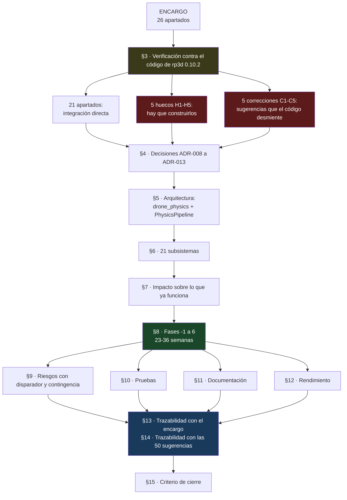

### 1.5 Las 5 sugerencias que el código de rp3d desmiente

No se incorporan tal cual porque parten de premisas falsas sobre la librería. Se incorporan **corregidas**, y la evidencia está en §3.3. Esto importa: cuatro de ellas describen comportamiento de **Bullet**, no de rp3d, y adoptarlas literalmente habría producido código que no compila o que no hace lo que promete.

| Sugerencia | Premisa | Realidad verificada |
|---|---|---|
| #47 | "rp3d subdivide `dt` internamente" | `PhysicsWorld::update()` da **un** paso. Sin `maxSubSteps`. Eso es `btDynamicsWorld::stepSimulation` |
| #48 | "`world->testAABBOverlap(aabb, callback)` … rp3d lo soporta" | **Ese método no existe.** Hay `testOverlap(Body*, …)` y `testCollision(…)`, siempre contra un cuerpo |
| #10 | "Exponer la información de islas de rp3d" | Las islas se calculan en `createIslands()` pero **no se exponen**: no hay `getIsland()` en `RigidBody` |
| #23 | "Iterar los `ContactManifold` activos" | **No hay acceso público** a los manifolds por cuerpo; solo llegan por callback |
| #18 | "Filtro dinámico … sin cambiar máscaras en caliente" | **No hay hook pre-narrowphase.** Cambiar la máscara en caliente *es* la solución, y rp3d la soporta |

---

### 1.6 Qué aporta rp3d y qué ponemos nosotros

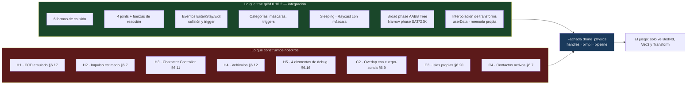

---

## 2. Punto de partida: qué es el juego hoy

Leído entero: 81 ficheros versionados, 3.416 líneas entre `src/` y `tests/`, 72 tests en verde.

```
src/core/          drone_core — simulación pura, CERO I/O (la CI lo verifica con un guard)
  GameController   máquina de estados + bucle de timestep fijo a 60 Hz
  World            agrega Drone + Environment + PhysicsEngine + EventBus
  PhysicsEngine    99 líneas: empuje, gravedad, arrastre, suelo, límites, AABB, batería
  Drone            estado (posición, velocidad, empuje, batería)
  Environment      viento por rachas con semilla, dificultad, obstáculos AABB
  EventBus         pub/sub tipado (BatteryLow, Collision, LevelUp, GameSaved…)
  WorldState       DTO inmutable que el core entrega al frontend cada frame
src/frontend/      IRenderer / IInputSource + terminal (HUD ANSI) + raylib (3D)
src/app/           main, ConfigLoader (toml++), SaveManager, GameLogger (spdlog)
```

**Lo que condiciona este plan:**

1. **El core no hace I/O y la CI lo bloquea.** rp3d tampoco hace I/O, así que el guard sobrevive — pero el core deja de tener cero dependencias.
2. **El estado autoritativo vive en el core y viaja por `WorldState`.** Con rp3d pasa a vivir en el mundo físico; `WorldState` se vuelve una proyección.
3. **Hay un test de determinismo** que compara trayectorias con `==` de floats. rp3d es determinista con el mismo binario, **no entre plataformas**: hay que reescribirlo (§7, §10.3).
4. **`GameConfig` inyecta todo desde TOML.** La configuración de rp3d entra por ahí, no por constantes nuevas (§6.1).
5. **`assets/levels/city.json` existe y no lo lee nadie.** Los obstáculos están hardcodeados; la Fase 3 lo conecta.
6. **No hay mallas 3D en el proyecto.** Convex, concave y heightfield no tienen datos: exigen antes un proveedor de assets (§6.14).

---

## 3. ReactPhysics3D 0.10.2 verificado

### 3.1 Lo que sí trae

| Apartado | Estado | Evidencia |
|---|---|---|
| **6 formas de colisión** | ✅ | `collision/shapes/`: `BoxShape.h`, `SphereShape.h`, `CapsuleShape.h`, `ConvexMeshShape.h`, `ConcaveMeshShape.h`, `HeightFieldShape.h` |
| **4 joints** | ✅ | `constraint/`: `BallAndSocketJoint.h`, `HingeJoint.h`, `SliderJoint.h`, `FixedJoint.h` |
| **Fuerzas de reacción de joints** | ✅ | `Joint::getReactionForce(dt)`, `getReactionTorque(dt)`, `HingeJoint::getMotorTorque(dt)` |
| **Colisión Enter/Stay/Exit** | ✅ | `CollisionCallback.h`: `ContactStart`, `ContactStay`, `ContactExit` |
| **Trigger Enter/Stay/Exit** | ✅ | `OverlapCallback.h`: `OverlapStart`, `OverlapStay`, `OverlapExit` |
| **Categorías y máscaras** | ✅ | `Collider::setCollisionCategoryBits()` / `setCollideWithMaskBits()` — **modificables en runtime** |
| **Triggers** | ✅ | `Collider::setIsTrigger(bool)` |
| **Sleeping** | ✅ | `WorldSettings::isSleepingEnabled`, `RigidBody::setIsAllowedToSleep()`, `setSleepLinearVelocity()` |
| **Raycast con máscara** | ✅ | `PhysicsWorld::raycast(const Ray&, RaycastCallback*, unsigned short categoryMask)` |
| **Datos de impacto** | ✅ | `RaycastInfo`: `worldPoint`, `worldNormal`, `hitFraction`, `triangleIndex`, `body`, `collider` |
| **Interpolación** | ✅ | `Transform::interpolateTransforms(old, new, factor)` |
| **Memoria propia** | ✅ | `PhysicsCommon(MemoryAllocator* = nullptr)` |
| **userData opaco** | ✅ | `Body::setUserData(void*)` / `getUserData()` |
| **Consultas de solapamiento** | ✅ Parcial | `testOverlap(Body*, OverlapCallback&)`, `testOverlap(OverlapCallback&)`, `testCollision(...)` — **contra cuerpo, no contra AABB libre** |
| **Broad/narrow phase** | ✅ Interno | Dynamic AABB Tree + SAT/GJK, sin API que configurar |

**Consecuencia:** formas, joints, filtrado, triggers, sleeping, raycast y broad/narrow phase son **integración, no implementación**. El coste ahí es la fachada y sus tests, no algoritmos.

### 3.2 Los 5 huecos, con evidencia

**H1 — Sin CCD.** `grep -rn "continuous"` sobre todos los headers devuelve una coincidencia, y es un comentario sobre arrays de vértices. Con `dt = 1/60`, un cuerpo a 30 m/s avanza 0,5 m por paso: atraviesa cualquier pared más fina.

**H2 — El contacto no expone impulso.** `CollisionCallback::ContactPoint` ofrece exactamente:

```cpp
decimal        getPenetrationDepth() const;
const Vector3& getWorldNormal() const;
const Vector3& getLocalPointOnCollider1() const;
const Vector3& getLocalPointOnCollider2() const;
```

El impulso del solver es interno. El encargo lo pide en **cada** evento: hay que estimarlo (§6.7).

**H3 — Sin Character Controller.** No existe la clase. Se construye entero.

**H4 — Sin vehículos.** Tampoco `RaycastVehicle`. Se construye entero.

**H5 — El DebugRenderer cubre 6 de 13.** `DebugRenderer::DebugItem` es exactamente `COLLIDER_AABB`, `COLLIDER_BROADPHASE_AABB`, `COLLISION_SHAPE`, `CONTACT_POINT`, `CONTACT_NORMAL`, `COLLISION_SHAPE_NORMAL`. Faltan raycasts, centros de masa, joints y ejes locales.

### 3.3 Correcciones: cinco suposiciones que el código desmiente

Esta sección existe porque cuatro de las cinco describen **Bullet**, no rp3d. Confundirlos es fácil y caro.

**C1 (sugerencia #47) — `update()` no subdivide internamente.** El cuerpo de `PhysicsWorld::update(decimal timeStep)` en `src/engine/PhysicsWorld.cpp` es una secuencia lineal sin bucle de subpasos:

```
computeCollisionDetection() → createIslands() → createContacts()
→ reportContactsAndTriggers() → updateBodiesInverseWorldInertiaTensors()
→ solver → integración → …
```

No hay `maxSubSteps` ni acumulador interno; eso es la firma de Bullet (`stepSimulation(dt, maxSubSteps, fixedDt)`). **Corrección:** el acumulador externo que ya tenemos (ADR-001) es obligatorio, no opcional. Los subpasos para CCD los damos nosotros llamando a `update()` varias veces (§6.17). Y como el broad phase **sí** se recalcula en cada `update()`, subdividir tiene coste real: por eso el subpaso es selectivo, no permanente.

**C2 (#48) — No existe `testAABBOverlap`.** `PhysicsWorld` ofrece `testOverlap(Body*, OverlapCallback&)`, `testOverlap(OverlapCallback&)` y las tres variantes de `testCollision`. Todas parten de un **cuerpo**, no de un AABB suelto. **Corrección:** una consulta "dame todo lo que hay en esta caja" se implementa con un cuerpo-sonda reutilizable (un cuerpo estático con `BoxShape`, marcado como trigger, movido y redimensionado por consulta) o manteniendo nuestro propio índice espacial. La primera opción es la que se planifica (§6.9); tiene coste de mover un cuerpo, no de recorrer el mundo.

**C3 (#10) — Las islas no están expuestas.** `createIslands()` es privado y `RigidBody` no tiene `getIsland()`. **Corrección:** si queremos islas para desactivar zonas lejanas, las calculamos nosotros con *union-find* sobre los pares de contacto que ya recibimos por eventos. Es barato (los pares ya los tenemos) pero es **código nuestro**, no información que rp3d regale (§6.20).

**C4 (#23) — No hay acceso público a los manifolds.** No existe `RigidBody::getContactManifolds()`. Los contactos solo llegan por `EventListener`. **Corrección:** `getContacts(BodyId)` se implementa manteniendo nuestro propio mapa de contactos activos, alimentado por `ContactStart`/`ContactStay`/`ContactExit`. Como `ContactStay` llega **cada frame** mientras dure el contacto, el mapa es exacto sin sondear nada (§6.7).

**C5 (#18) — No hay hook de filtrado pre-narrowphase.** No existe nada parecido a `shouldCollide(a, b)`. **Corrección:** el filtro dinámico se implementa **cambiando la máscara en caliente**, que rp3d sí permite (`setCollideWithMaskBits` es un setter normal). El objetivo de la sugerencia —"atravesar paredes con un power-up"— se cumple igual; lo que no se cumple es hacerlo *sin tocar máscaras*. Un filtro aplicado después del solver no serviría: el rebote ya habría ocurrido.

---

## 4. Decisiones de arquitectura (ADR-008 a ADR-013)

### 4.1 ADR-008 · rp3d sustituye a la física propia (revierte ADR-004)

[ADR-004](docs/adr/004-fisica-propia-vs-bullet.md) eligió física propia porque "un motor completo es sobredimensionado para un dron con menos de 10 obstáculos". **Ese razonamiento sigue siendo correcto para el juego actual** y deja de serlo para el objetivo del encargo. ADR-008 lo sustituye dejando constancia de que el motivo es la ampliación de alcance, no un defecto de la física propia. ADR-004 se marca *Reemplazado*, no se borra.

### 4.2 ADR-009 · rp3d vive en un módulo `drone_physics`

| Opción | Veredicto |
|---|---|
| rp3d dentro de `drone_core` | ❌ El core pierde su "cero dependencias"; los tests de lógica pura arrastran 13 MB |
| Puerto virtual `IPhysicsBackend` | ❌ YAGNI: abstracción para un segundo backend que el encargo **prohíbe** |
| **Módulo `drone_physics` propio** | ✅ **Elegida** — modular, límite claro, rp3d no se filtra |

`drone_physics` no expone **ningún** header de rp3d en su API pública (pimpl). El core nunca incluye `reactphysics3d.h`, y un guard de CI lo garantiza.

```
drone_frontend_raylib ─┐
drone_frontend_terminal┼→ drone_core → drone_physics → reactphysics3d
DroneFlightSim ────────┘
```

### 4.3 ADR-010 · Handles opacos sobre un `HandlePool` reutilizable

`PhysicsManager` devuelve `BodyId`/`ColliderId` (índice + generación), nunca punteros de rp3d. Es lo que hace posibles *"creación y destrucción segura"* y *"object pooling"* sin punteros colgantes.

La estructura no se improvisa dentro del manager: vive en `src/physics/HandlePool.h` como plantilla reutilizable con **tests propios que no dependen de rp3d** (§10.4). Es la pieza más crítica y la más fácil de testear en aislamiento.

### 4.4 ADR-011 · `PhysicsManager` delgado + sistemas especializados

Un manager que simule, consulte, gestione joints, mueva personajes, dibuje debug y perfile acaba en 2.000 líneas intocables. Reparto:

| Módulo | Responsabilidad | Por qué separado |
|---|---|---|
| `PhysicsManager` | Mundo, cuerpos, colliders, paso, sincronización | El núcleo, y solo eso |
| `PhysicsQuerySystem` | Raycasts (3 variantes + lote), overlaps | Las consultas crecen solas; no deben engordar el manager |
| `JointSystem` | Los 4 joints, límites, motores, fuerzas de reacción | Cada joint tiene parámetros distintos |
| `CharacterController` | Movimiento de personaje | Es un simulador aparte que *usa* la física |
| `VehicleSystem` | Chasis + ruedas por raycast | Ídem |
| `PhysicsProfiler` | Contadores y tiempos | Debe poder desactivarse entero |
| `PhysicsRewindSystem` | Grabar y reproducir | Solo en debug/tests |
| `PhysicsLODSystem` | Degradar simulación por distancia | Política, no mecánica |
| `IPhysicsDebugger` | Visualización | **Interfaz**, no acoplada al manager |

**`IPhysicsDebugger` es interfaz, no un getter.** En v1.0 el manager exponía `const DebugGeometry&`. Ahora el manager **publica** geometría de debug a suscriptores:

```cpp
class IPhysicsDebugger {
public:
    virtual ~IPhysicsDebugger() = default;
    virtual void beginFrame() = 0;
    virtual void line(const Vec3& a, const Vec3& b, uint32_t rgba) = 0;
    virtual void triangle(const Vec3& a, const Vec3& b, const Vec3& c, uint32_t rgba) = 0;
    virtual void endFrame() = 0;
};
void PhysicsManager::addDebugger(IPhysicsDebugger*);   // varios a la vez
```

Así conviven un dibujante de raylib, un volcado a fichero para tests y ninguno (coste cero) sin tocar el manager.

### 4.5 ADR-012 · Capas numéricas + matriz de colisión, sobre las máscaras

Las máscaras de 16 bits son potentes y **ilegibles**: `category = 0x0004, mask = 0xFFFB` no le dice nada a nadie. Encima de ellas, una capa numérica por collider y una matriz declarativa:

```toml
[physics.layers]
names = ["default", "drone", "edificio", "proyectil", "trigger", "personaje"]

[[physics.collision_matrix]]
layer_a = "proyectil"
layer_b = "drone"
collide = false          # los proyectiles no golpean al que dispara
```

`LayerRegistry` compila esa matriz a los `categoryBits`/`maskBits` de rp3d al arrancar y **valida que sea simétrica** (si A no colisiona con B, B no colisiona con A — una asimetría es siempre un error de configuración, y sin validación produce colisiones que ocurren "a veces"). Límite heredado de rp3d: **máximo 16 capas**, porque las máscaras son `unsigned short`. Se comprueba al cargar.

### 4.6 ADR-013 · ECS con archetypes

Un archetype (combinación fija de componentes) permite recorrer las entidades con `(Transform, Rigidbody)` sin tocar las que solo tienen `Transform`, con memoria contigua.

**Coste honesto:** los cambios estructurales (añadir o quitar un componente) obligan a mover la entidad de archetype. Para físicas es poco frecuente —un cuerpo rara vez deja de tener `Rigidbody`— así que el coste es bajo y la ganancia en caché, alta. Se acepta.

**Límite de alcance:** archetypes sí; sistema de scheduling, dependencias entre sistemas y paralelismo, no. Eso es un motor ECS completo y no lo pide nadie todavía.

---

## 5. Arquitectura propuesta

```mermaid
graph TB
    subgraph app["src/app"]
        MAIN["main.cpp — composición"]
    end
    subgraph fe["src/frontend"]
        RAY["RaylibRenderer"]
        DBG["RaylibPhysicsDebugger<br/>(implementa IPhysicsDebugger)"]
        TERM["TerminalRenderer"]
    end
    subgraph core["src/core — drone_core (sin I/O)"]
        GC["GameController"]
        SC["Scene / ECS con archetypes"]
        HIER["TransformHierarchy"]
        EVT["EventBus tipado"]
    end
    subgraph phys["src/physics — drone_physics (NUEVO)"]
        PIPE["PhysicsPipeline<br/>pre-step · step · post-step · sync"]
        PM["PhysicsManager<br/>mundo · cuerpos · colliders"]
        HP["HandlePool"]
        QS["PhysicsQuerySystem"]
        JS["JointSystem"]
        CC["CharacterController"]
        VS["VehicleSystem"]
        CB["ContactBridge"]
        TB["TriggerBridge"]
        PROF["PhysicsProfiler"]
        LOD["PhysicsLODSystem"]
        RW["PhysicsRewindSystem"]
        ISL["IslandTracker"]
        AP["IAssetProvider"]
    end
    RP3D["reactphysics3d 0.10.2"]

    MAIN --> GC & RAY & TERM & DBG
    GC --> SC --> HIER
    SC --> PIPE
    PIPE --> PM & QS & JS & CC & VS & LOD & RW & ISL
    PM --> HP & AP
    PM --> CB & TB
    CB & TB --> EVT
    PM --> PROF
    PM --> RP3D
    PM -. "IPhysicsDebugger" .-> DBG

    style phys fill:#1a472a,color:#fff
    style core fill:#1a3a5c,color:#fff
    style RP3D fill:#3a3a1a,color:#fff
```

**Guard de CI nuevo:** ningún fichero fuera de `src/physics/` puede incluir `reactphysics3d`, igual que el guard de I/O que ya existe.

### 5.1 `PhysicsPipeline`: fases explícitas y ganchos

El `fixedStep` monolítico de v1.0 se convierte en un pipeline con puntos de extensión, para que un sistema de gameplay pueda inyectar lógica "justo antes del solver" sin tocar el manager:

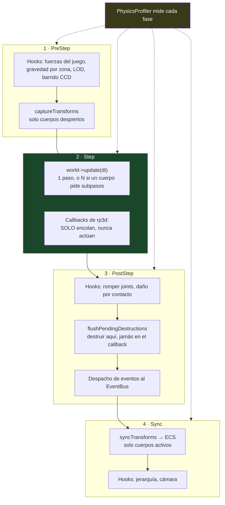


```cpp
enum class PhysicsPhase { PreStep, PostStep, PostSync };

class PhysicsPipeline {
public:
    using Hook = std::function<void(float dt)>;
    void addHook(PhysicsPhase phase, Hook hook);
    void step(float dt);
};

void PhysicsPipeline::step(float dt) {
    m_profiler.begin(Stage::PreStep);
    runHooks(PhysicsPhase::PreStep, dt);   // fuerzas, gravedad por zona, LOD, CCD previo
    m_manager.captureTransforms();          // solo cuerpos despiertos
    m_profiler.end(Stage::PreStep);

    m_profiler.begin(Stage::Solver);
    m_manager.stepWorld(dt);                // rp3d: 1 update (o N si hay subpasos)
    m_profiler.end(Stage::Solver);

    m_profiler.begin(Stage::PostStep);
    runHooks(PhysicsPhase::PostStep, dt);   // el mundo ya avanzó, aún no se publicó
    m_manager.flushPendingDestructions();   // destruir aquí, nunca en el callback
    m_bridges.dispatchQueuedEvents();       // eventos al EventBus
    m_profiler.end(Stage::PostStep);

    m_profiler.begin(Stage::Sync);
    m_manager.syncTransforms(m_scene);      // solo cuerpos activos → ECS
    runHooks(PhysicsPhase::PostSync, dt);
    m_profiler.end(Stage::Sync);
}
```

Ejemplo real del encargo: un power-up que duplica la gravedad durante un frame es un hook de `PreStep`, no una modificación del manager.

### 5.2 Flujo de un frame

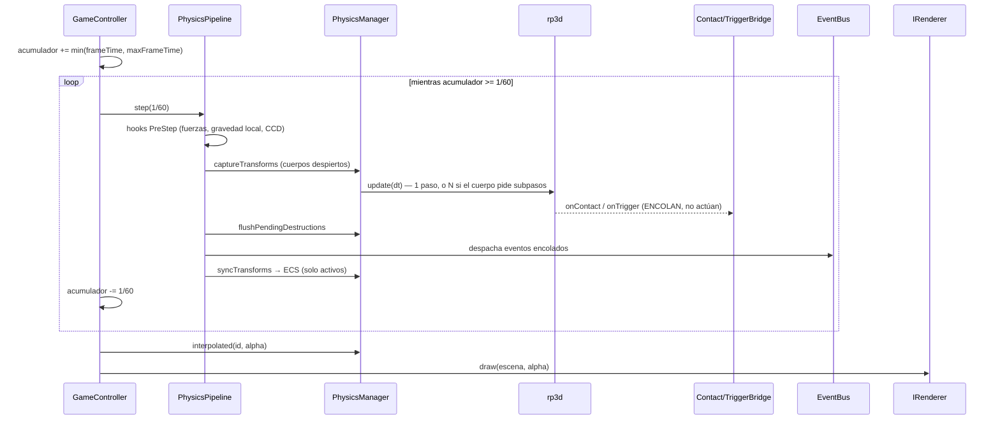

El bucle de timestep fijo **ya existe y no cambia** (ADR-001).

---

## 6. Diseño técnico por subsistema

### 6.1 `PhysicsSettings` ↔ TOML

Todos los campos de `rp3d::WorldSettings`, mapeados explícitamente. Los valores son los **defaults reales verificados** en el header:

```toml
[physics.world]
gravity                          = [0.0, -9.81, 0.0]
persistent_contact_distance      = 0.03    # rp3d default
default_friction_coefficient     = 0.3
default_bounciness               = 0.5
restitution_velocity_threshold   = 0.5     # por debajo, no rebota
velocity_solver_iterations       = 6
position_solver_iterations       = 3
cos_angle_similar_contact_manifold = 0.95

[physics.sleeping]
enabled                 = true
time_before_sleep       = 1.0     # s
sleep_linear_velocity   = 0.02    # m/s
sleep_angular_velocity  = 0.0523  # rad/s ≈ 3°/s

[physics.step]
fixed_timestep   = 0.0166667
max_frame_time   = 0.25
max_sub_steps    = 4        # tope global de subpasos por frame (§6.17)

[physics.debug]
enabled = false
items   = ["collision_shape", "contact_point", "raycasts", "center_of_mass"]
```

`validateConfig` —que ya existe con rangos y avisos— se extiende a estos campos. **Regla:** ninguna constante física en código; si un valor merece existir, merece estar en el TOML.

### 6.2 `HandlePool`

```cpp
// src/physics/HandlePool.h — sin dependencias, testeable en aislamiento
template <typename T>
class HandlePool {
public:
    struct Handle { uint32_t index = 0; uint32_t generation = 0; };

    Handle create(T value);
    bool valid(Handle h) const;      // generación coincide
    T* get(Handle h);                // nullptr si inválido — nunca UB
    void destroy(Handle h);          // incrementa generación y encola el índice
    size_t aliveCount() const;

private:
    std::vector<T> m_items;
    std::vector<uint32_t> m_generations;
    std::vector<uint32_t> m_freeList;   // reutilización de índices = pooling
};
```

Un handle liberado y reusado incrementa su generación, así que un `BodyId` viejo **no** apunta al cuerpo nuevo. Es la diferencia entre un bug detectable y una corrupción silenciosa:

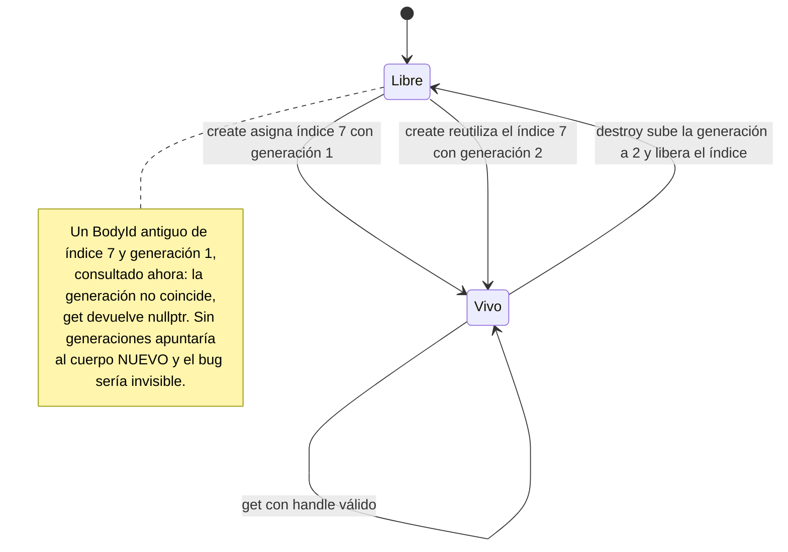


### 6.3 API pública de `PhysicsManager`

```cpp
// src/physics/PhysicsTypes.h — SIN headers de rp3d
struct BodyId     { uint32_t index = 0, generation = 0; bool valid() const { return generation != 0; } };
struct ColliderId { uint32_t index = 0, generation = 0; };

enum class BodyType  { Static, Dynamic, Kinematic };
enum class ShapeType { Box, Sphere, Capsule, ConvexMesh, ConcaveMesh, HeightField };

struct MaterialDesc { float density = 1.0f, friction = 0.3f, bounciness = 0.1f; };

struct ShapeDesc {
    ShapeType type = ShapeType::Box;
    Vec3  halfExtents{0.5f, 0.5f, 0.5f};   // Box
    float radius = 0.5f, height = 1.0f;    // Sphere / Capsule
    AssetId mesh;                          // Convex/Concave/HeightField (§6.14)
    Transform localOffset;                 // varios colliders por cuerpo
    MaterialDesc material;
    LayerId layer = LayerId::Default;      // §4.5 — no bits a mano
    bool isTrigger = false;
    bool autoUpdateMass = true;            // §6.5
};

struct BodyDesc {
    BodyType type = BodyType::Dynamic;
    Transform transform;
    BodyId parent;                  // jerarquía opcional (§6.13)
    uint64_t userData = 0;          // EntityId del juego (§6.5)
    bool allowSleep = true, gravityEnabled = true;
    float linearDamping = 0.0f, angularDamping = 0.0f;
    uint8_t maxSubSteps = 1;        // CCD por cuerpo (§6.17)
};
```

```cpp
class PhysicsManager {
public:
    explicit PhysicsManager(const PhysicsSettings&, IAssetProvider&);
    ~PhysicsManager();

    // Ciclo de vida
    BodyId createBody(const BodyDesc&);
    void createBodies(std::span<const BodyDesc>, std::span<BodyId> out);  // lote (§6.5)
    void destroyBody(BodyId);                    // diferida hasta PostStep
    bool isValid(BodyId) const;
    ColliderId addCollider(BodyId, const ShapeDesc&);
    void removeCollider(ColliderId);

    // Simulación (la llama el pipeline, no el juego)
    void captureTransforms();
    void stepWorld(float dt);
    void syncTransforms(Scene&);
    Transform interpolated(BodyId, float alpha) const;

    // Estado
    void applyForce(BodyId, const Vec3&);
    void applyTorque(BodyId, const Vec3&);
    void setLinearVelocity(BodyId, const Vec3&);
    void setActive(BodyId, bool);
    void setLayer(ColliderId, LayerId);          // filtro dinámico (§6.8)
    uint64_t userData(BodyId) const;

    // Contactos activos (§6.7)
    std::span<const ContactPointInfo> contacts(BodyId) const;

    // Depuración
    void addDebugger(IPhysicsDebugger*);
    const PhysicsProfiler& profiler() const;

private:
    struct Impl;                     // pimpl: rp3d no sale de aquí
    std::unique_ptr<Impl> m_impl;
};
```

### 6.4 Paso fijo, subpasos e interpolación

```cpp
void PhysicsManager::Impl::captureTransforms() {
    // Solo cuerpos despiertos: aquí empieza "actualizar únicamente activos".
    for (BodyRecord& b : awakeBodies) {
        b.previousTransform = b.body->getTransform();
        b.previousVelocity  = b.body->getLinearVelocity();   // para estimar impulso
    }
}

void PhysicsManager::Impl::stepWorld(float dt) {
    // rp3d NO subdivide internamente (§3.3 C1): los subpasos son nuestros.
    const int n = requiredSubSteps();       // 1 salvo que haya cuerpos rápidos con CCD
    const float sub = dt / static_cast<float>(n);
    for (int i = 0; i < n; ++i) world->update(sub);
}

Transform PhysicsManager::Impl::interpolated(BodyId id, float alpha) const {
    const BodyRecord& b = get(id);
    if (b.isSleeping) return fromRp3d(b.body->getTransform());   // dormido: sin coste
    return fromRp3d(rp3d::Transform::interpolateTransforms(
        b.previousTransform, b.body->getTransform(), alpha));
}
```

**Determinismo:** reproducible con el mismo binario y el mismo orden de creación de cuerpos; **no** entre plataformas ni entre niveles de optimización. Ver §10.3.

### 6.5 Cuerpos, formas y sus tres trampas

```cpp
ColliderId PhysicsManager::Impl::addCollider(BodyId id, const ShapeDesc& s) {
    rp3d::CollisionShape* shape = m_shapeCache.acquire(s);   // ver ShapeKey abajo
    rp3d::Collider* col = get(id).body->addCollider(shape, toRp3d(s.localOffset));

    rp3d::Material& m = col->getMaterial();
    m.setMassDensity(s.material.density);
    m.setFrictionCoefficient(s.material.friction);
    m.setBounciness(s.material.bounciness);

    const LayerBits bits = m_layers.bitsFor(s.layer);        // §4.5
    col->setCollisionCategoryBits(bits.category);
    col->setCollideWithMaskBits(bits.mask);
    col->setIsTrigger(s.isTrigger);

    if (s.autoUpdateMass) get(id).body->updateMassPropertiesFromColliders();
    return m_colliders.create(col);
}
```

**Trampa 1 — la clave de caché de formas.** Cachear por `ShapeDesc` con floats es frágil: dos radios que difieren en 1e-7 son claves distintas y duplican la forma. La clave se **cuantiza**:

```cpp
struct ShapeKey {
    ShapeType type;
    int32_t qx, qy, qz;     // dimensiones en milímetros (redondeadas)
    AssetId  mesh;          // para mallas, el id del asset manda: sin cuantizar nada
    bool operator==(const ShapeKey&) const = default;
};
inline int32_t quantize(float meters) { return static_cast<int32_t>(std::lround(meters * 1000.0f)); }
```

**Trampa 2 — masa vs densidad.** rp3d deriva la masa de densidad × volumen en `updateMassPropertiesFromColliders()`. Fijar `setMass()` **antes** de esa llamada no sirve: la sobreescribe. Por eso `autoUpdateMass` es un flag explícito y quien quiera masa fija la aplica después. Es el bug del "dron de 40 kg".

**Trampa 3 — el mapa BodyId↔Entidad.** Un `std::unordered_map<BodyId, EntityId>` consultado en cada callback de contacto es una indirección en el camino caliente. Se elimina con el `userData` que rp3d ya ofrece:

```cpp
body->setUserData(reinterpret_cast<void*>(static_cast<uintptr_t>(entityId)));
// en el callback: EntityId e = static_cast<EntityId>(reinterpret_cast<uintptr_t>(body->getUserData()));
```

**Creación en lote.** Cargar 200 edificios uno a uno dispara 200 inserciones en el broad phase. `createBodies(std::span<const BodyDesc>, std::span<BodyId>)` los crea agrupados y **añade todos los colliders antes de la primera llamada a `update()`**, que es cuando el árbol AABB se reequilibra de una vez.

### 6.6 Materiales

| Propiedad | Dónde vive | API |
|---|---|---|
| Fricción · Restitución · Densidad | **Collider** | `Material::setFrictionCoefficient` / `setBounciness` / `setMassDensity` |
| Masa · Centro de masa · Inercia | **Cuerpo** | `RigidBody::setMass` / `setLocalCenterOfMass` / `setLocalInertiaTensor` |
| Sleeping | Cuerpo + mundo | `setIsAllowedToSleep` + `WorldSettings::isSleepingEnabled` |
| Activación | Cuerpo | `RigidBody::setIsActive` |

`PhysicsMaterialComponent` respeta ese reparto en vez de fingir que las ocho son lo mismo.

### 6.7 Eventos: dos puentes, no uno

Colisiones y triggers comparten la clase base `rp3d::EventListener` pero **no comparten política**: un trigger no estima impulso, no frena a nadie y no debería pasar por el mismo filtrado. Un solo puente con `if (isTrigger)` repartido por el callback envejece mal.

```cpp
class ContactBridge final : public rp3d::EventListener {
    void onContact(const rp3d::CollisionCallback::CallbackData&) override;  // encola
    void onTrigger(const rp3d::OverlapCallback::CallbackData&) override {}  // delega
};
class TriggerBridge {          // lo llama ContactBridge::onTrigger
    void process(const rp3d::OverlapCallback::CallbackData&);
};
```

| Evento del encargo | Origen en rp3d |
|---|---|
| `OnCollisionEnter` / `Stay` / `Exit` | `ContactStart` / `ContactStay` / `ContactExit` |
| `OnTriggerEnter` / `Stay` / `Exit` | `OverlapStart` / `OverlapStay` / `OverlapExit` |

```cpp
struct ContactEvent {
    EntityId a, b;
    Vec3 point, normal;
    float penetration;
    float impulse;   // ESTIMADO — §3.2 H2
    float force;     // impulse / dt
};
```

**El impulso estimado (H2).** El solver no lo publica. Se calcula con la velocidad relativa **antes** del paso, que `captureTransforms` ya guardó:

```cpp
// j = (1 + e) · |v_rel · n| · m_ef,  con m_ef = (mA·mB)/(mA+mB); m_ef = mA contra estático.
float estimateImpulse(const BodyRecord& a, const BodyRecord& b, const Vec3& n) {
    const float vRel = std::fabs(dot(a.previousVelocity - b.previousVelocity, n));
    const float mEff = b.isStatic ? a.mass : (a.mass * b.mass) / (a.mass + b.mass);
    return (1.0f + restitutionBetween(a, b)) * vRel * mEff;
}
```

Ignora fricción, reparto entre puntos de contacto e iteraciones del solver. Para decidir si un impacto es fatal, escalar un sonido o lanzar partículas es suficiente — y es exactamente lo que ya hace hoy `PhysicsEngine::resolveGround`. Se documenta como estimación **en el propio campo** para que nadie lo tome por exacto.

**Contactos activos (`getContacts`, corrección C4).** rp3d no expone los manifolds, así que el puente mantiene el mapa:

```cpp
// ContactStart → insertar · ContactStay → actualizar · ContactExit → borrar
std::unordered_map<BodyId, std::vector<ContactPointInfo>> m_activeContacts;
```

Como `ContactStay` llega **cada frame** mientras el contacto dure, el mapa está siempre al día sin sondear nada. Esto es lo que habilita el daño por contacto continuo, que con solo eventos de cambio de estado no se puede hacer.

**Regla dura:** los callbacks se invocan **dentro** de `world->update()`. Prohibido crear o destruir cuerpos ahí. Los puentes solo encolan; el pipeline despacha en `PostStep`:

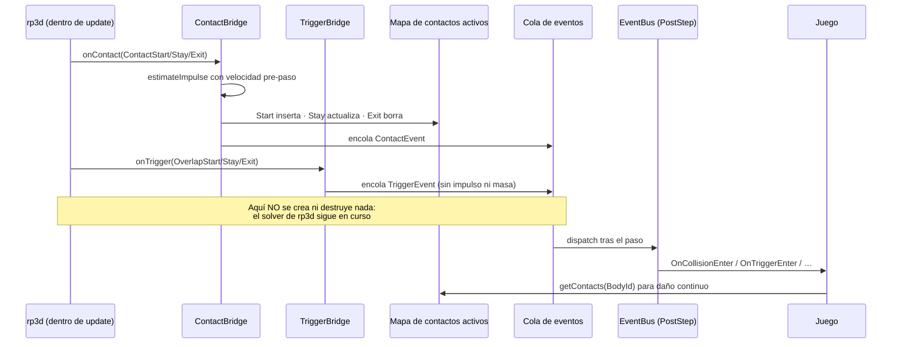


### 6.8 Filtrado: capas, matriz y filtro dinámico

Tres niveles, del más declarativo al más dinámico:

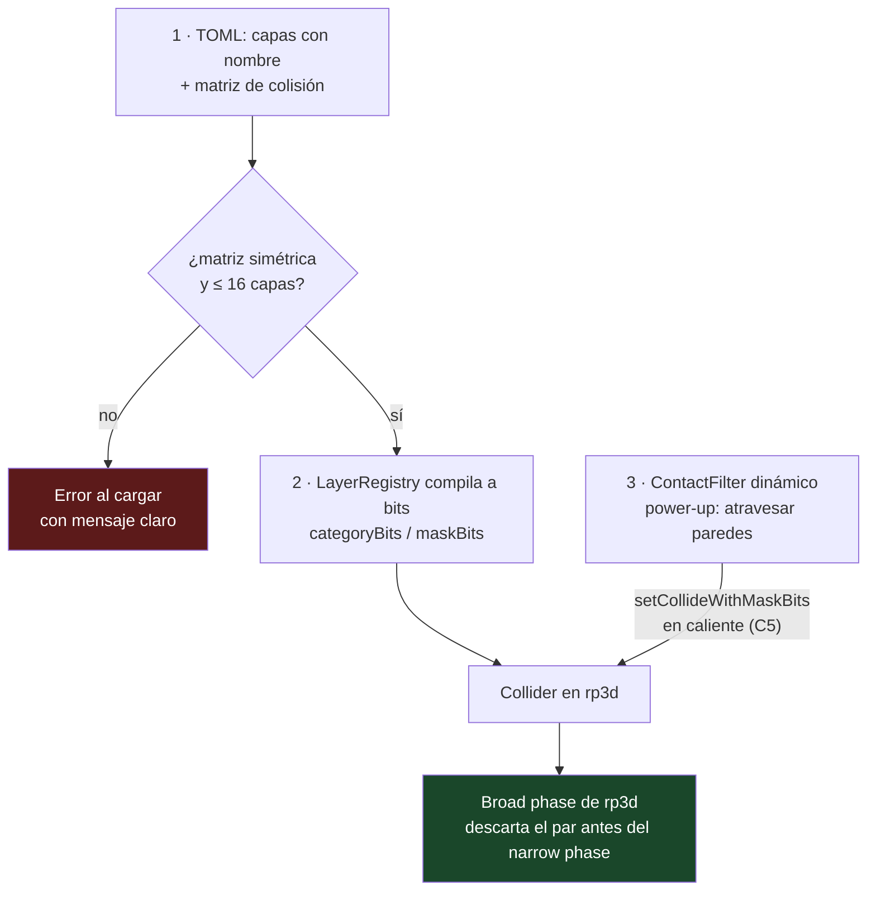


1. **Capas + matriz TOML** (§4.5): la configuración normal, legible y validada al cargar.
2. **Máscaras de bits**: lo que `LayerRegistry` genera; nadie las escribe a mano.
3. **Filtro dinámico** (corrección C5): rp3d no tiene hook pre-narrowphase, así que un cambio temporal de reglas se hace **cambiando la máscara en caliente**:

```cpp
// Power-up "atravesar paredes": quitar la capa "edificio" de la máscara del dron.
void ContactFilter::setPassThrough(BodyId body, LayerId layer, bool passThrough);
```

Es una escritura por collider afectado, no una consulta por par de cuerpos y por frame: **más barato** que el hook que la sugerencia imaginaba. Lo que no permite es decidir caso por caso en función de estado arbitrario del juego; si algún día hiciera falta, la vía es marcar el collider como trigger y resolver la respuesta a mano.

### 6.9 `PhysicsQuerySystem`: raycasts y solapamientos

```cpp
class PhysicsQuerySystem {
public:
    RaycastHit closest(const Ray&, const QueryFilter&) const;
    bool any(const Ray&, const QueryFilter&) const;
    void all(const Ray&, const QueryFilter&, std::vector<RaycastHit>& out) const;

    // Lote: un solo recorrido de preparación para N rayos (§6.11)
    void batch(std::span<const Ray>, const QueryFilter&, std::span<RaycastHit> out) const;

    // Solapamiento — corrección C2: rp3d no tiene testAABBOverlap
    void overlapBox(const Vec3& center, const Vec3& halfExtents,
                    const QueryFilter&, std::vector<BodyId>& out) const;
    void overlapSphere(const Vec3& center, float radius,
                       const QueryFilter&, std::vector<BodyId>& out) const;
};
```

Las tres variantes de raycast salen del valor de retorno de `notifyRaycastHit`:

| Variante | Retorno | Efecto |
|---|---|---|
| `closest` | `info.hitFraction` | Recorta el rayo: solo llegan impactos más cercanos |
| `all` | `1.0` | Recorre todo |
| `any` | `0.0` | Para en el primero — el más barato, para visibilidad |

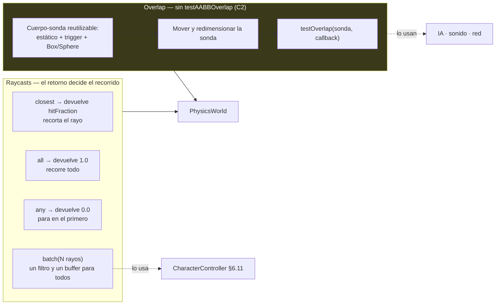

**Overlap sin `testAABBOverlap`:** se mantiene un **cuerpo-sonda** reutilizable (estático, trigger, con `BoxShape` y `SphereShape`) que se mueve y redimensiona por consulta y se pasa a `testOverlap(probe, callback)`. Coste: mover un cuerpo, no recorrer el mundo. El cuerpo-sonda se crea una vez y vive con el sistema — object pooling aplicado donde de verdad se nota.

**Lote de rayos:** el `QueryFilter` y el buffer de salida se preparan una vez para los N rayos, en lugar de construir un callback por rayo. Lo aprovecha el character controller, que lanza un abanico en cada paso.

### 6.10 `JointSystem`

```cpp
struct HingeJointDesc {
    BodyId a, b;
    Vec3 anchorWorld, axisWorld;
    bool limitEnabled = false; float minAngle = 0, maxAngle = 0;
    bool motorEnabled = false; float motorSpeed = 0, maxMotorTorque = 0;
    float breakForce = 0.0f;    // 0 = irrompible (§ abajo)
};

class JointSystem {
public:
    JointId createHinge(const HingeJointDesc&);
    JointId createBallAndSocket(const BallSocketJointDesc&);
    JointId createSlider(const SliderJointDesc&);
    JointId createFixed(const FixedJointDesc&);
    void destroy(JointId);

    void setHingeMotor(JointId, bool enabled, float speed, float maxTorque);   // en caliente

    // Fuerzas internas — rp3d SÍ las expone (verificado)
    Vec3  reactionForce(JointId, float dt) const;    // Joint::getReactionForce
    Vec3  reactionTorque(JointId, float dt) const;   // Joint::getReactionTorque
    float motorTorque(JointId, float dt) const;      // HingeJoint::getMotorTorque
};
```

Exponer las fuerzas de reacción habilita dos cosas que el encargo no pedía pero que un motor necesita: **visualizar tensiones** en el debug renderer y **romper joints por sobrecarga** (`breakForce`), que el `JointSystem` comprueba en `PostStep`.

### 6.11 Character Controller (H3)

Cápsula **kinemática** movida a mano, no cuerpo dinámico: un dinámico con fricción produce el personaje que resbala en rampas y se engancha en escalones.

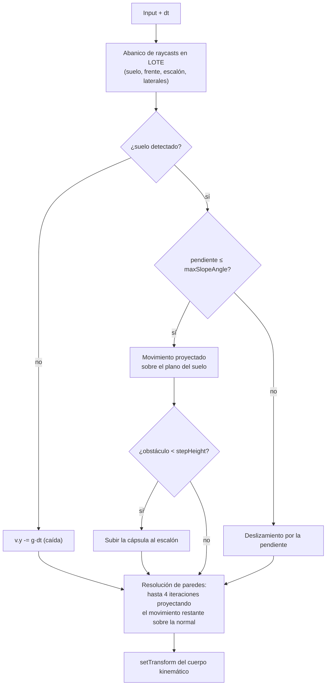

Parámetros a TOML: `radius`, `height`, `step_height`, `max_slope_angle`, `skin_width`, `jump_speed`, `gravity_scale`, `max_wall_iterations`.

**Limitación conocida:** rp3d no tiene *shape cast*, así que el barrido se aproxima con el abanico de raycasts. Con cápsulas finas y velocidades altas puede colarse por esquinas; el test de §10.1 fija el límite y el ADR lo documenta.

### 6.12 Vehículos (H4 — base ampliable)

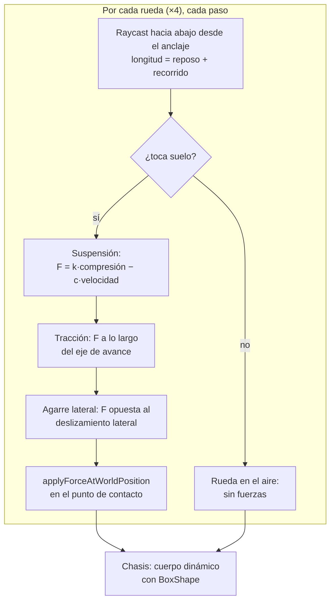

Cuatro raycasts, no cuatro cuerpos con hinges: es lo estándar y evita las inestabilidades de cuatro articulaciones acopladas. La estructura queda preparada para sustituir ruedas por cuerpos + `HingeJoint` si algún día hace falta simulación fina.

### 6.13 ECS, jerarquía y gravedad por zona

```cpp
struct TransformComponent       { Vec3 position; Quat rotation; Vec3 scale{1,1,1}; };
struct RigidbodyComponent       { physics::BodyId body; BodyType type; bool sleeping; };
struct ColliderComponent        { SmallVector<physics::ColliderId, 2> colliders; };
struct PhysicsMaterialComponent { float density, friction, bounciness;    // por collider
                                  float mass; Vec3 centerOfMass;          // por cuerpo
                                  bool allowSleep, active; };
struct GravityZoneComponent     { Vec3 gravity; float radius; };          // §abajo
struct HierarchyComponent       { EntityId parent; Transform localOffset; };
```

**Autoridad, que es lo que evita dos fuentes de verdad:**

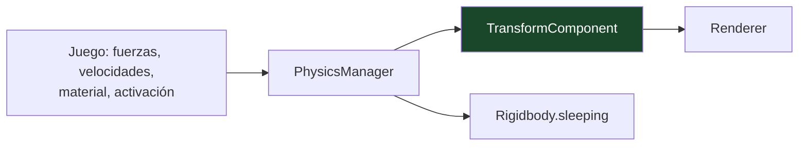

**Regla:** nadie escribe `TransformComponent` salvo `syncTransforms`. Mover una entidad es `setTransform`/`applyForce` sobre el cuerpo — tocar el componente hace divergir física y render.

**Archetypes y jerarquía, en una imagen:**

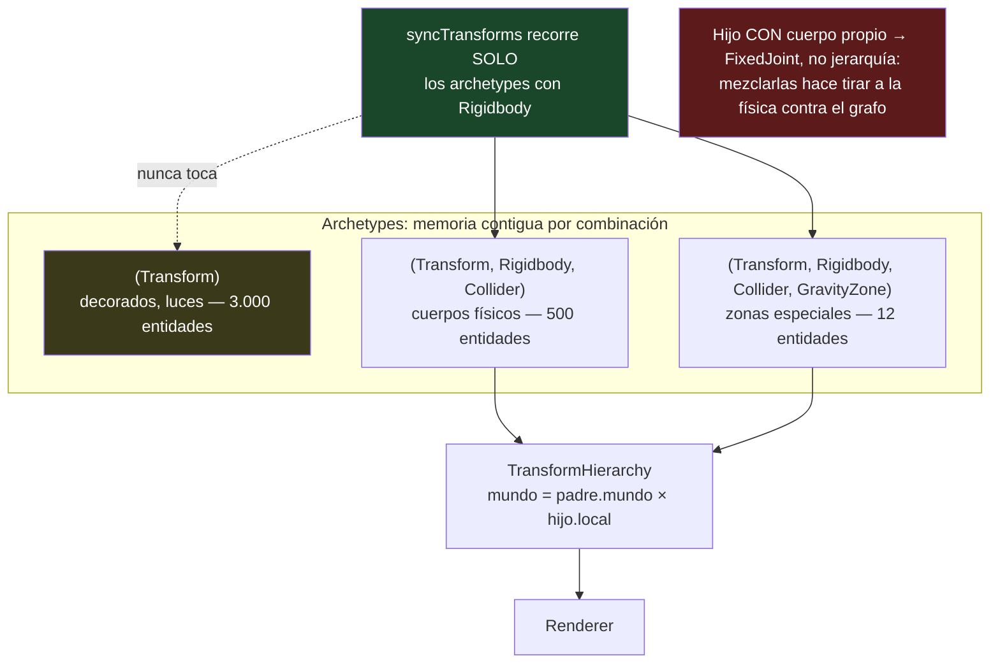

**Jerarquía padre-hijo.** rp3d no tiene grafo de escena: un dron con accesorios, un vehículo con piezas o un personaje con arma lo necesitan. `TransformHierarchy` resuelve `mundo = padre.mundo * hijo.local` **después** de `syncTransforms`, y solo para hijos sin cuerpo propio. Un hijo **con** cuerpo propio se une al padre con un `FixedJoint`, no con jerarquía: mezclar ambas cosas produce el clásico tirón entre lo que dice la física y lo que dice el grafo.

**Gravedad por zona.** rp3d solo tiene gravedad global. Un cuerpo dentro de una `GravityZoneComponent` desactiva la gravedad global (`body->enableGravity(false)`) y recibe su vector como fuerza en el hook `PreStep`. Con esto salen zonas de baja gravedad, planetoides y ascensores de aire sin tocar el mundo.

### 6.14 `IAssetProvider` para mallas

```cpp
// drone_physics NO carga ficheros: los recibe ya en memoria.
class IAssetProvider {
public:
    virtual ~IAssetProvider() = default;
    virtual MeshData convexMesh(AssetId) = 0;       // vértices + índices
    virtual MeshData concaveMesh(AssetId) = 0;
    virtual HeightFieldData heightField(AssetId) = 0;
};
```

Que `drone_physics` no incluya cargadores de OBJ/GLTF mantiene el módulo limpio **y permite testear las formas de malla con geometría sintética** (un cubo generado en el test) sin ficheros ni assets. La implementación real vive en `src/app/`, junto al resto de la I/O.

### 6.15 Puente con raylib

```cpp
// src/frontend/raylib/RaylibPhysicsBridge.h — SOLO en el frontend
inline ::Vector3 toRaylib(const drone::Vec3& v)    { return {v.x, v.y, v.z}; }
inline ::Quaternion toRaylib(const drone::Quat& q) { return {q.x, q.y, q.z, q.w}; }

// NO se usa rp3d::Transform::getOpenGLMatrix: entrega column-major de OpenGL y
// raylib::Matrix es row-major. Mezclarlas da rotaciones transpuestas: un bug
// silencioso y carísimo de localizar. Se construye desde posición y cuaternión.
inline ::Matrix modelMatrix(const drone::Transform& t, const drone::Vec3& s) {
    return MatrixMultiply(
        MatrixMultiply(MatrixScale(s.x, s.y, s.z), QuaternionToMatrix(toRaylib(t.rotation))),
        MatrixTranslate(t.position.x, t.position.y, t.position.z));
}
```

Las conversiones viven en el **frontend**: `drone_physics` no conoce raylib, igual que no lo conoce el core. La "sincronización automática" del encargo se cumple porque el renderer recorre las entidades con `TransformComponent` y dibuja; nadie sincroniza a mano.

### 6.16 Debug: `IPhysicsDebugger` (H5)

Los 6 elementos nativos se vuelcan al debugger tras cada paso:

```cpp
world->setIsDebugRenderingEnabled(true);
rp3d::DebugRenderer& dr = world->getDebugRenderer();
dr.setIsDebugItemDisplayed(DebugItem::COLLISION_SHAPE, true);
// tras update(): recorrer dr.getNbLines() / dr.getNbTriangles() → IPhysicsDebugger
```

| Elemento pedido | Origen |
|---|---|
| Bounding boxes / AABB | `COLLIDER_AABB` + `COLLIDER_BROADPHASE_AABB` |
| Colliders (cápsulas, esferas, convex, concave, heightfields) | `COLLISION_SHAPE` |
| Normales · Contact points | `COLLISION_SHAPE_NORMAL`, `CONTACT_NORMAL`, `CONTACT_POINT` |
| **Raycasts** | **Propio:** el `QuerySystem` graba los rayos del frame cuando el debug está activo |
| **Centros de masa** | **Propio:** `getLocalCenterOfMass()` → esfera |
| **Joints** | **Propio:** línea entre anclajes + eje + **magnitud de la fuerza de reacción** (§6.10) |
| **Ejes locales** | **Propio:** tres líneas RGB desde el transform |

Todo tras `[physics.debug] enabled` más subinterruptores por elemento.

### 6.17 CCD emulado (H1), por cuerpo

rp3d no lo trae y `update()` no subdivide (C1), así que:

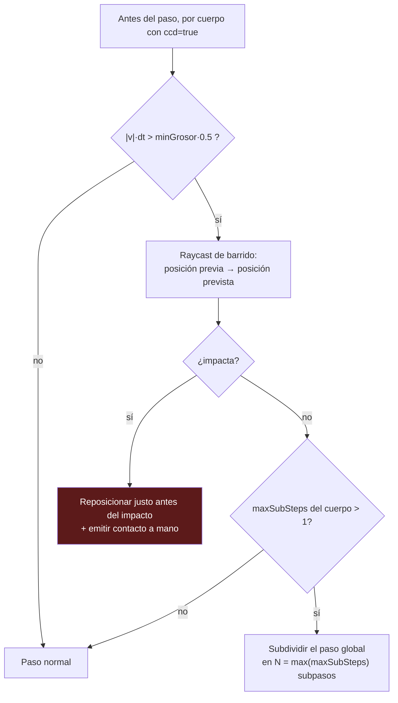

**Corrección respecto a la sugerencia #4:** los subpasos **no pueden ser por cuerpo**. `world->update()` avanza el mundo entero, así que subdividir afecta a todos. Por eso el mecanismo es de dos capas:

- **El barrido por raycast sí es por cuerpo** (`BodyDesc::maxSubSteps > 1` marca al cuerpo como candidato) y es la vía barata: un proyectil paga su rayo y nadie más paga nada.
- **La subdivisión global** solo se activa si algún cuerpo lo exige y está **acotada** por `[physics.step] max_sub_steps`. El profiler cuenta los frames subdivididos para que el coste sea visible en vez de sorpresa.

Ninguna de las dos es CCD real (no hay *shape casting* rotacional). Se declara en el ADR y se cubre con el test de §10.1.

### 6.18 `PhysicsProfiler` — desde la Fase 1

Optimizar en la Fase 6 sin datos de las fases 1-5 es adivinar. El profiler entra con el primer cuerpo:

```cpp
struct PhysicsStats {
    uint32_t bodiesTotal, bodiesAwake, contactPairs, eventsDispatched;
    uint32_t raycastsThisFrame, subStepsThisFrame;
    float msPreStep, msSolver, msPostStep, msSync;   // media móvil
};
```

Se muestra en el HUD de debug y se vuelca al log cada N frames. **Criterio:** ningún trabajo de optimización se acepta sin un antes/después de estos contadores.

### 6.19 `PhysicsRewindSystem`

rp3d es determinista con el mismo binario: eso se explota para depurar y para tests.

```cpp
struct PhysicsFrame {   // instantánea mínima: rp3d no serializa nada por sí mismo
    std::vector<BodyState> bodies;   // transform + velocidades lineal y angular
    uint64_t frameIndex;
};
class PhysicsRewindSystem {
    void record(const PhysicsManager&);          // en PostSync, si está activo
    void restore(PhysicsManager&, uint64_t frame);
    void replay(PhysicsManager&, std::span<const InputFrame>);
};
```

Usos: reproducir un bug frame a frame, y el test de determinismo por rebobinado de §10.3. Solo activo en builds de debug o bajo bandera.

### 6.20 `IslandTracker` (corrección C3)

rp3d agrupa cuerpos en islas internamente pero **no lo expone**. Para "mundo abierto" la información es útil (desactivar islas enteras lejanas), así que se calcula:

```cpp
// Union-find sobre los pares de contacto que los puentes ya reciben.
// No consulta nada a rp3d: reutiliza información que ya pasa por nuestras manos.
class IslandTracker {
    void onContactPair(BodyId a, BodyId b);   // union
    void rebuild();                            // en PostStep
    IslandId island(BodyId) const;
    std::span<const BodyId> bodiesIn(IslandId) const;
};
```

Coste: proporcional a los pares de contacto, que ya se recorren para despachar eventos.

### 6.21 `PhysicsLODSystem`

Sin LOD de física, un mundo abierto simula igual de caro lo que está a 5 m que lo que está a 500 m:

| Distancia al jugador | Política |
|---|---|
| < `near` | Simulación completa cada paso |
| `near` … `far` | Actualización cada 2-3 pasos; sin contactos entre pares de esta banda |
| > `far` | Isla desactivada (`setActive(false)`); se reactiva al acercarse |
| > `cull` | Descarga del mundo físico (el cuerpo se destruye y se recrea al volver) |

Las bandas van a TOML. La política se apoya en el `IslandTracker`: se activa y desactiva **por isla**, nunca por cuerpo suelto, o una caja de una pila se congelaría con el resto de la pila en movimiento:

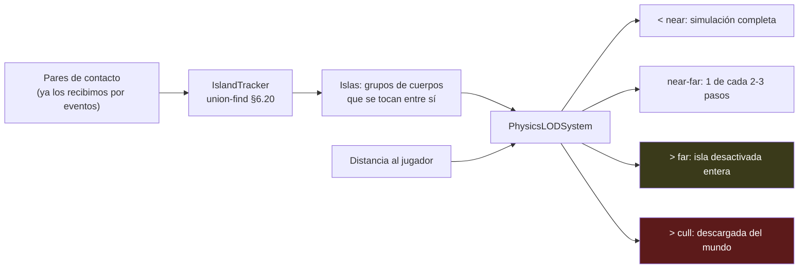


---

## 7. Impacto sobre lo que ya funciona

**Ninguno es un obstáculo, pero todos cuestan tiempo y hay que contarlos.**

| Qué | Impacto | Acción |
|---|---|---|
| **`TestPhysics.cpp` (9 tests)** | Escritos contra fórmulas de la física propia (hover exacto, velocidad terminal `m·g/k`) | Reescribir como tests de comportamiento con tolerancias (§10.1) |
| **Test de determinismo** (`==` de floats) | rp3d no es determinista entre plataformas: la matriz de CI se pondría intermitente | Tolerancia + test estricto por rebobinado en el mismo binario (§10.3) |
| **`SaveData`** | Guarda posición y velocidad del dron; el estado autoritativo pasa a rp3d y con ECS hay N cuerpos | `version = 2` por entidad, **con carga de v1 y test de compatibilidad** (§8, Fase 1) |
| **`WorldState`** | Un dron + obstáculos, copiado por valor cada frame | Lista de entidades con buffer reutilizable: sin asignaciones en el bucle caliente |
| **Frontend terminal** | Un HUD ANSI no muestra un mundo 3D con N cuerpos | Vista reducida (dron + telemetría). Es la red de seguridad para tests de humo sin GPU |
| **`GameConfig`** | Los parámetros propios (`dragCoefficient`, `crashSpeed`) cambian de significado | Secciones `[physics.*]` nuevas (§6.1); `validateConfig` ya existe y se extiende |
| **CI** | rp3d alarga el build; hay un guard nuevo | Caché de `_deps` + guard `! grep -rn "reactphysics3d" src/core src/frontend src/app` |
| **`ADR-004`** | Contradicho | Marcar *Reemplazado por ADR-008*; no borrar |
| **Licencia** | rp3d es **zlib**, permisiva y compatible con el MIT del proyecto | Documentar en README |

---

## 8. Plan por fases con criterios de aceptación

Reglas transversales, aplicables a **todas** las fases:

- La fase termina con **un binario jugable** que un tester pueda ejecutar y comentar. Una fase que "funciona" pero no se ve, no se puede validar.
- Estimaciones con **rango optimista–pesimista**. El rango superior se activa si se dispara alguno de los riesgos de §9.
- Cada fase actualiza `docs/physics/CHANGELOG-fisica.md` (§11.3).

### Fase −1 — Formación (0–2 semanas, **condicional**)

Solo si quien implementa no ha trabajado antes con un motor de físicas iterativo. Contenido: leer los headers de rp3d, el solver iterativo (por qué las iteraciones importan), estabilidad de pilas, diferencia entre *impulso* y *fuerza*, y el patrón de timestep fijo. **Disparador:** si en la espiga de la Fase 0 el desarrollador no sabe explicar por qué una pila de 10 cajas tiembla, esta fase se activa.

### Fase 0 — Decisión, espiga y línea base (1–2 semanas)

| Tarea | Criterio de aceptación |
|---|---|
| ADR-008 a ADR-013 (§4) y ADR-004 marcado *Reemplazado* | Ficheros en `docs/adr/`, enlazados desde el README |
| rp3d por `FetchContent`, `GIT_TAG v0.10.2`, `SYSTEM` | Compila en Linux/macOS/Windows en la matriz de CI |
| Espiga: caja cayendo sobre un plano con raylib | Ejecutable descartable que muestra la caja cayendo y reposando |
| **Benchmark de rp3d aislado, sin el juego** | 1.000 cajas cayendo: FPS y ms/paso registrados en `docs/physics/baseline.md` |
| Impacto en el tiempo de CI | Build completo < 8 min con caché de `_deps` |

**Por qué el benchmark aislado:** si en la Fase 6 el rendimiento decepciona, esta línea base dice si la culpa es de rp3d o de nuestra capa. Sin ella, es una discusión de opiniones.

### Fase 1 — `PhysicsManager` y migración del dron (4–6 semanas) · *la fase que decide todo*

| Tarea | Criterio de aceptación |
|---|---|
| `HandlePool` con tests propios (§6.2) | Suite de §10.4 en verde, sin depender de rp3d |
| `PhysicsSettings` completo desde TOML (§6.1) | Cambiar `velocity_solver_iterations` cambia el comportamiento sin recompilar |
| Módulo `drone_physics` con pimpl (§6.3) | `! grep -rn "reactphysics3d" src/core src/frontend src/app` como job de CI |
| `PhysicsPipeline` con las 4 fases y ganchos (§5.1) | Un hook de prueba duplica la gravedad un frame sin tocar el manager |
| `PhysicsProfiler` (§6.18) | Contadores visibles en el HUD de debug desde el primer día |
| Dron dinámico + obstáculos estáticos; empuje/viento como fuerzas | El dron vuela, choca con los edificios y se posa |
| **Checklist de limpieza de la física propia** | Ver abajo — los 5 puntos verificados |
| **Migración de savegames v1 → v2** | Test que carga un save v1 real y produce una partida jugable |
| Reescritura de `TestPhysics` a comportamiento (§10.1) | Suite verde; hover ±0,3 m en 10 s |

**Checklist de limpieza (no basta "borrar PhysicsEngine.cpp"):**

1. `git rm src/core/PhysicsEngine.{h,cpp}`
2. Ningún `#include "core/PhysicsEngine.h"` en el árbol
3. Sin miembros `m_physics` ni referencias en `World`
4. Tests antiguos migrados o eliminados, no comentados
5. `grep -rn "PhysicsEngine" src/ tests/` devuelve **cero** líneas

**DoD (hito clave):** **el juego es indistinguible para el jugador, pero por dentro lo mueve rp3d.** Si la fase no llega aquí, no se sigue: se revisa el diseño (§9, contingencia de R1).

### Fase 2 — Eventos, materiales, filtrado y consultas (3–4 semanas)

| Tarea | Criterio de aceptación |
|---|---|
| `ContactBridge` + `TriggerBridge` separados (§6.7) | Test: dron contra edificio da `Enter` → `Stay`… → `Exit` en ese orden |
| Impulso estimado (H2) + `getContacts(BodyId)` (C4) | Un cuerpo apoyado reporta sus contactos activos cada frame |
| Materiales completos (§6.6) | Cambiar `bounciness` en TOML cambia el rebote sin recompilar |
| Capas + matriz de colisión validada (§4.5) | Una matriz asimétrica en el TOML **falla al cargar** con un mensaje claro |
| `ContactFilter` dinámico por máscara (C5) | Un power-up hace que el dron atraviese edificios y luego vuelve a colisionar |
| `PhysicsQuerySystem`: 3 raycasts + lote + overlaps (§6.9) | Altímetro por raycast sustituye a `position.y`; `overlapSphere` lista cuerpos cercanos |
| Sleeping y activación | El contador `bodiesAwake` del profiler baja al reposar la escena |

### Fase 2.5 — Integración vertical del dron (1 semana)

Una fase corta y deliberada: **que el dron use de verdad todo lo construido**, en lugar de acumular sistemas que nadie ejerce.

| Tarea | Criterio de aceptación |
|---|---|
| Materiales reales por superficie | El dron rebota distinto en suelo y en edificio |
| Altímetro y detección de obstáculos por raycast | El HUD muestra distancia al suelo real, no `position.y` |
| Eventos de colisión → sonido y aviso en pantalla | Un choque suena y se ve en ambos frontends |
| Capas aplicadas al juego real | Dron, edificios, suelo y triggers en sus capas, definidas en TOML |

**DoD:** una partida completa ejercita colisiones, materiales, raycasts, eventos y capas. Es el momento de validar con un tester que "la sensación es la misma o mejor".

### Fase 3 — ECS, jerarquía y formas restantes (4–6 semanas)

| Tarea | Criterio de aceptación |
|---|---|
| ECS con archetypes y los 4 componentes (§6.13) | Iterar `(Transform, Rigidbody)` no toca entidades sin cuerpo (test con contador) |
| `TransformHierarchy` padre-hijo | Un dron con accesorio: el accesorio sigue al dron sin cuerpo propio |
| `GravityZoneComponent` | Una zona de baja gravedad altera la caída sin tocar la gravedad global |
| Cápsula y esfera; varios colliders por cuerpo | Un cuerpo con 2 colliders tiene masa e inercia correctas |
| `IAssetProvider` + convex/concave/heightfield (§6.14) | Formas de malla testeadas con geometría **sintética**, sin ficheros |
| Carga de `assets/levels/city.json` (hoy muerto) | Los obstáculos salen del fichero; `createBodies` en lote |
| `WorldState` sin copia por frame | Cero asignaciones en el bucle caliente (medido) |

### Fase 4 — Debug renderer y joints (3–4 semanas)

| Tarea | Criterio de aceptación |
|---|---|
| `IPhysicsDebugger` + implementación raylib (§6.16) | Dos debuggers simultáneos (pantalla + volcado a fichero) sin tocar el manager |
| 6 elementos nativos + 4 propios | **13/13** elementos del encargo visibles |
| `JointSystem` con los 4 joints en caliente (§6.10) | Escenas: péndulo (hinge), puente (ball-socket), ascensor (slider) |
| Fuerzas de reacción y `breakForce` | Un joint sobrecargado se rompe; el debug dibuja la tensión |

### Fase 5 — Character controller, vehículos y CCD (5–7 semanas)

| Tarea | Criterio de aceptación |
|---|---|
| Character controller (§6.11) | Sube escalones ≤ `step_height`, resbala en pendientes mayores, **no atraviesa paredes a velocidad máxima** |
| Base de vehículo (§6.12) | Acelera, gira y no vuelca en llano |
| CCD emulado por cuerpo (§6.17) | Proyectil a 100 m/s contra pared de 0,1 m **no** la atraviesa |
| `IslandTracker` (§6.20) | Islas correctas en una escena con dos pilas separadas |

### Fase 6 — LOD, rendimiento y cierre (2–4 semanas)

| Tarea | Criterio de aceptación |
|---|---|
| `PhysicsLODSystem` (§6.21) | 5.000 cuerpos en el mundo, 500 activos: 60 FPS estables |
| `PhysicsRewindSystem` (§6.19) | Rebobinar 100 frames y re-simular da el mismo resultado bit a bit |
| Optimización guiada por el profiler | Cada mejora con antes/después de `PhysicsStats` |
| Documentación completa (§11) | Un desarrollador nuevo añade un cuerpo siguiendo solo las guías |

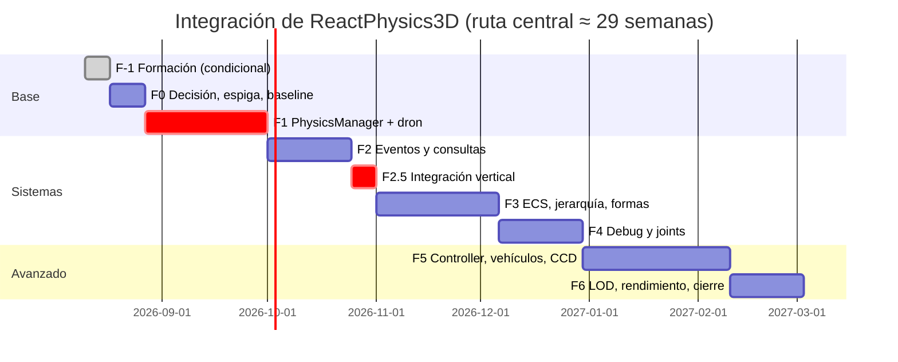

---

## 9. Riesgos, disparadores y contingencias

Cada riesgo con **disparador medible** y **acción concreta**, no una intención.

| # | Riesgo | Prob. | Disparador | Contingencia |
|---|---|---|---|---|
| R1 | **El dron "se siente" distinto** con rp3d | Alta | El tester lo rechaza al final de la Fase 1 | 3 días de ajuste de parámetros (ya en TOML). Si a los 3 días sigue mal: **capa de asistencia de vuelo** (amortiguación de entrada) en vez de seguir peleando con el solver |
| R2 | **La Fase 1 se va de 6 semanas** | Media | Semana 7 sin cumplir el DoD | Congelar alcance en "dron + cajas estáticas + profiler", mover pipeline y settings a la Fase 2, y **replanificar el resto con los datos reales**, no con la estimación original |
| R3 | rp3d no compila con `-Werror` en alguna plataforma | Media | Job rojo en la Fase 0 | `SYSTEM` desde el principio; si aun así falla, excluir esa plataforma de `-Werror` documentándolo, nunca desactivar el flag globalmente |
| R4 | **Determinismo intermitente en CI** | Media | Un test de física falla de forma no reproducible | Reescribir a tolerancias **en la Fase 1**, no cuando falle. Un test intermitente tolerado envenena la suite entera |
| R5 | **Alcance: character controller y vehículos** no los usa el juego | **Alta** | Semana 20 con la Fase 4 sin cerrar | Cortar Fases 5-6. El motor sigue completo **para el juego**; se documenta como "no implementado", nunca como "hecho" |
| R6 | Formas de malla sin assets que probar | Media | Fase 3 sin mallas reales | Geometría sintética en los tests (§6.14). Si al acabar la fase no hay assets, esas formas quedan marcadas *sin validar en producción* |
| R7 | El tiempo de CI se dispara | Media | Build > 12 min | Caché de `_deps`; si no basta, precompilar rp3d como artefacto por plataforma |
| R8 | **El plan se convierte en deuda documental** | Media | 3 semanas sin actualizarlo | Actualizarlo es tarea de cierre de cada fase, con el CHANGELOG de física (§11.3) |

---

## 10. Estrategia de pruebas

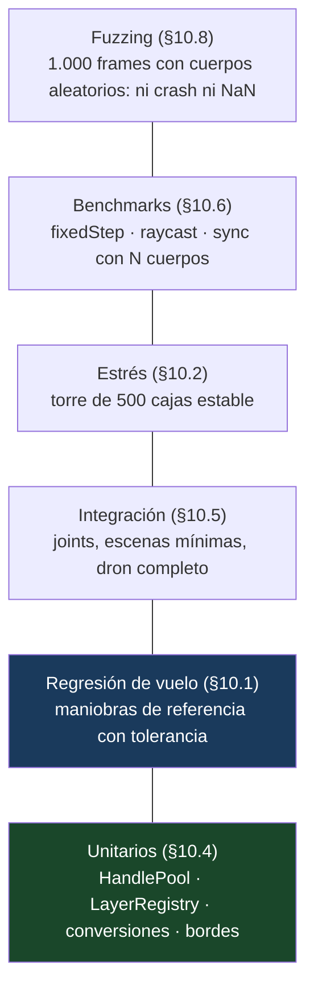

### 10.1 · Regresión de vuelo

Maniobras de referencia con posición y orientación esperadas y **tolerancia explícita**: despegue vertical de 2 s, hover de 10 s, caída libre desde 20 m, choque lateral contra edificio. Si un cambio de parámetros o de versión de rp3d altera el vuelo, salta. Sustituye a los tests de fórmula de la física propia.

### 10.2 · Estrés

Una torre de 500 cajas apiladas debe seguir en pie tras 10 s: es el "hola mundo" del estrés en motores de física y detecta regresiones en las iteraciones del solver o en `WorldSettings`. Segundo caso: 1.000 cuerpos creados y destruidos sin crecimiento de memoria (con ASan).

### 10.3 · Determinismo por rebobinado, dentro del mismo binario

Simular 100 pasos, guardar el estado con `PhysicsRewindSystem`, resetear el mundo, re-simular con las mismas entradas y exigir **igualdad bit a bit**. Esto sí es válido en CI multiplataforma, porque compara el binario consigo mismo — a diferencia del test actual, que compara contra constantes grabadas.

### 10.4 · Unitarios sin rp3d

`HandlePool` (asignar, liberar, reusar índice con generación nueva, usar handle caduco → error detectable), `LayerRegistry` (matriz asimétrica rechazada, >16 capas rechazadas), `ShapeKey` (cuantización estable), conversiones matemáticas. Son los tests más baratos y los que más bugs atrapan.

### 10.5 · Integración de joints

Péndulo con hinge (periodo aproximado), slider bajo fuerza constante (desplazamiento esperado), fixed joint (distancia invariante), ball-socket (cadena que no se desmonta). Verifican la fachada **y** avisan si rp3d cambia semántica en una actualización.

### 10.6 · Benchmarks

Con `BENCHMARK` de Catch2: `fixedStep(1/60)` con 100/500/1.000 cuerpos, `closest` en un mundo con M colliders, `syncTransforms` con K activos. Línea base registrada en `docs/physics/baseline.md`; una optimización que empeore otra métrica se ve al instante.

### 10.7 · Bordes

Masa 0 o negativa (rechazada con error definido), escala 0, velocidad NaN o infinita (saneada al entrar, nunca propagada), cuerpo sin colliders, collider sin cuerpo, handle de un cuerpo ya destruido, timestep 0 y negativo.

### 10.8 · Fuzzing

1.000 frames con cuerpos, formas, fuerzas y destrucciones aleatorias con semilla fija: el mundo no debe crashear ni producir NaN. No sustituye a los tests dirigidos, pero encuentra los bugs de integración que nadie imagina.

---

## 11. Documentación

### 11.1 · `docs/physics/` con guías por caso de uso

, no solo referencia de API. Lo que un desarrollador necesita el primer día: *cómo añadir un cuerpo estático*, *cómo hacer un proyectil*, *cómo configurar capas*, *cómo depurar un cuerpo que atraviesa el suelo*, *cómo perfilar un frame lento*. La referencia se genera; las guías se escriben.

### 11.2 · `docs/physics/MIGRATION.md`

La diferencia de comportamiento entre la física propia y rp3d, por escrito y **antes** de que alguien pregunte por qué el dron se siente raro:

| Antes (física propia) | Ahora (rp3d) | Qué ajustar |
|---|---|---|
| Arrastre lineal `k·(viento − v)` | Damping lineal/angular + fricción de contacto | `linear_damping`, `friction` |
| Respuesta de suelo: clamp instantáneo | Solver iterativo con restitución | `bounciness`, `restitution_velocity_threshold` |
| Sin rotación (el dron era un punto) | Cuerpo con inercia: puede volcar | `angular_damping`, centro de masa |
| Colisión = evento con velocidad de impacto | Contacto con normal, penetración e impulso estimado | Umbral de choque en `[physics]` |

### 11.3 · `docs/physics/CHANGELOG-fisica.md` desde la Fase 1

Cada cambio de parámetro en `game.toml`, cada tolerancia ajustada en un test, cada tipo de cuerpo nuevo. Cuando en la Fase 4 el dron deje de flotar bien, poder señalar el cambio concreto de la Fase 3 vale más que un día de bisect.

### 11.4 · Diagramas de secuencia

Para lo complejo: character controller (§6.11), vehículo (§6.12) y CCD emulado (§6.17) ya los tienen en este documento; se mantienen sincronizados con el código.

### 11.5 · El "por qué" en las cabeceras

Los ADR cubren la decisión macro; el comentario de cabecera cubre la implementación. `PhysicsManager.h` abre explicando por qué existe el módulo, por qué usa pimpl y por qué no expone rp3d — para el que abre el fichero sin haber leído ningún ADR.

---

## 12. Rendimiento y optimización

| Técnica | Dónde | Nota |
|---|---|---|
| Sleeping automático | `WorldSettings` + por cuerpo | Nativo de rp3d |
| Dynamic AABB Tree / broad phase | Interno de rp3d | Sin trabajo nuestro |
| Object pooling | `HandlePool` (§6.2) + cuerpo-sonda de queries | Reutiliza índices y cuerpos |
| Reutilización de formas | `ShapeCache` con `ShapeKey` cuantizada (§6.5) | 500 cajas iguales, una `BoxShape` |
| Solo cuerpos activos | `captureTransforms` / `syncTransforms` | El coste escala con **despiertos** |
| Creación en lote | `createBodies` (§6.5) | Amortiza el reequilibrado del árbol |
| LOD de física | `PhysicsLODSystem` (§6.21) | Por isla, nunca por cuerpo suelto |
| Islas | `IslandTracker` (§6.20) | Calculadas por nosotros (C3) |
| Consultas espaciales sin colisión | `overlapBox` / `overlapSphere` (§6.9) | Para IA, sonido o red |
| Subpasos acotados | `[physics.step] max_sub_steps` | Solo cuando un cuerpo con CCD lo exige |

**Regla de oro:** ninguna optimización entra sin un antes/después de `PhysicsStats` (§6.18). La línea base de la Fase 0 dice si un problema es de rp3d o nuestro.

---

## 13. Trazabilidad con el encargo

| Apartado del encargo | Fase | Estado previsto |
|---|---|---|
| Exclusivamente ReactPhysics3D | F0 | ✅ Sin Bullet/PhysX/Jolt/Box2D |
| `PhysicsManager` (common, world, memoria, fixed step, sync, creación/destrucción segura, colisiones, raycasts, debug, eventos) | F1–F2 | ✅ Repartido en sistemas (§4.4) |
| Fixed update independiente del FPS | F1 | ✅ Ya existe (ADR-001); **obligatorio**, rp3d no subdivide (C1) |
| Static / Dynamic / Kinematic | F1 | ✅ §6.3 |
| Las 6 formas de colisión | F1 (box, sphere) · F3 (resto) | ✅ Las 6 existen |
| Múltiples colliders por cuerpo | F3 | ✅ Con recálculo de masa/inercia |
| Materiales (8 propiedades) | F2 | ✅ §6.6 (masa/centro/inercia son del cuerpo) |
| Broad phase Dynamic AABB Tree | F1 | ✅ Interno |
| Narrow phase SAT + GJK | F1 | ✅ Interno |
| **Continuous Collision Detection** | F5 | ⚠️ **Emulada** (H1, §6.17) |
| Collision filtering | F2 | ✅ Capas + matriz TOML sobre máscaras (§4.5) |
| Triggers | F2 | ✅ `setIsTrigger` + `TriggerBridge` |
| 6 eventos Enter/Stay/Exit | F2 | ✅ Mapeo directo (§6.7) |
| Evento con entidad, punto, normal | F2 | ✅ Directo del callback + `userData` |
| **Evento con fuerza e impulso** | F2 | ⚠️ **Estimados** (H2, §6.7) |
| Raycast / All / Closest + máscaras + ignorar entidades | F2 | ✅ §6.9 |
| Los 4 joints con parámetros en tiempo real | F4 | ✅ §6.10, + fuerzas de reacción |
| **Character Controller** | F5 | ⚠️ **Se implementa entero** (H3, §6.11) |
| **Vehículos** | F5 | ⚠️ **Se implementa entero** (H4, §6.12) |
| Conversiones raylib ↔ rp3d | F1 | ✅ §6.15, con la trampa row/column-major resuelta |
| Sincronización física↔render automática | F1/F3 | ✅ Vía `TransformComponent` |
| ECS con los 4 componentes | F3 | ✅ Con archetypes (§6.13) |
| **Debug renderer: 13 elementos** | F4 | ⚠️ **6 nativos + 4 propios** (H5, §6.16) |
| Optimización (sleeping, AABB tree, pooling, reutilización, solo activos, borrado seguro) | F1–F6 | ✅ §12 |
| Resultado: base para mundo abierto, shooters, simuladores | F6 | ✅ Con las 5 salvedades documentadas |

**Resumen honesto:** de los 26 apartados, **21 son integración directa** y **5 exigen construir lo que la librería no tiene**. Ninguno se presenta como resuelto por rp3d cuando no lo está.

---

## 14. Trazabilidad con las 50 sugerencias

Las 50 se agrupan por lo que tocan. Ninguna queda sin destino: el mapa muestra **dónde vive cada grupo** y las cinco que se incorporan corregidas.

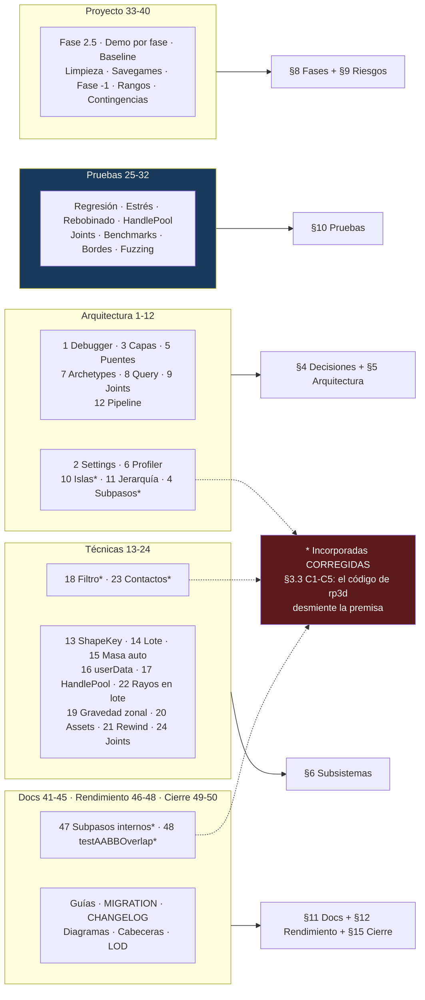

| # | Qué se pidió | Qué se hizo — artefacto verificable | § |
|---|---|---|---|
| 1 | `IPhysicsDebugger` en vez de getter | Interfaz con `beginFrame`/`line`/`triangle`/`endFrame` y `addDebugger()` para **varios** visualizadores a la vez; el `debugGeometry()` de v1.0 se elimina | §4.4, §6.16 |
| 2 | `PhysicsSettings` completo a TOML | Bloques `[physics.world]`, `[physics.sleeping]` y `[physics.step]` con los **12 campos de `WorldSettings`** y sus defaults reales leídos del header (`time_before_sleep`, `sleep_linear_velocity`, `sleep_angular_velocity`…) | §6.1 |
| 3 | Capas + matriz de colisión | `[physics.layers]` con nombres + `collision_matrix`; `LayerRegistry` compila a bits, **valida simetría** y rechaza >16 capas (tope real de `unsigned short`) | §4.5, §6.8 |
| 4 | Subpasos por cuerpo | `BodyDesc::maxSubSteps` + `[physics.step] max_sub_steps`. **Corregido (C1):** el barrido por raycast sí es por cuerpo; la subdivisión de `update()` es global por fuerza | §6.17 |
| 5 | Separar contactos y triggers | `ContactBridge` y `TriggerBridge` como clases distintas: el trigger no estima impulso ni consulta masas | §6.7 |
| 6 | Profiler desde la Fase 1 | `struct PhysicsStats` con cuerpos activos, pares de contacto, eventos, raycasts, subpasos y ms por fase; **tarea explícita de la Fase 1** y regla de "antes/después" para optimizar | §6.18, §8 F1, §12 |
| 7 | ECS con archetypes | ADR-013 con el coste de los cambios estructurales dicho; diagrama de qué archetypes recorre `syncTransforms` y cuáles no | §4.6, §6.13 |
| 8 | `PhysicsQuerySystem` separado | Clase propia con `closest`/`any`/`all`/`batch` + `overlapBox`/`overlapSphere`; el manager ya no tiene consultas | §4.4, §6.9 |
| 9 | `JointSystem` separado | Clase propia con los 4 constructores, `setHingeMotor` en caliente y las fuerzas de reacción | §4.4, §6.10 |
| 10 | Islas de simulación | `IslandTracker` por union-find. **Corregido (C3):** rp3d **no expone** islas (`createIslands()` es privado), se calculan con los pares que ya recibimos | §6.20 |
| 11 | Jerarquía padre-hijo | `HierarchyComponent` + `BodyDesc::parent`; regla explícita: hijo **con** cuerpo propio va con `FixedJoint`, no con jerarquía | §6.13 |
| 12 | Pipeline con fases y ganchos | `enum class PhysicsPhase` (PreStep/PostStep/PostSync) + `addHook`; diagrama de las 4 fases y ejemplo del power-up de gravedad | §5.1 |
| 13 | `ShapeKey` con hash estable | Clave cuantizada a **milímetros** (`quantize()`), y para mallas manda el `AssetId`, sin cuantizar nada | §6.5 |
| 14 | Creación en lote | `createBodies(std::span<const BodyDesc>, std::span<BodyId>)`, con los colliders añadidos antes del primer `update()` para que el árbol AABB se reequilibre una sola vez | §6.5, §12 |
| 15 | `autoUpdateMass` como flag | Campo en `ShapeDesc` (por defecto `true`) + explicación del orden que produce el "dron de 40 kg" | §6.3, §6.5 |
| 16 | `userData` opaco | `BodyDesc::userData` (uint64) sobre `Body::setUserData` — **verificado que existe**; elimina el mapa `BodyId→Entidad` del camino caliente | §6.3, §6.5 |
| 17 | `HandlePool` reutilizable | `src/physics/HandlePool.h` como plantilla con freelist y generaciones, **tests propios sin rp3d** y diagrama del ciclo de vida | §4.3, §6.2, §10.4 |
| 18 | `ContactFilter` dinámico | `setPassThrough(body, layer, bool)`. **Corregido (C5):** no hay hook pre-narrowphase; se hace cambiando la máscara en caliente, que además es más barato que un filtro por par | §6.8 |
| 19 | Gravedad por zona | `GravityZoneComponent`: desactiva la gravedad global del cuerpo y aplica su vector en el hook `PreStep` | §6.13 |
| 20 | `IAssetProvider` | Interfaz con `convexMesh`/`concaveMesh`/`heightField`; `drone_physics` no incluye cargadores y las formas se testean con **geometría sintética** | §6.14 |
| 21 | `PhysicsRewindSystem` | `PhysicsFrame` con transform + velocidades (rp3d no serializa), `record`/`restore`/`replay`; solo en debug | §6.19, §10.3 |
| 22 | Raycast en lote | `batch(std::span<const Ray>, filtro, span<RaycastHit>)` con buffer preasignado; lo consume el character controller | §6.9, §6.11 |
| 23 | `getContacts(BodyId)` | `contacts(BodyId)` sobre un mapa propio `m_activeContacts`. **Corregido (C4):** los `ContactManifold` **no** son accesibles; el mapa se alimenta de Start/Stay/Exit y `ContactStay` llega cada frame | §6.7 |
| 24 | Fuerzas internas de joints | `reactionForce`, `reactionTorque` y `motorTorque` — **verificado que rp3d los expone** — más `breakForce` para romper joints y dibujo de la tensión en el debug | §6.10, §6.16 |
| 25 | Regresión de vuelo | 4 maniobras de referencia con tolerancia: despegue 2 s, hover 10 s, caída desde 20 m, choque lateral. Sustituyen a los tests de fórmula | §10.1 |
| 26 | Estrés | Torre de 500 cajas estable a 10 s + 1.000 cuerpos creados y destruidos sin fuga (ASan) | §10.2 |
| 27 | Determinismo por rebobinado | Simular 100 pasos, guardar, resetear, re-simular y exigir **igualdad bit a bit**; válido en CI multiplataforma porque compara el binario consigo mismo | §10.3 |
| 28 | Tests de `HandlePool` | Los 4 casos pedidos (asignar, invalidar, reusar con generación nueva, handle caduco detectable) + `LayerRegistry` y `ShapeKey` | §10.4 |
| 29 | Tests de joints | Péndulo (periodo), slider bajo fuerza constante, fixed (distancia invariante), ball-socket (cadena); detectan cambios de semántica de rp3d | §10.5 |
| 30 | Benchmarks | `BENCHMARK` de Catch2 sobre `fixedStep` con 100/500/1.000 cuerpos, `closest` y `syncTransforms`; línea base en `docs/physics/baseline.md` | §10.6, §8 F0 |
| 31 | Condiciones de borde | Masa 0/negativa, escala 0, NaN e infinito saneados, cuerpo sin colliders, handle destruido, timestep 0 y negativo | §10.7 |
| 32 | Fuzzer | 1.000 frames con cuerpos, formas, fuerzas y destrucciones aleatorias con semilla fija: ni crash ni NaN | §10.8 |
| 33 | Fase 2.5 | Fase propia de 1 semana con 4 criterios: materiales por superficie, altímetro por raycast, eventos con sonido y aviso, capas aplicadas al juego real | §8 F2.5 |
| 34 | Demo jugable por fase | Elevado a **regla transversal** de todas las fases, no una tarea suelta | §8 |
| 35 | Benchmark de rp3d aislado | Tarea de Fase 0: 1.000 cajas con rp3d puro, FPS y ms/paso a `baseline.md`, para saber después si la culpa es de rp3d o nuestra | §8 F0 |
| 36 | Checklist de limpieza | 5 pasos verificables, terminando en `grep -rn "PhysicsEngine" src/ tests/` con **cero** líneas | §8 F1 |
| 37 | Migración de savegames | Tarea de Fase 1 con test que carga un save **v1 real** y produce partida jugable en v2 | §7, §8 F1 |
| 38 | Fase −1 de formación | Fase condicional (0–2 semanas) con **disparador medible**: si no sabe explicar por qué tiembla una pila de 10 cajas, se activa | §8 F−1 |
| 39 | Estimaciones con rango | Todas las fases con rango optimista–pesimista y total **23–36 semanas** (antes: 22 fijas) | §1.1, §8 |
| 40 | Contingencia por riesgo | Los 8 riesgos con **disparador medible** y acción concreta, incluido qué hacer si la Fase 1 llega a la semana 7 | §9 |
| 41 | Guías por caso de uso | `docs/physics/` con 5 guías nombradas (cuerpo estático, proyectil, capas, depurar atravesamiento, perfilar frame) | §11.1 |
| 42 | `MIGRATION.md` | Tabla "antes hacía X / ahora hace Y / ajusta Z" con 4 diferencias reales entre el integrador propio y rp3d | §11.2 |
| 43 | CHANGELOG de física | `docs/physics/CHANGELOG-fisica.md` desde la Fase 1, y actualizarlo es tarea de cierre de cada fase | §11.3, §8 |
| 44 | Diagramas de vehículo y CCD | Diagrama de rueda-suspensión-suelo y diagrama del flujo de barrido y subpasos, además del de character controller que ya existía | §6.12, §6.17 |
| 45 | El "por qué" en cabeceras | Regla explícita: `PhysicsManager.h` abre explicando por qué existe el módulo, por qué usa pimpl y por qué no expone rp3d | §11.5 |
| 46 | `PhysicsLODSystem` | 4 bandas (near / near-far / far / cull) configurables, aplicadas **por isla** y no por cuerpo suelto | §6.21 |
| 47 | Delegar subpasos en rp3d | **No incorporada — imposible.** `PhysicsWorld::update()` es lineal, sin `maxSubSteps` ni acumulador interno; eso es `stepSimulation` de Bullet. El acumulador externo pasa de opcional a obligatorio | §3.3 C1 |
| 48 | `testAABBOverlap` | **No incorporada — no existe.** Solo hay `testOverlap` contra un cuerpo. Se sustituye por un **cuerpo-sonda reutilizable** que da el mismo resultado | §3.3 C2, §6.9 |
| 49 | Lecciones de otros proyectos | 6 patrones de fracaso recurrentes, cada uno con la mitigación concreta de este plan | §15.1 |
| 50 | Criterio de completitud | 4 condiciones para marcar el plan **Cerrado** y reparto de su contenido vivo a `docs/` | §15.2 |
---

## 15. Cierre: lecciones ajenas y criterio de completitud

### 15.1 Lo que suele salir mal al migrar de física propia a motor

Patrones recurrentes en proyectos que han hecho este mismo camino. No son anécdotas técnicas: son las que descarrilan el calendario.

1. **El ajuste de parámetros se subestima siempre.** La integración funciona en semanas; que el juego *se sienta* como antes lleva más. Por eso R1 tiene contingencia propia y la Fase 1 reserva días de ajuste.
2. **Se optimiza antes de medir.** Aparece un LOD o un pooling elaborado para un problema que no existía. Mitigación: el profiler desde la Fase 1 y la regla de "antes/después" de §12.
3. **La física propia sobrevive meses en paralelo** con un flag "por si acaso", y el proyecto mantiene dos motores. Mitigación: la checklist de limpieza de la Fase 1, con `grep` que devuelve cero.
4. **El determinismo se da por hecho** hasta que la CI se pone intermitente y alguien marca el test como *flaky*. Mitigación: reescribirlo en la Fase 1 (R4).
5. **Se construye el motor genérico y se olvida el juego.** Seis meses después hay character controller, vehículos y ningún nivel nuevo. Mitigación: la Fase 2.5, la demo jugable por fase y el corte de R5.
6. **La versión de la librería se actualiza a mitad** y cambia la semántica del solver. Mitigación: `GIT_TAG` fijo y los tests de joints de §10.5, que detectan cambios de comportamiento.

### 15.2 Cuándo se considera cerrado este documento

`grafico.md` es un documento vivo durante todo el proyecto y pasa a mantenimiento cuando se cumplen **las cuatro** condiciones:

1. Los 26 apartados de §13 están en estado final: **verificado** o **documentado como no implementado**. Ninguno en "previsto".
2. Las 5 salvedades (H1–H5) tienen su ADR con la limitación por escrito y su test que fija el límite.
3. `docs/physics/` está completo (§11) y alguien ajeno al desarrollo ha añadido un cuerpo físico siguiendo solo las guías.
4. La línea base de rendimiento de la Fase 0 tiene su contraparte final medida y comparada.

Cumplidas las cuatro, este plan se marca **Cerrado** y su contenido vivo se reparte: la arquitectura a `docs/architecture.md`, las decisiones a los ADR, las guías a `docs/physics/`. Lo que quede aquí es histórico — el registro de por qué el motor es como es.

---

*Plan v2.0, redactado tras leer el juego completo (81 ficheros, 3.416 LOC) y verificar la API de ReactPhysics3D v0.10.2 contra su código fuente. Las afirmaciones sobre la librería salen de sus headers y sus fuentes, no de su documentación. Cuando una sugerencia de revisión contradecía al código, ha ganado el código (§3.3).*
